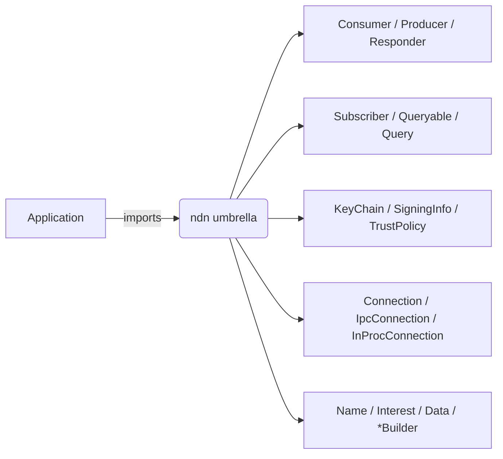

# Develop tier — the `ndn` umbrella

The Develop tier is what an application reaches for when it wants to
fetch a `Data` by name or serve one and treat the forwarder as
opaque. Everything below is a re-export of `ndn-app`, `ndn-packet`,
and `ndn-security` from the `ndn-rs-prelude` crate (library name
`ndn`).

Package vs library: `Cargo.toml` carries `ndn-rs-prelude = "0.1"`;
imports read `use ndn::Consumer;`. The split is recorded in
`crates/spec/ndn-rs-prelude/Cargo.toml` and in the tier design notes
at `docs/notes/tiered-api-design-2026-05-20.md` §2.

## Inventory



| Re-export | Source | What it does |
|---|---|---|
| `Consumer` | `ndn_app::Consumer` (`crates/spec/ndn-app/src/consumer.rs`) | Express Interests; fetch a single `Data` or a segmented object. |
| `Producer` | `ndn_app::Producer` (`crates/spec/ndn-app/src/producer.rs`) | Register a prefix; serve `Data` on demand. |
| `Responder` | `ndn_app::Responder` (`crates/spec/ndn-app/src/responder.rs`) | Callback-style producer (one closure → one `Data`). |
| `Subscriber`, `SubscriberConfig`, `Sample` | `ndn_app::subscriber` | SVS-style multi-publisher stream subscription. |
| `Queryable`, `Query` | `ndn_app::queryable` | Request/reply primitive (one Interest → one Data). |
| `KeyChain` | `ndn_security::KeyChain` | Identity / key / cert management; entry point for signing. |
| `SigningInfo`, `SignerSelection` | `ndn_security::{SigningInfo, SignerSelection}` | "Sign me with X" descriptor. |
| `ValidationPolicy`, `TrustPolicy` | `ndn_security::{ValidationPolicy, TrustPolicy}` | Trust-decision contracts. |
| `Connection`, `IpcConnection`, `InProcConnection` | `ndn_app::*` | Trait + concrete connections; unifies external forwarder and embedded engine. |
| `Name`, `NameComponent`, `Interest`, `Data`, `NackReason` | `ndn_packet::*` | Decoded packets. |
| `InterestBuilder`, `DataBuilder` | `ndn_packet::encode::*` | Builder-style packet construction. |
| `AppError` | `ndn_app::error::AppError` | Single error type at the Develop tier boundary. |

The full inventory and decision log lives in
`docs/notes/tiered-api-design-2026-05-20.md` §2.1.

## Consumer

```rust,ignore
use ndn::prelude::*;
use ndn::Consumer;

# async fn run() -> Result<(), ndn::AppError> {
let mut consumer = Consumer::connect("/tmp/ndn-fwd.sock").await?;
let data = consumer.fetch("/example/hello").await?;
println!("got {} bytes", data.content().len());
# Ok(()) }
```

- `fetch(name)` expresses one Interest, returns one `Data`.
- `fetch_object(name)` performs RDR discovery (`<name>/32=metadata`)
  and reassembles segmented `Data`.
- `fetch_on(face_id, name)` pins the Interest to a face via
  `NextHopFaceId` — useful for measurement or multipath tests.
- The Consumer applies the configured `ValidationPolicy` to every
  returned `Data` before handing it back.

## Producer

```rust,ignore
use ndn::prelude::*;
use ndn::{KeyChain, Producer};

# async fn run() -> Result<(), Box<dyn std::error::Error + Send + Sync>> {
let keychain = KeyChain::open_default().await?;
let mut producer = Producer::connect("/tmp/ndn-fwd.sock", keychain).await?;
producer.publish_object("/example/hello", b"hi".to_vec()).await?;
# Ok(()) }
```

- `publish_object(name, bytes)` signs and segments the object,
  registers the prefix, and serves segments on demand.
- The signing identity comes from the `KeyChain`'s default unless
  the producer is configured with an explicit `SigningInfo`.
- Re-publishing the same name replaces the served content; the
  forwarder's cache is invalidated through `FreshnessPeriod`.

## Responder

A `Responder` is a closure-style producer. Use it when each Interest
needs a dynamic reply rather than pre-published bytes.

```rust,ignore
use ndn::prelude::*;
use ndn::{KeyChain, Responder};

# async fn run() -> Result<(), Box<dyn std::error::Error + Send + Sync>> {
let keychain = KeyChain::open_default().await?;
let mut responder = Responder::connect("/tmp/ndn-fwd.sock", keychain).await?;

responder.serve("/example/time", |_interest| async {
    Ok(format!("{:?}", std::time::SystemTime::now()).into_bytes())
}).await?;
# Ok(()) }
```

## Subscriber

A `Subscriber` joins a multi-publisher stream (SVS pub/sub shape).
Each peer publishes under its own name; `Subscriber` reassembles a
total order and yields `Sample` items.

```rust,ignore
use ndn::prelude::*;
use ndn::{Subscriber, SubscriberConfig};

# async fn run() -> Result<(), Box<dyn std::error::Error + Send + Sync>> {
let mut sub = Subscriber::connect(
    "/tmp/ndn-fwd.sock",
    SubscriberConfig::new("/svs/chatroom"),
).await?;
while let Some(sample) = sub.next().await {
    println!("{}: {:?}", sample.publisher(), sample.content());
}
# Ok(()) }
```

Note: in v0.1.0 the `Subscriber` is read-only. Publishing into a
sync group from Develop-tier code is filed for v0.1.x — see
`docs/notes/api-completeness-check-2026-05-20.md` GAP-5.

## Connection {#connection}

`Connection` is the trait the Develop types accept; two concrete
implementations cover the typical deployments.

| Type | Where the engine lives | Typical use |
|---|---|---|
| `IpcConnection` | External `ndn-fwd` over Unix socket | Production apps on Linux/macOS. |
| `InProcConnection` | Embedded `ForwarderEngine` in the same process | Tests, mobile, browser. |

### Embedded engine

```rust,ignore
use ndn::prelude::*;
use ndn::{Consumer, InProcConnection};
use ndn_engine::{EngineBuilder, EngineConfig};
use ndn_faces::local::InProcFace;
use ndn_transport::FaceId;

# async fn run() -> Result<(), Box<dyn std::error::Error + Send + Sync>> {
let (face, handle) = InProcFace::new(FaceId(1), 64);
let (_engine, _shutdown) = EngineBuilder::new(EngineConfig::default())
    .face(face)
    .build()
    .await?;
let mut consumer = Consumer::new(InProcConnection::from_handle(handle));
let _ = consumer.fetch("/example/hello").await?;
# Ok(()) }
```

`EngineBuilder` is in `crates/spec/ndn-engine/`. The umbrella does
not re-export it: the Develop tier treats the engine as opaque, and
embedding it is an Extend-tier or test-time concern.

## KeyChain

```rust,ignore
use ndn::prelude::*;
use ndn::{KeyChain, SigningInfo};

# async fn run() -> Result<(), Box<dyn std::error::Error + Send + Sync>> {
let mut keychain = KeyChain::open_default().await?;
let identity = keychain.create_identity("/alice").await?;
let _cert = identity.self_signed_cert();

let info = SigningInfo::by_identity("/alice");
let mut data = DataBuilder::new("/alice/notes/1").content(b"hi");
keychain.sign(&mut data, &info).await?;
# Ok(()) }
```

Persistence backends: SQLite-backed PIB on native targets; IndexedDB
PIB on wasm32. See [Identity and keys](../concepts/identity-and-keys.md).

## Wasm target

The umbrella compiles for `wasm32-unknown-unknown` but exports a
smaller surface: `Name`, `Interest`, `Data`, `InterestBuilder`,
`DataBuilder`, `SigningInfo`, `TrustPolicy`. `Consumer`, `Producer`,
`KeyChain`, and the connection types stay native-only because
`ndn-app` pulls the full Tokio runtime.

Browser callers build the engine in-page with
`ndn_engine::WasmEngineBuilder` and drive the `Producer` shape from
`ndn-engine` directly. The split is intentional and documented in
the prelude crate's top-level docs.

## What this tier does not expose

The Develop tier deliberately omits:

- Direct `ForwarderEngine` access (PIT/FIB/CS tables) — that's the
  [Instrument tier](./instrument.md).
- `Strategy`, `RoutingProtocol`, `Face`, `LinkService` traits —
  that's the [Extend tier](./extend.md).
- Per-crate error enums (`ConfigError`, `TrustError`, etc.) — they
  collapse into `AppError` at this boundary.

The full omission list is in
`docs/notes/tiered-api-design-2026-05-20.md` §2.4.

## See also

- [Building an application](../guides/building-an-app.md) — end-to-end
  guide that uses every type on this page.
- [Five-minute app](../quickstart/5-minute-app.md) — Consumer in 20
  lines.
- [Ten-minute producer](../quickstart/10-minute-producer.md) —
  Producer + Consumer pair.
- [`examples/tier1-develop-5min/`](https://github.com/Quarmire/ndn-rs/tree/main/examples/tier1-develop-5min) —
  the audit-witnessed reference example.
