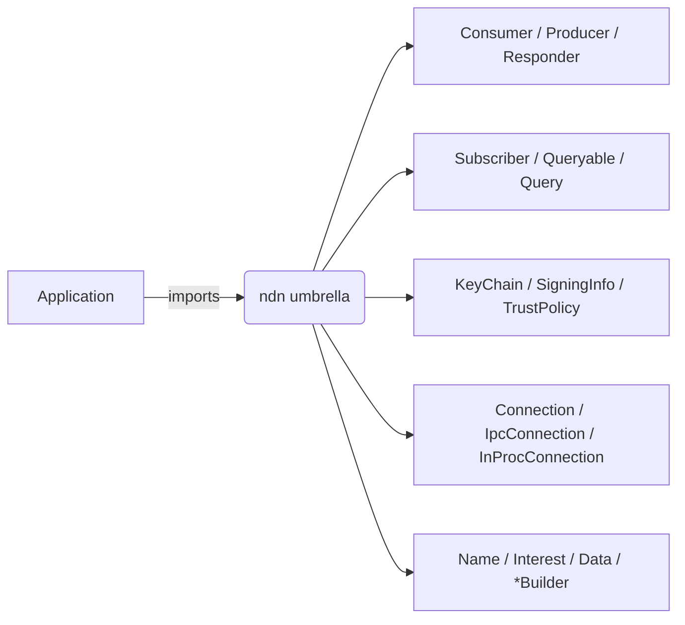

# Develop tier — the `ndn` umbrella

The Develop tier is what an application reaches for when it wants to
fetch a `Data` by name or serve one and treat the forwarder as
opaque. Everything below is a re-export of `ndn-app`, `ndn-packet`,
and `ndn-security` from the `ndn-rs-prelude` crate (library name
`ndn`).

Package vs library: `Cargo.toml` carries `ndn-rs-prelude = "0.1"`;
imports read `use ndn::Consumer;`. The split is recorded in
`crates/ndn-rs-prelude/Cargo.toml`.

## Inventory



| Re-export | Source | What it does |
|---|---|---|
| `Consumer` | `ndn_app::Consumer` (`crates/ndn-app/src/consumer.rs`) | Express Interests; fetch a single `Data` or a segmented object. |
| `Producer` | `ndn_app::Producer` (`crates/ndn-app/src/producer.rs`) | Register a prefix; serve `Data` on demand. |
| `Responder` | `ndn_app::Responder` (`crates/ndn-app/src/responder.rs`) | Callback-style producer (one closure → one `Data`). |
| `Subscriber`, `SubscriberConfig`, `Sample` | `ndn_app::subscriber` | SVS-style multi-publisher stream subscription. |
| `Queryable`, `Query` | `ndn_app::queryable` | Request/reply primitive (one Interest → one Data). |
| `KeyChain` | `ndn_security::KeyChain` | Identity / key / cert management; entry point for signing. |
| `SigningInfo`, `SignerSelection` | `ndn_security::{SigningInfo, SignerSelection}` | "Sign me with X" descriptor. |
| `ValidationPolicy`, `TrustPolicy` | `ndn_security::{ValidationPolicy, TrustPolicy}` | Trust-decision contracts. |
| `Connection`, `IpcConnection`, `InProcConnection` | `ndn_app::*` | Trait + concrete connections; unifies external forwarder and embedded engine. |
| `Name`, `NameComponent`, `Interest`, `Data`, `NackReason` | `ndn_packet::*` | Decoded packets. |
| `InterestBuilder`, `DataBuilder` | `ndn_packet::encode::*` | Builder-style packet construction. |
| `AppError` | `ndn_app::error::AppError` | Single error type at the Develop tier boundary. |


## Consumer

```rust,ignore
use ndn::prelude::*;
use ndn::Consumer;

# async fn run() -> Result<(), ndn::AppError> {
let mut consumer = Consumer::connect("/tmp/ndn-fwd.sock").await?;
let data = consumer.fetch("/example/hello").await?;
println!("got {} bytes", data.content().len());
# Ok(()) }
```

- `fetch(name)` expresses one Interest, returns one `Data`.
- `fetch_object(name)` performs RDR discovery (`<name>/32=metadata`)
  and reassembles segmented `Data`. Segments are fetched **pipelined** (a
  sliding window of in-flight Interests, retransmitting on a stall), so
  throughput is `window / RTT × chunk` rather than one round-trip per segment.
- `fetch_object_to_file_hinted_progress(name, validator, hint, file, on_progress)`
  **streams** each verified segment to a file at its byte offset as it arrives —
  the object is never held in memory, so an arbitrarily large object is received
  with flat memory. `on_progress(received, total)` drives a download bar.
- `fetch_on(face_id, name)` pins the Interest to a face via
  `NextHopFaceId` — useful for measurement or multipath tests.
- The Consumer applies the configured `ValidationPolicy` to every
  returned `Data` before handing it back.

## Producer

```rust,ignore
use ndn::prelude::*;

# async fn run() -> Result<(), Box<dyn std::error::Error>> {
let keychain = KeyChain::ephemeral("/example")?;
// connect registers the prefix; with_signer makes published Data signed.
let producer = Producer::connect("/tmp/ndn-fwd.sock", "/example")
    .await?
    .with_signer(keychain.signer()?);
producer
    .publish_object("/example/hello".parse()?, b"hi".to_vec().into(), 0)
    .await?;
# Ok(()) }
```

- `publish_object(name, content, chunk_size)` segments and serves the
  object — **signing** each segment with the configured signer, else
  `DigestSha256`. `chunk_size == 0` uses the default.
- `publish_object_from_file(name, file, size, chunk_size)` serves a **file-backed**
  object: segments are read from the file on demand (positioned reads), so an
  arbitrarily large file is published without ever loading it into memory.
- `connect(socket, prefix)` registers the prefix; re-publishing the
  same name replaces the content (`FreshnessPeriod` governs the cache).

## Responder

A `Responder` is the reply handle passed to `Producer::serve` — a
closure-style producer for when each Interest needs a dynamic reply.
With a signer configured, `respond` signs the reply.

```rust,ignore
use ndn::prelude::*;

# async fn run() -> Result<(), Box<dyn std::error::Error>> {
let keychain = KeyChain::ephemeral("/example")?;
let producer = Producer::connect("/tmp/ndn-fwd.sock", "/example/time")
    .await?
    .with_signer(keychain.signer()?);
producer.serve(|interest, responder| async move {
    let now = format!("{:?}", std::time::SystemTime::now());
    // `respond` signs with the configured signer.
    responder.respond((*interest.name).clone(), now.into_bytes()).await.ok();
}).await?;
# Ok(()) }
```

## Subscriber

A `Subscriber` joins a multi-publisher stream (SVS pub/sub shape).
Each peer publishes under its own name; `Subscriber` reassembles a
total order and yields `Sample` items.

```rust,ignore
use ndn::prelude::*;
use ndn::Subscriber;

# async fn run() -> Result<(), Box<dyn std::error::Error + Send + Sync>> {
let mut sub = Subscriber::connect("/tmp/ndn-fwd.sock", "/svs/chatroom").await?;
while let Some(sample) = sub.recv().await {
    println!("{}: {:?}", sample.publisher, sample.payload);
}
# Ok(()) }
```

Note: in v0.1.0 the `Subscriber` is read-only. Publishing into a
sync group from Develop-tier code is filed for v0.1.x.

## Connection {#connection}

`Connection` is the trait the Develop types accept; two concrete
implementations cover the typical deployments.

| Type | Where the engine lives | Typical use |
|---|---|---|
| `IpcConnection` | External `ndn-fwd` over Unix socket | Production apps on Linux/macOS. |
| `InProcConnection` | Embedded `ForwarderEngine` in the same process | Tests, mobile, browser. |

### Embedded engine

```rust,ignore
use ndn::prelude::*;
use ndn::{Consumer, InProcConnection};
use ndn_engine::{EngineBuilder, EngineConfig};
use ndn_face_native::local::InProcFace;
use ndn_transport::FaceId;

# async fn run() -> Result<(), Box<dyn std::error::Error + Send + Sync>> {
let (face, handle) = InProcFace::new(FaceId(1), 64);
let (_engine, _shutdown) = EngineBuilder::new(EngineConfig::default())
    .face(face)
    .build()
    .await?;
let mut consumer = Consumer::new(InProcConnection::from_handle(handle));
let _ = consumer.fetch("/example/hello").await?;
# Ok(()) }
```

`EngineBuilder` is in `crates/ndn-engine/`. The umbrella does
not re-export it: the Develop tier treats the engine as opaque, and
embedding it is an Extend-tier or test-time concern.

## KeyChain

```rust,ignore
use ndn::prelude::*;

# fn run() -> Result<(), Box<dyn std::error::Error>> {
// A KeyChain is one identity; `ephemeral` / `open_or_create` generate its key
// and self-signed cert.
let keychain = KeyChain::ephemeral("/alice")?;
// Sign a Data with that key → ready-to-send wire bytes.
let wire = keychain.sign_data(DataBuilder::new("/alice/notes/1", b"hi"))?;
# Ok(()) }
```

Persistence backends: SQLite-backed PIB on native targets; IndexedDB
PIB on wasm32. See [Identity and keys](../concepts/identity-and-keys.md).

## Wasm target

The umbrella compiles for `wasm32-unknown-unknown` but exports a
smaller surface: `Name`, `Interest`, `Data`, `InterestBuilder`,
`DataBuilder`, `SigningInfo`, `TrustPolicy`. `Consumer`, `Producer`,
`KeyChain`, and the connection types stay native-only because
`ndn-app` pulls the full Tokio runtime.

Browser callers build the engine in-page with
`ndn_engine::WasmEngineBuilder` and drive the `Producer` shape from
`ndn-engine` directly. The split is intentional and documented in
the prelude crate's top-level docs.

## Cross-platform parity {#parity}

The endpoint API keeps the same *names and arguments* on every target,
so application logic ports unchanged. The execution model is the only
divergence — and it is forced by the platform, not chosen:

| Axis | native / browser | embedded (`ndn-embedded`) |
|---|---|---|
| Suspension | `async fn … .await` | `nb::Result` poll (`WouldBlock`) |
| Result | owned `Data` / `Bytes` | borrowed `&[u8]` into an `MTU` buffer |
| Sizing | heap | const-generic buffers, no alloc |
| Ownership | `Arc<Engine>`, `&self` | `&mut Forwarder<…>` |

The packet, name, and signing primitives (`Name`, `Interest`, `Data`,
Ed25519 sign/verify) are the *same crates* on all three targets, so
only the seam above changes. `ndn-embedded` exposes
`Consumer::fetch(name)` and `Producer::serve(handler)` — the same verbs
as this tier, returning `nb::Result` rather than a future:

```rust,ignore
use ndn_embedded::{Consumer, Producer};

// native:   let data = consumer.fetch("/ndn/sensor/temp").await?;
// embedded:  poll the same call (here driven to completion with nb::block!)
let mut c: Consumer<_> = Consumer::new(&mut face, seed);
let data: &[u8] = nb::block!(c.fetch("/ndn/sensor/temp"))?;

// native:   producer.serve(|interest, responder| async move { … }).await?;
// embedded:  one Interest per poll, from your event loop
let mut p: Producer<_> = Producer::new(&mut face, "/app");
let _ = p.serve(|_name, out| {
    out[..2].copy_from_slice(b"on");
    Some(2) // content length, or None to decline
});
```

## What this tier does not expose

The Develop tier deliberately omits:

- Direct `ForwarderEngine` access (PIT/FIB/CS tables) — that's the
  [Instrument tier](./instrument.md).
- `Strategy`, `RoutingProtocol`, `Face`, `LinkService` traits —
  that's the [Extend tier](./extend.md).
- Per-crate error enums (`ConfigError`, `TrustError`, etc.) — they
  collapse into `AppError` at this boundary.


## See also

- [Building an application](../guides/building-an-app.md) — end-to-end
  guide that uses every type on this page.
- [Five-minute app](../quickstart/5-minute-app.md) — Consumer in 20
  lines.
- [Ten-minute producer](../quickstart/10-minute-producer.md) —
  Producer + Consumer pair.
