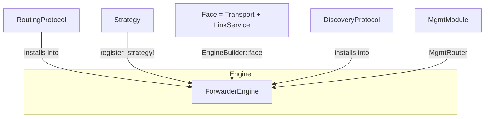

# Extend tier — protocol, strategy, and face authors

The Extend tier is the union of trait surfaces a protocol author
implements to plug a new routing algorithm, forwarding strategy, or
face transport into ndn-rs without forking the engine. It is not a
single crate: each trait lives next to the subsystem it extends.



## Trait inventory

| Trait | Crate path | Purpose |
|---|---|---|
| `Strategy` + `StrategyContext` + `ScheduledEvent` | `ndn_strategy::strategy` (`crates/ndn-strategy/src/strategy.rs:7`) | Forwarding-strategy contract; `schedule()` for timers. |
| `register_strategy!` macro | `ndn_strategy::registry` | `linkme`-backed registry; strategies auto-register. |
| `RoutingProtocol` + `RoutingHandle` | `ndn_engine::routing` (`crates/ndn-engine/src/routing.rs`) | Pluggable routing-plane; produces a typed `RoutingProtocolStatus`. |
| `InstallableProtocol` + `PostBuildQueue` | `ndn_engine::installable` (`crates/ndn-engine/src/installable.rs`) | "Install yourself into an `EngineBuilder`" trait. |
| `Transport` | `ndn_transport::transport` (`crates/ndn-transport/src/transport.rs`) | Raw byte send/recv. |
| `LinkService` + `LinkServiceFrame` | `ndn_transport::link_service` | NDNLPv2 framing, IncomingFaceId, congestion-mark policy. |
| `Face` = `Transport` + `LinkService` | `ndn_transport::face` (`crates/ndn-transport/src/face.rs:298`) | The composition the engine sees. |
| `DiscoveryProtocol` (+ contexts) | `ndn_discovery_core` (`crates/ndn-discovery-core/src/`) | Neighbor discovery contract. |
| `MgmtModule` + `MgmtContext` + `MgmtRouter` | `ndn_mgmt::module` (`crates/ndn-mgmt/src/module.rs`) | Per-module management verb authorship. |
| `NotificationStream` | `ndn_mgmt::notification` | Async notification dataset publisher. |
| `TrustPolicy` | `ndn_security::trust` (`crates/ndn-security/src/trust.rs`) | "Should this signing key be trusted for this name?" |
| `ValidationPolicy` | `ndn_security::validation_policy` | Pluggable verdict chain. |
| `Signer` / `Verifier` | `ndn_security::{signer, verifier}` | Crypto primitives. |


## Strategy {#strategy}

A `Strategy` decides which face an Interest goes out on and when it
retransmits. The contract lives at `crates/ndn-strategy/src/strategy.rs:7`.

```rust,ignore
use ndn_strategy::{Strategy, StrategyContext, register_strategy};
use ndn_packet::Interest;

pub struct RandomNexthopStrategy;

#[async_trait::async_trait]
impl Strategy for RandomNexthopStrategy {
    fn name(&self) -> &'static str { "/strategy/random" }

    async fn after_receive_interest(
        &self,
        ctx: &mut StrategyContext<'_>,
        interest: &Interest,
    ) {
        if let Some(face) = ctx.fib_lookup(interest.name()).random_nexthop() {
            ctx.send_interest(face, interest).await;
        }
    }
}

register_strategy!(RandomNexthopStrategy);
```

`register_strategy!` uses `linkme` to put the strategy into a
distributed slice. The engine reads the slice at startup; no manual
wiring is required.

In-tree references: `crates/ndn-strategy/src/best_route.rs`,
`crates/ndn-strategy/src/multicast.rs`, and
[`examples/strategy-custom/`](https://github.com/Quarmire/ndn-rs/tree/main/examples/strategy-custom).

## RoutingProtocol {#routingprotocol}

A `RoutingProtocol` produces FIB updates. It also reports a typed
`RoutingProtocolStatus` so the management plane can describe state
without parsing free-form strings.

In-tree references: `crates/ndn-routing/src/protocols/static.rs`
(static FIB), `…/nlsr/protocol.rs` (link-state),
`…/dv/...` (distance vector). The DV implementation uses the
typed status codes 201/202/204/206/208/210/301.

To install a routing protocol into an engine, implement
`InstallableProtocol`. `EngineBuilder::install(protocol)` then wires
it through. See `crates/ndn-engine/src/installable.rs`.

## Face {#face}

A `Face` is `Transport + LinkService`. The transport handles raw
bytes; the link service handles NDNLPv2 framing, fragmentation,
IncomingFaceId, and congestion marks.

```rust,ignore
use ndn_transport::{Transport, LinkService, Face, LpLinkService};

pub struct MyTransport { /* ... */ }
impl Transport for MyTransport { /* send / recv / close */ }

let face = Face::new(MyTransport { /* ... */ }, LpLinkService::default());
```

`LpLinkService` is the default link service (NDNLPv2). For raw
bytes-in-bytes-out, use `PassthroughLinkService`.

Twelve face transports ship in-tree; the catalog is in
[Face transports](../reference/face-transports.md). To add a new
transport, implement `Transport` and pick a link service.

In-tree references: `crates/ndn-face-native/src/{net,local,l2,serial}/`.

## DiscoveryProtocol

A `DiscoveryProtocol` brings neighbors to the routing plane. It owns
discovery state, exposes a `NeighborContext`, and may react to face
up/down via `FaceLifecycleContext`.

In-tree references: `crates/ndn-discovery-core/src/no_discovery.rs`
(zero-discovery default), the autoconf path in
`crates/ndn-discovery/src/`.

## MgmtModule

A `MgmtModule` answers `/localhost/nfd/<module>/<verb>` Interests for
a given module. The mgmt-router fans verbs out to modules based on
the second name component.

```rust,ignore
use ndn_mgmt::{MgmtModule, MgmtContext, MgmtRouter};

pub struct MyModule;

#[async_trait::async_trait]
impl MgmtModule for MyModule {
    fn module(&self) -> &'static str { "my-module" }

    async fn handle(&self, ctx: &mut MgmtContext<'_>) -> ndn_mgmt::Result<()> {
        match ctx.verb() {
            "list" => ctx.reply_dataset(/* ... */).await,
            _ => ctx.reply_control_error(404, "verb not found").await,
        }
    }
}
```

In-tree references: each verb has its own module file at
`crates/ndn-mgmt/src/modules/{faces,fib,rib,strategy,cs,forwarder_status,routing}.rs`.
The verb catalog itself is in [Management verbs](../reference/mgmt-verbs.md).

## Trust and validation

`TrustPolicy` answers "should this key sign that name?". The
`KeyChain` consults it before signing; the validator consults it
before accepting a verified `Data`. `ValidationPolicy` chains
verdicts so a deployment can compose hierarchical + LVS + custom
overrides.

In-tree references: `crates/ndn-security/src/trust.rs`,
`crates/ndn-security/src/validation_policy.rs`.
Concrete policies and the LVS rule schema: [Trust policies](../reference/trust-policies.md).

## Conventions

- Every Extend-tier trait has at least one in-tree reference impl.
  Grep for `impl <Trait> for ` to find one.
- Every Extend-tier trait has `///` docs on the trait and every
  required method, including preconditions, ownership, and threading.
- Extend-tier surfaces stay SemVer-stable across v0.1.x patches.

## See also

- [Writing a strategy](../guides/writing-a-strategy.md) — full walkthrough.
- [Implementing a face](../guides/implementing-a-face.md) — full walkthrough.
- [Instrument tier](./instrument.md) — researcher access below the
  Extend trait surface.
- [`examples/strategy-custom/`](https://github.com/Quarmire/ndn-rs/tree/main/examples/strategy-custom),
  [`examples/strategy-composed/`](https://github.com/Quarmire/ndn-rs/tree/main/examples/strategy-composed),
  [`examples/context-enricher/`](https://github.com/Quarmire/ndn-rs/tree/main/examples/context-enricher),
  [`examples/wasm-strategy/`](https://github.com/Quarmire/ndn-rs/tree/main/examples/wasm-strategy).
