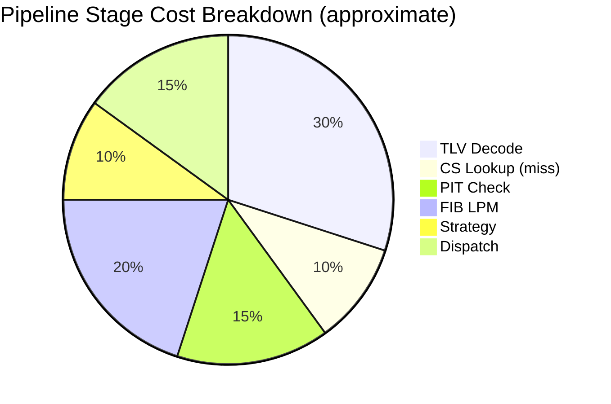
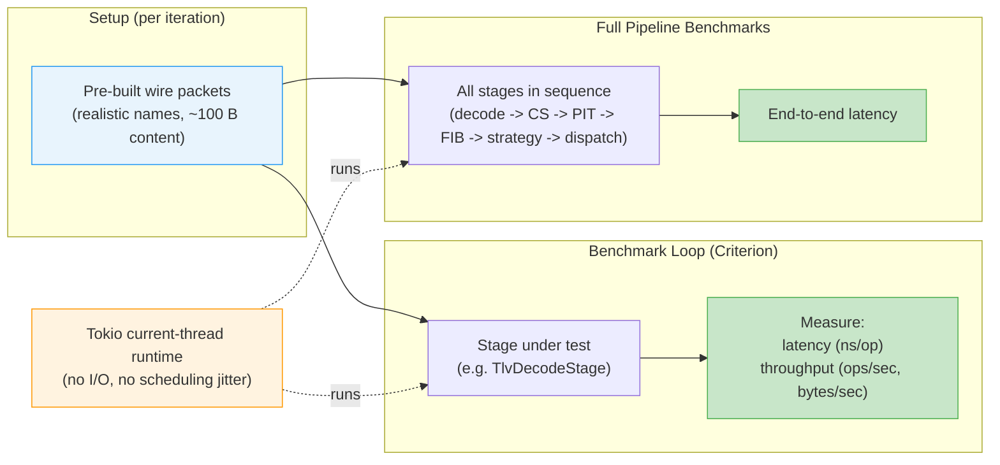

# Pipeline Benchmarks

ndn-rs ships a Criterion-based benchmark suite that measures individual pipeline stage costs and end-to-end forwarding latency. The benchmarks live in `crates/engine/ndn-engine/benches/pipeline.rs`.

## Running Benchmarks

```bash
# Run the full suite
cargo bench -p ndn-engine

# Run a specific benchmark group
cargo bench -p ndn-engine -- "cs/"
cargo bench -p ndn-engine -- "fib/lpm"
cargo bench -p ndn-engine -- "interest_pipeline"

# View HTML reports after a run
open target/criterion/report/index.html
```

Criterion generates HTML reports with statistical analysis, throughput charts, and comparison against previous runs in `target/criterion/`.

## Approximate Relative Cost of Pipeline Stages



The chart above shows approximate relative costs for a typical Interest pipeline traversal (CS miss path). TLV decode and FIB longest-prefix match dominate because they involve parsing variable-length names and traversing trie nodes. CS lookup on a miss and strategy execution are comparatively cheap. Actual proportions depend on name length, table sizes, and cache state -- run the benchmarks to get precise numbers for your workload.

## Benchmark Harness Architecture



## What Is Benchmarked

### TLV Decode

**Groups:** `decode/interest`, `decode/data`

Measures the cost of `TlvDecodeStage` -- parsing raw wire bytes into a decoded `Interest` or `Data` struct and setting `ctx.name`. Tested with 4-component and 8-component names to show scaling with name length.

Throughput is reported in bytes/sec to make comparisons across packet sizes meaningful.

### Content Store Lookup

**Group:** `cs`

- **`cs/hit`**: lookup of a name that exists in the CS. Measures the fast path where a cached Data is returned and the Interest pipeline short-circuits (no PIT or strategy involved).
- **`cs/miss`**: lookup of a name not in the CS. Measures the overhead added to every Interest that proceeds past the CS stage.

Uses a 64 MiB `LruCs` with a pre-populated entry for the hit case.

### PIT Check

**Group:** `pit`

- **`pit/new_entry`**: inserting a new PIT entry for a never-seen name. Uses a fresh PIT per iteration to isolate insert cost.
- **`pit/aggregate`**: second Interest with a different nonce hitting an existing PIT entry. This is the aggregation path where the Interest is suppressed (returned as `Action::Drop`).

### FIB Longest-Prefix Match

**Group:** `fib/lpm`

Measures LPM lookup time with 10, 100, and 1000 routes in the FIB. Routes have 2-component prefixes; the lookup name has 4 components (2 matching + 2 extra). This isolates trie traversal cost from name parsing.

### PIT Match (Data Path)

**Group:** `pit_match`

- **`pit_match/hit`**: Data arriving that matches an existing PIT entry. Seeds the PIT with a matching Interest, then measures the match and entry extraction.
- **`pit_match/miss`**: Data arriving with no matching PIT entry (unsolicited Data, dropped).

### CS Insert

**Group:** `cs_insert`

- **`cs_insert/insert_replace`**: steady-state replacement of an existing CS entry (same name, new Data). Measures the cost when the CS is warm.
- **`cs_insert/insert_new`**: inserting a unique name on each iteration. Measures cold-path cost including NameTrie node creation.

### Validation Stage

**Group:** `validation_stage`

- **`validation_stage/disabled`**: passthrough when no `Validator` is configured. Measures the baseline overhead of the stage itself.
- **`validation_stage/cert_via_anchor`**: full Ed25519 signature verification using a trust anchor. Includes schema check, key lookup, and cryptographic verify.

### Full Interest Pipeline

**Groups:** `interest_pipeline`, `interest_pipeline/cs_hit`

- **`interest_pipeline/no_route`**: decode + CS miss + PIT new entry. Stops before the strategy stage to isolate pure pipeline overhead. Tested with 4 and 8 component names.
- **`interest_pipeline/cs_hit`**: decode + CS hit. Measures the fast path where a cached Data satisfies the Interest immediately.

### Full Data Pipeline

**Group:** `data_pipeline`

Decode + PIT match + CS insert. Seeds the PIT with a matching Interest, then runs the full Data path. Tested with 4 and 8 component names. Throughput is reported in bytes/sec.

### Decode Throughput

**Group:** `decode_throughput`

Batch decoding of 1000 Interests in a tight loop. Reports throughput in elements/sec rather than latency, giving a peak-rate estimate for the decode stage.

## Benchmark Design Notes

- All async benchmarks use a **current-thread Tokio runtime** with no I/O, isolating CPU cost from scheduling jitter.
- Packet wire bytes are built with realistic name lengths (4 and 8 components) and ~100 B Data content.
- The PIT is cleared between iterations where noted to ensure consistent starting state.
- Each benchmark group uses Criterion's `Throughput` annotations so reports show both latency and throughput.

## Interpreting Results

Criterion reports **median** latency by default. Look for:

- **Regression alerts**: Criterion flags changes >5% from the baseline. CI uses a 10% threshold (see [Methodology](./methodology.md)).
- **Outliers**: high outlier percentages suggest contention or GC pauses. The current-thread runtime minimizes this.
- **Throughput numbers**: useful for capacity planning. If `decode_throughput` shows 2M Interest/sec, that is the ceiling before other stages are considered.

The HTML report at `target/criterion/report/index.html` includes violin plots, PDFs, and regression analysis for each benchmark.

### SHA-256 vs BLAKE3 in this bench

`signing/sha256-digest` uses `sha2::Sha256` (rustcrypto), which on
both x86_64 and aarch64 ships runtime CPUID dispatch through the
[`cpufeatures`](https://docs.rs/cpufeatures) crate and uses Intel
SHA-NI / ARMv8 SHA crypto when the CPU exposes them. **Effectively
every modern CI runner and consumer CPU does**, so the absolute
SHA-256 numbers in this table are SHA-NI numbers — there is no
practical "software SHA" baseline left to compare against.

That makes BLAKE3 a comparison between a hardware-accelerated SHA-256
and an AVX2/NEON-vectorised BLAKE3, and it shows: BLAKE3 is **not**
single-thread faster than SHA-256 on these CPUs at the input sizes a
typical NDN signed portion has (a few hundred bytes to a few KB). The
"BLAKE3 is 3–8× faster than SHA-256" claim refers to BLAKE3 vs *plain
software* SHA-256 — true on chips without SHA extensions, but no
longer the common case. See [Why BLAKE3](../deep-dive/why-blake3.md)
for the actual reasons ndn-rs supports BLAKE3 (Merkle-tree partial
verification of segmented Data, multi-thread hashing, single algorithm
for hash + MAC + KDF + XOF) — none of which are about raw single-
thread throughput.

## Latest CI Results

<!-- BENCH_RESULTS_START -->
*Last updated by CI on 2026-04-15 (ubuntu-latest, stable Rust)*

| Benchmark | Median | ± Variance |
|-----------|--------|------------|
| `cs/hit` | 768 ns | ±1 ns |
| `cs/miss` | 548 ns | ±14 ns |
| | | |
| `cs_insert/insert_new` | 10.00 µs | ±17.60 µs |
| `cs_insert/insert_replace` | 944 ns | ±2 ns |
| | | |
| `data_pipeline/4` | 1.88 µs | ±31 ns |
| `data_pipeline/8` | 2.27 µs | ±38 ns |
| | | |
| `decode/data/4` | 389 ns | ±0 ns |
| `decode/data/8` | 465 ns | ±0 ns |
| `decode/interest/4` | 443 ns | ±0 ns |
| `decode/interest/8` | 523 ns | ±1 ns |
| | | |
| `decode_throughput/4` | 458.85 µs | ±499 ns |
| `decode_throughput/8` | 537.84 µs | ±671 ns |
| | | |
| `fib/lpm/10` | 34 ns | ±0 ns |
| `fib/lpm/100` | 100 ns | ±0 ns |
| `fib/lpm/1000` | 98 ns | ±0 ns |
| | | |
| `interest_pipeline/cs_hit` | 915 ns | ±2 ns |
| `interest_pipeline/no_route/4` | 1.36 µs | ±6 ns |
| `interest_pipeline/no_route/8` | 1.52 µs | ±7 ns |
| | | |
| `large/blake3-rayon/hash/1MB` | 117.22 µs | ±1.90 µs |
| `large/blake3-rayon/hash/256KB` | 37.30 µs | ±566 ns |
| `large/blake3-rayon/hash/4MB` | 442.96 µs | ±4.96 µs |
| `large/blake3-single/hash/1MB` | 248.59 µs | ±697 ns |
| `large/blake3-single/hash/256KB` | 61.24 µs | ±165 ns |
| `large/blake3-single/hash/4MB` | 1.01 ms | ±2.36 µs |
| `large/sha256/hash/1MB` | 659.98 µs | ±466 ns |
| `large/sha256/hash/256KB` | 164.65 µs | ±91 ns |
| `large/sha256/hash/4MB` | 2.64 ms | ±1.02 µs |
| | | |
| `lru/evict` | 189 ns | ±1 ns |
| `lru/evict_prefix` | 2.09 µs | ±2.84 µs |
| `lru/get_can_be_prefix` | 295 ns | ±0 ns |
| `lru/get_hit` | 211 ns | ±2 ns |
| `lru/get_miss_empty` | 140 ns | ±0 ns |
| `lru/get_miss_populated` | 188 ns | ±0 ns |
| `lru/insert_new` | 1.99 µs | ±1.46 µs |
| `lru/insert_replace` | 374 ns | ±1 ns |
| | | |
| `name/display/components/4` | 452 ns | ±1 ns |
| `name/display/components/8` | 877 ns | ±4 ns |
| `name/eq/eq_match` | 37 ns | ±0 ns |
| `name/eq/eq_miss_first` | 2 ns | ±0 ns |
| `name/eq/eq_miss_last` | 37 ns | ±0 ns |
| `name/has_prefix/prefix_len/1` | 6 ns | ±0 ns |
| `name/has_prefix/prefix_len/4` | 20 ns | ±0 ns |
| `name/has_prefix/prefix_len/8` | 35 ns | ±1 ns |
| `name/hash/components/4` | 85 ns | ±1 ns |
| `name/hash/components/8` | 163 ns | ±0 ns |
| `name/parse/components/12` | 661 ns | ±3 ns |
| `name/parse/components/4` | 241 ns | ±4 ns |
| `name/parse/components/8` | 427 ns | ±1 ns |
| `name/tlv_decode/components/12` | 329 ns | ±0 ns |
| `name/tlv_decode/components/4` | 149 ns | ±2 ns |
| `name/tlv_decode/components/8` | 231 ns | ±0 ns |
| | | |
| `pit/aggregate` | 2.30 µs | ±126 ns |
| `pit/new_entry` | 1.24 µs | ±4 ns |
| | | |
| `pit_match/hit` | 1.60 µs | ±3 ns |
| `pit_match/miss` | 1.89 µs | ±26 ns |
| | | |
| `sharded/get_hit/1` | 225 ns | ±0 ns |
| `sharded/get_hit/16` | 224 ns | ±1 ns |
| `sharded/get_hit/4` | 225 ns | ±0 ns |
| `sharded/get_hit/8` | 223 ns | ±0 ns |
| `sharded/insert/1` | 2.59 µs | ±1.68 µs |
| `sharded/insert/16` | 1.85 µs | ±1.54 µs |
| `sharded/insert/4` | 2.55 µs | ±1.81 µs |
| `sharded/insert/8` | 1.99 µs | ±1.63 µs |
| | | |
| `signing/blake3-keyed/sign_sync/100B` | 183 ns | ±0 ns |
| `signing/blake3-keyed/sign_sync/1KB` | 1.20 µs | ±1 ns |
| `signing/blake3-keyed/sign_sync/2KB` | 2.40 µs | ±2 ns |
| `signing/blake3-keyed/sign_sync/4KB` | 3.53 µs | ±59 ns |
| `signing/blake3-keyed/sign_sync/500B` | 617 ns | ±0 ns |
| `signing/blake3-keyed/sign_sync/8KB` | 4.79 µs | ±3 ns |
| `signing/blake3-plain/sign_sync/100B` | 188 ns | ±1 ns |
| `signing/blake3-plain/sign_sync/1KB` | 1.21 µs | ±1 ns |
| `signing/blake3-plain/sign_sync/2KB` | 2.40 µs | ±3 ns |
| `signing/blake3-plain/sign_sync/4KB` | 3.53 µs | ±212 ns |
| `signing/blake3-plain/sign_sync/500B` | 623 ns | ±0 ns |
| `signing/blake3-plain/sign_sync/8KB` | 4.79 µs | ±3 ns |
| `signing/ed25519/sign_sync/100B` | 20.61 µs | ±1.29 µs |
| `signing/ed25519/sign_sync/1KB` | 24.06 µs | ±937 ns |
| `signing/ed25519/sign_sync/2KB` | 27.91 µs | ±59 ns |
| `signing/ed25519/sign_sync/4KB` | 34.98 µs | ±69 ns |
| `signing/ed25519/sign_sync/500B` | 22.11 µs | ±37 ns |
| `signing/ed25519/sign_sync/8KB` | 50.06 µs | ±708 ns |
| `signing/hmac/sign_sync/100B` | 265 ns | ±0 ns |
| `signing/hmac/sign_sync/1KB` | 829 ns | ±0 ns |
| `signing/hmac/sign_sync/2KB` | 1.49 µs | ±3 ns |
| `signing/hmac/sign_sync/4KB` | 2.73 µs | ±10 ns |
| `signing/hmac/sign_sync/500B` | 506 ns | ±0 ns |
| `signing/hmac/sign_sync/8KB` | 5.26 µs | ±3 ns |
| `signing/sha256-digest/sign_sync/100B` | 102 ns | ±1 ns |
| `signing/sha256-digest/sign_sync/1KB` | 664 ns | ±0 ns |
| `signing/sha256-digest/sign_sync/2KB` | 1.30 µs | ±7 ns |
| `signing/sha256-digest/sign_sync/4KB` | 2.54 µs | ±2 ns |
| `signing/sha256-digest/sign_sync/500B` | 339 ns | ±0 ns |
| `signing/sha256-digest/sign_sync/8KB` | 5.07 µs | ±3 ns |
| | | |
| `validation/cert_missing` | 194 ns | ±6 ns |
| `validation/schema_mismatch` | 145 ns | ±0 ns |
| `validation/single_hop` | 42.38 µs | ±61 ns |
| | | |
| `validation_stage/cert_via_anchor` | 43.41 µs | ±2.35 µs |
| `validation_stage/disabled` | 648 ns | ±0 ns |
| | | |
| `verification/blake3-keyed/verify/100B` | 299 ns | ±4 ns |
| `verification/blake3-keyed/verify/1KB` | 1.31 µs | ±3 ns |
| `verification/blake3-keyed/verify/2KB` | 2.51 µs | ±1 ns |
| `verification/blake3-keyed/verify/4KB` | 3.65 µs | ±5 ns |
| `verification/blake3-keyed/verify/500B` | 732 ns | ±0 ns |
| `verification/blake3-keyed/verify/8KB` | 4.91 µs | ±3 ns |
| `verification/blake3-plain/verify/100B` | 303 ns | ±0 ns |
| `verification/blake3-plain/verify/1KB` | 1.32 µs | ±2 ns |
| `verification/blake3-plain/verify/2KB` | 2.51 µs | ±2 ns |
| `verification/blake3-plain/verify/4KB` | 3.64 µs | ±87 ns |
| `verification/blake3-plain/verify/500B` | 737 ns | ±0 ns |
| `verification/blake3-plain/verify/8KB` | 4.91 µs | ±7 ns |
| `verification/ed25519/verify/100B` | 42.46 µs | ±128 ns |
| `verification/ed25519/verify/1KB` | 44.66 µs | ±66 ns |
| `verification/ed25519/verify/2KB` | 46.18 µs | ±57 ns |
| `verification/ed25519/verify/4KB` | 50.18 µs | ±95 ns |
| `verification/ed25519/verify/500B` | 43.91 µs | ±58 ns |
| `verification/ed25519/verify/8KB` | 58.58 µs | ±432 ns |
| `verification/sha256-digest/verify/100B` | 103 ns | ±0 ns |
| `verification/sha256-digest/verify/1KB` | 664 ns | ±0 ns |
| `verification/sha256-digest/verify/2KB` | 1.30 µs | ±0 ns |
| `verification/sha256-digest/verify/4KB` | 2.55 µs | ±1 ns |
| `verification/sha256-digest/verify/500B` | 340 ns | ±0 ns |
| `verification/sha256-digest/verify/8KB` | 5.08 µs | ±3 ns |
<!-- BENCH_RESULTS_END -->
