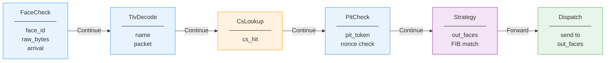
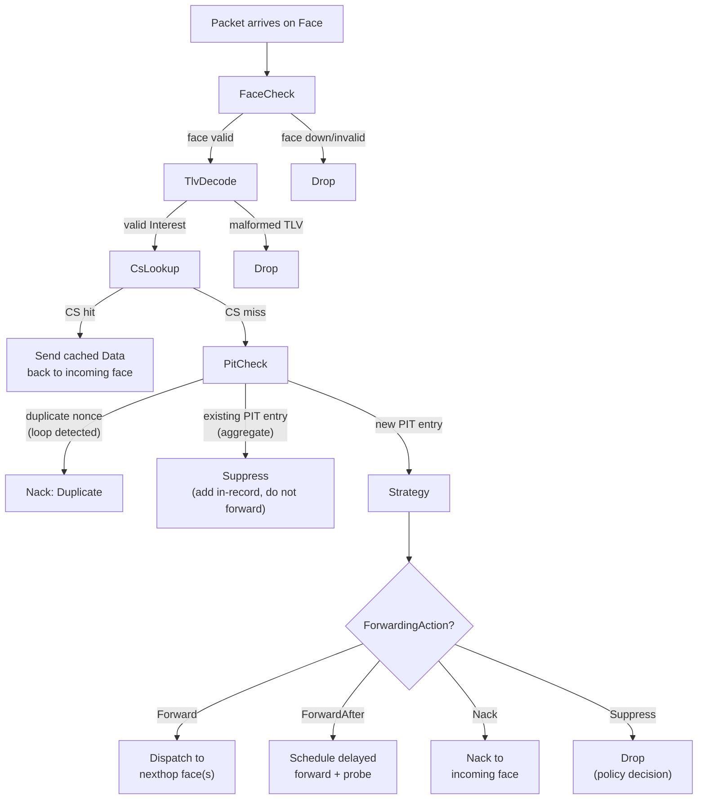
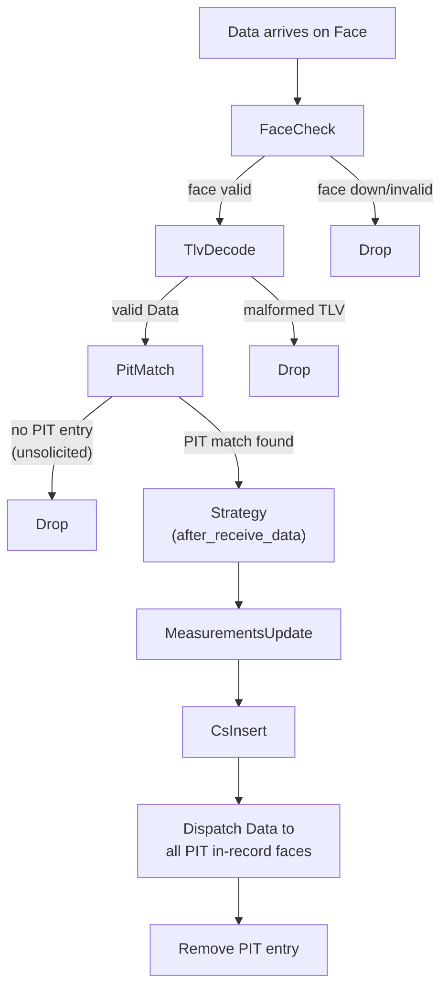
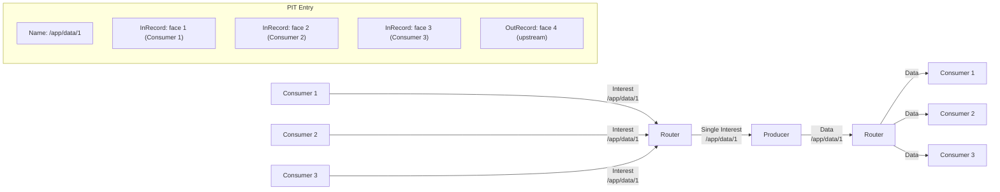

# Interest and Data Lifecycle

Every NDN packet that enters ndn-rs follows a carefully choreographed journey. Let's trace an Interest from the moment it arrives as raw bytes to the moment matching Data flows back to the consumer.

## The Pipeline Machine

At the core of this journey is a pipeline -- a fixed sequence of `PipelineStage` trait objects determined at build time so the compiler can monomorphize the hot path. A runner loop drains a shared `mpsc` channel fed by all face tasks, picks up each packet, and drives it through the appropriate pipeline. There are no hidden callbacks or middleware chains; the runner simply matches on the `Action` returned by each stage and decides what happens next.

> **💡 Key insight:** `PacketContext` is passed **by value** (moved) through each stage. This means ownership transfers at every step -- a stage that short-circuits the pipeline *consumes* the context, and the compiler prevents any subsequent stage from accidentally using it. In C++, this invariant would require runtime checks; in Rust, it is a compile-time guarantee.

The stage contract is minimal:

```rust
pub trait PipelineStage: Send + Sync + 'static {
    fn process(
        &self,
        ctx: PacketContext,
    ) -> impl Future<Output = Result<Action, DropReason>> + Send;
}
```

And the `Action` enum gives each stage explicit control over what comes next:

```rust
pub enum Action {
    Continue(PacketContext),  // pass to next stage
    Send(PacketContext, SmallVec<[FaceId; 4]>),  // forward and exit
    Satisfy(PacketContext),   // satisfy PIT entries and exit
    Drop(DropReason),        // discard silently
    Nack(PacketContext, NackReason),  // send Nack to incoming face
}
```

## The Traveling Context

Before we follow a packet through the pipeline, it helps to understand what it carries. A `PacketContext` is born the moment bytes arrive on a face, and it accumulates information as each stage does its work:

```rust
pub struct PacketContext {
    pub raw_bytes: Bytes,              // original wire bytes
    pub face_id:   FaceId,            // face the packet arrived on
    pub name:      Option<Arc<Name>>,  // None until TlvDecodeStage
    pub packet:    DecodedPacket,      // Raw -> Interest/Data after decode
    pub pit_token: Option<PitToken>,   // set by PitCheckStage
    pub out_faces: SmallVec<[FaceId; 4]>,  // populated by StrategyStage
    pub lp_pit_token: Option<Bytes>,  // LP PIT token echoed in responses
    pub cs_hit:    bool,
    pub verified:  bool,
    pub arrival:   u64,                // ns since Unix epoch
    pub tags:      AnyMap,             // extensible per-packet metadata
}
```

Notice that `name` starts as `None` -- it won't be populated until the TLV decode stage runs. This progressive population is deliberate: a Content Store hit can short-circuit the pipeline before expensive fields like nonce or lifetime are ever accessed.



Now let's follow an Interest through the full journey.

## The Interest's Journey

An Interest packet materializes on a face -- perhaps a UDP datagram from a downstream consumer, or bytes pushed through an in-process `AppFace`. Its journey begins.



### First contact: FaceCheck

The very first thing the forwarder does is verify that the face the packet arrived on is still alive. If the face has been torn down or is in the process of shutting down, there's no point proceeding -- the packet is dropped immediately. This is a cheap guard that prevents stale packets from wasting pipeline resources.

### Making sense of the bytes: TlvDecode

With the face confirmed, the raw `Bytes` are parsed into a typed `Interest` struct. The context's `name` field is populated with an `Arc<Name>`, giving subsequent stages a shared, zero-copy reference to the packet's identity. Malformed TLV drops the packet here.

> **🔧 Implementation note:** Fields like nonce and lifetime are decoded lazily via `OnceLock<T>`. They sit dormant inside the Interest struct, only computed when a later stage actually reads them. If the pipeline short-circuits before that happens, the CPU cycles are never spent.

### The fast path: CsLookup

Now comes the moment that can make the entire rest of the pipeline irrelevant. The forwarder checks its Content Store for a cached Data packet matching this Interest's name. If one is found, the cached wire-format `Bytes` are sent directly back to the incoming face. The pipeline short-circuits -- no PIT entry is created, no FIB lookup occurs, no upstream forwarding happens.

> **📊 Performance:** The CS short-circuit is the single most important optimization in the pipeline. A cache hit skips PIT insertion, FIB lookup, strategy invocation, and upstream forwarding -- reducing a multi-stage pipeline to a hash lookup and a reference-count increment. With lazy `OnceLock` decoding, even the Interest's nonce and lifetime fields are never parsed on this path.

### Tracking the request: PitCheck

On a cache miss, the Interest reaches the Pending Interest Table. Here the forwarder must answer three questions at once. Has this exact Interest been seen before with the same nonce? If so, there's a forwarding loop -- the packet is Nacked with `Duplicate`. Is there already an outstanding PIT entry for this name from a different consumer? If so, the Interest is *aggregated*: its face is added as an in-record to the existing entry, but no new upstream Interest is sent. This is the mechanism behind NDN's built-in multicast efficiency. Only if the entry is genuinely new does the Interest proceed to the next stage.

### Deciding where to go: Strategy

For a fresh Interest that needs forwarding, the forwarder performs a longest-prefix match against the FIB to discover nexthop faces, then invokes the strategy assigned to that prefix. The strategy receives an immutable `StrategyContext` -- it can observe the forwarder's state but cannot mutate it -- and returns a forwarding decision:

```rust
pub enum ForwardingAction {
    Forward(SmallVec<[FaceId; 4]>),
    ForwardAfter { faces: SmallVec<[FaceId; 4]>, delay: Duration },
    Nack(NackReason),
    Suppress,
}
```

`Forward` sends the Interest immediately. `ForwardAfter` enables probe-and-fallback patterns without the strategy needing to spawn its own timers -- the forwarder handles the scheduling. `Nack` and `Suppress` end the journey here.

> **⚠️ Strategy isolation:** Strategies cannot mutate global state. They receive a read-only snapshot and return a decision. This makes strategies safe to swap at runtime and prevents a buggy strategy from corrupting the FIB or PIT.

### The final hop: Dispatch

The Interest is sent out on the selected nexthop face(s), and out-records are created in the PIT entry to track when each was sent. The Interest is now in flight, and the forwarder waits for a response.

## The Satisfying Return: Data Pipeline

Somewhere upstream -- perhaps one hop away, perhaps many -- a producer or another router's cache generates a Data packet matching the Interest. That Data now makes its way back through the network to our router.



The Data's journey begins with the same FaceCheck and TlvDecode stages that every packet passes through. But after decoding, the paths diverge.

### Finding who asked: PitMatch

The forwarder looks up the PIT for an entry matching this Data's name. If no entry exists, the Data is *unsolicited* -- nobody asked for it, so it is dropped. This is a fundamental NDN security property: routers only accept Data that was explicitly requested. When a match is found, the PIT entry reveals which downstream faces are waiting for this content.

### Learning from success: Strategy and Measurements

The strategy is notified that Data arrived via `after_receive_data`. This allows it to update its internal state -- mark a path as working, cancel retransmission timers, adjust preferences. Then the `MeasurementsUpdate` stage computes per-face, per-prefix statistics: EWMA RTT (derived from the gap between the out-record's send timestamp and this Data's arrival) and satisfaction rate. These measurements feed back into future strategy decisions, letting the forwarder learn which paths perform best.

> **📊 Performance:** Measurements are stored in a `DashMap`-backed `MeasurementsTable`, so updating statistics for one prefix never blocks lookups for another. The EWMA computation is a single multiply-and-add -- negligible cost for valuable routing intelligence.

### Caching for the future: CsInsert

Before the Data reaches its final recipients, it is inserted into the Content Store. The wire-format `Bytes` are stored directly -- no re-encoding -- so future cache hits can be served as zero-copy sends. The `FreshnessPeriod` is decoded once at insert time to compute a `stale_at` timestamp.

### Delivering the payload: Dispatch

Finally, the Data is sent to every face listed in the PIT entry's in-records. If three consumers requested the same content, all three receive it now. The PIT entry is consumed -- removed from the table -- and the lifecycle is complete.

## The Power of Aggregation

The interplay between the Interest and Data pipelines reveals one of NDN's most powerful properties. When multiple consumers request the same data, the PIT aggregates their Interests so that only a single Interest is forwarded upstream. When the Data returns, it fans out to all of them:

> **💡 Key insight:** PIT aggregation is what makes NDN inherently multicast-friendly. Three consumers requesting the same video segment generate only *one* upstream Interest and *one* Data packet over the bottleneck link. The router's PIT entry fans the Data out locally. This is fundamentally different from IP, where each consumer opens a separate connection and the same data traverses the network three times.



Consumer 1's Interest arrives first and creates a new PIT entry. Consumer 2's Interest for the same name finds the existing entry and is aggregated -- an in-record is added, but no second Interest goes upstream. Consumer 3 is aggregated the same way. When the Data returns, the forwarder reads all three in-records and delivers the Data to each consumer. One upstream packet, three downstream deliveries.

## When Things Go Wrong: The Nack Pipeline

Not every Interest finds its Data. Sometimes there is no route in the FIB. Sometimes the upstream path is congested. Sometimes the producer is unreachable. NDN handles these failures with Network Nacks -- negative acknowledgements that flow back toward the consumer.

Nacks can be generated at two points in the Interest pipeline. A strategy that finds no viable nexthop returns `ForwardingAction::Nack(reason)`, and any pipeline stage can return `Action::Nack(ctx, reason)` to signal a problem. The `PitCheck` stage does this when it detects a loop via duplicate nonce.

When a Nack arrives *from* upstream, it follows a shortened pipeline: decode, PIT match, and strategy notification. The strategy then faces a choice -- try an alternative nexthop if one exists, or propagate the Nack downstream to the consumer. If no alternatives remain, the Nack flows back to every face in the PIT entry's in-records, and the entry is removed.

> **⚠️ Nack propagation is conservative:** A strategy will exhaust all available nexthops before propagating a Nack downstream. Only when every path has failed does the consumer learn that its Interest cannot be satisfied. This gives the network maximum opportunity to find the data through alternative routes.

## The Full Picture

The two pipelines are symmetric and complementary. Interests flow upstream from consumer toward producer, driven by the FIB. Data flows downstream from producer toward consumer, guided by the PIT entries that Interests left behind. The Content Store sits at the junction, short-circuiting the loop when it can. And the strategy system ties it all together, learning from every Data arrival and every Nack to make better forwarding decisions over time.

This is the packet lifecycle in ndn-rs: a pipeline that is small enough to reason about stage by stage, yet powerful enough to express multicast aggregation, in-network caching, and adaptive forwarding -- all without a single IP address in sight.
