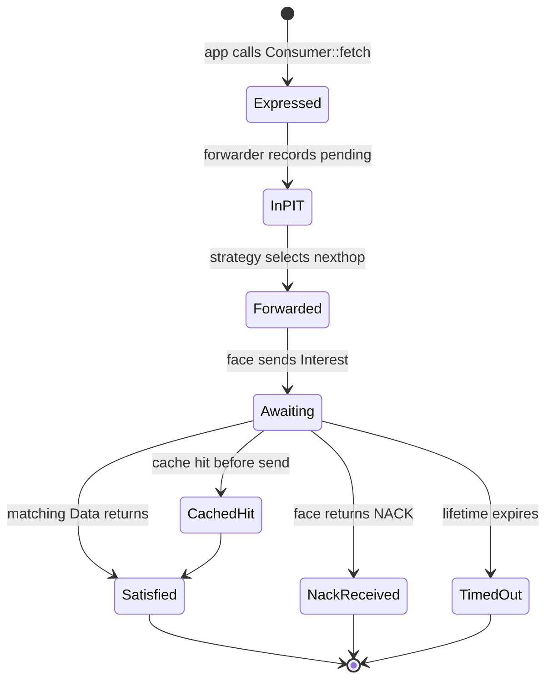
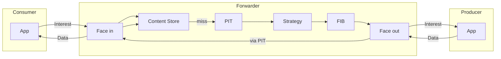

# Interest and Data lifecycle

This page traces an Interest from the application that expresses it
to the producer that answers it, and the Data back along the
reverse path. The three tables that govern the trip — PIT, FIB,
Content Store — are introduced as they appear.

## The state machine

```mermaid
%% In stateDiagram-v2 a transition label ends at the first ':', so a
%% literal '::' reparses and errors. #58; is the colon entity → 'Consumer::fetch'.
stateDiagram-v2
    [*] --> Expressed: app calls Consumer#58;#58;fetch
    Expressed --> InPIT: forwarder records pending
    InPIT --> Forwarded: strategy selects nexthop
    Forwarded --> Awaiting: face sends Interest
    Awaiting --> Satisfied: matching Data returns
    Awaiting --> CachedHit: cache hit before send
    Awaiting --> NackReceived: face returns NACK
    Awaiting --> TimedOut: lifetime expires
    CachedHit --> Satisfied
    Satisfied --> [*]
    NackReceived --> [*]
    TimedOut --> [*]
```

Every arrow is a public observable: `Consumer::fetch` resolves on
the `Satisfied`, `NackReceived`, or `TimedOut` transitions. The
state itself lives in the forwarder's PIT.

## The data flow

```mermaid
graph LR
    subgraph Consumer
        C[App]
    end
    subgraph Forwarder
        ICS[Content Store]
        PIT[PIT]
        FIB[FIB]
        STR[Strategy]
        IFC[Face in]
        OFC[Face out]
    end
    subgraph Producer
        P[App]
    end
    C -->|Interest| IFC --> ICS
    ICS -->|miss| PIT
    PIT --> STR
    STR --> FIB
    FIB --> OFC
    OFC -->|Interest| P
    P -->|Data| OFC
    OFC -->|via PIT| IFC
    IFC --> ICS
    IFC -->|Data| C
```

That's the only diagram pair in the wiki (state + flow, both on
this page) — every other page sticks to one.

## PIT — Pending Interest Table

Indexed by name. Each entry records every face that has expressed an
Interest for this name and is still waiting. When a `Data` arrives,
the PIT entry is consumed: the `Data` is sent out on every recorded
face, the entry is removed.

ndn-rs's PIT is a `DashMap` (`crates/forwarding/ndn-store/src/pit.rs`). No
global lock on the hot path. The PIT entry is consulted via the
`Pit` accessor from the [Instrument tier](../api/instrument.md).

The PIT is what makes NDN naturally multicast: ten consumers
asking for the same name leave one PIT entry; the producer's Data
satisfies all ten in-records in a single fan-out.

One `Data` can satisfy *several* PIT entries at once — an exact-name
entry plus any `CanBePrefix` entry at a shorter prefix. All matching
entries are satisfied and the union of their downstream faces is served
(deduplicated by face), matching NFD's `findAllDataMatches`.

Forwarded `Data` is not echoed back out the face it arrived on — except
on an **ad-hoc** link (`LinkType::AdHoc`), where re-radiating onto the
shared medium is how other listeners hear it. This is what lets a single
broadcast face act as a relay for the neighbours behind it.

## FIB — Forwarding Information Base

Indexed by name prefix. Each entry lists the faces the forwarder
will consider for Interests under that prefix. The `Strategy`
chooses which face (or faces) to use; the FIB is the candidate set.

Routes land in the FIB via:

- `Producer::publish_object` (the producer announces a prefix to its
  local forwarder).
- A `RoutingProtocol` impl (NLSR, DV, static — see
  [Extend tier](../api/extend.md#routingprotocol)).
- Operator `nfdc register` over the management protocol.

## Content Store

A bounded cache of `Data` packets. The forwarder consults the CS
before the PIT: if the requested name (subject to `MustBeFresh`) is
in the cache, the cached `Data` is returned and the Interest never
needs to leave the forwarder.

ndn-rs's default Content Store is LRU; the `ContentStore` trait
allows custom impls. See `crates/forwarding/ndn-store/`.

**Unsolicited Data** — `Data` that arrives with no matching PIT entry
(e.g. overheard on a broadcast medium) — is dropped by default. The
`UnsolicitedDataPolicy` knob (`[cs] unsolicited_policy`, or
`EngineBuilder::unsolicited_data_policy`) can opt to cache it instead:
`admit-network` is the choice for a broadcast/ad-hoc bearer, so a later
Interest is served locally. Admitted Data is cached only (never
forwarded) and still must pass validation before entering the CS.

## Strategy decisions

When the FIB has nexthops, the strategy decides:

- Which face(s) to send the Interest on.
- Whether to retransmit, and when (via `Strategy::schedule`).
- How to react to NACKs and timeouts.

Strategies that ship in-tree: `BestRouteStrategy` (probe primary,
fall back to secondaries), `MulticastStrategy` (send everywhere
matching the FIB), `ComposedStrategy` (chain strategies by prefix).

## Where to set things

| You want to… | Reach for |
|---|---|
| Express an Interest from app code | `Consumer::fetch` / `fetch_object` |
| Serve Data from app code | `Producer::publish_object` |
| Install a route by hand | `ndn-ctl route add <prefix> <nexthop>` |
| See what's in the PIT/FIB/CS | Instrument tier `engine.pit() / fib() / cs()` |
| Replace the strategy under a prefix | `ndn-ctl strategy set <prefix> <strategy>` |

## See also

- [NDN overview](./ndn-overview.md) — names, signing, trust.
- [Develop tier](../api/develop.md) — `Consumer` and `Producer`.
- [Extend tier](../api/extend.md#strategy) — `Strategy` contract.
- [Management verbs](../reference/mgmt-verbs.md) — `nfdc` / `ndn-ctl` verbs.
