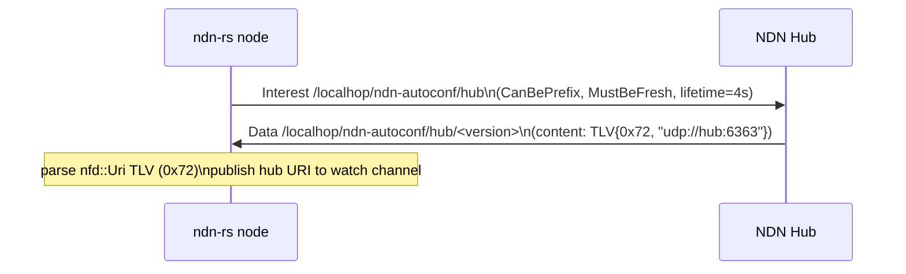
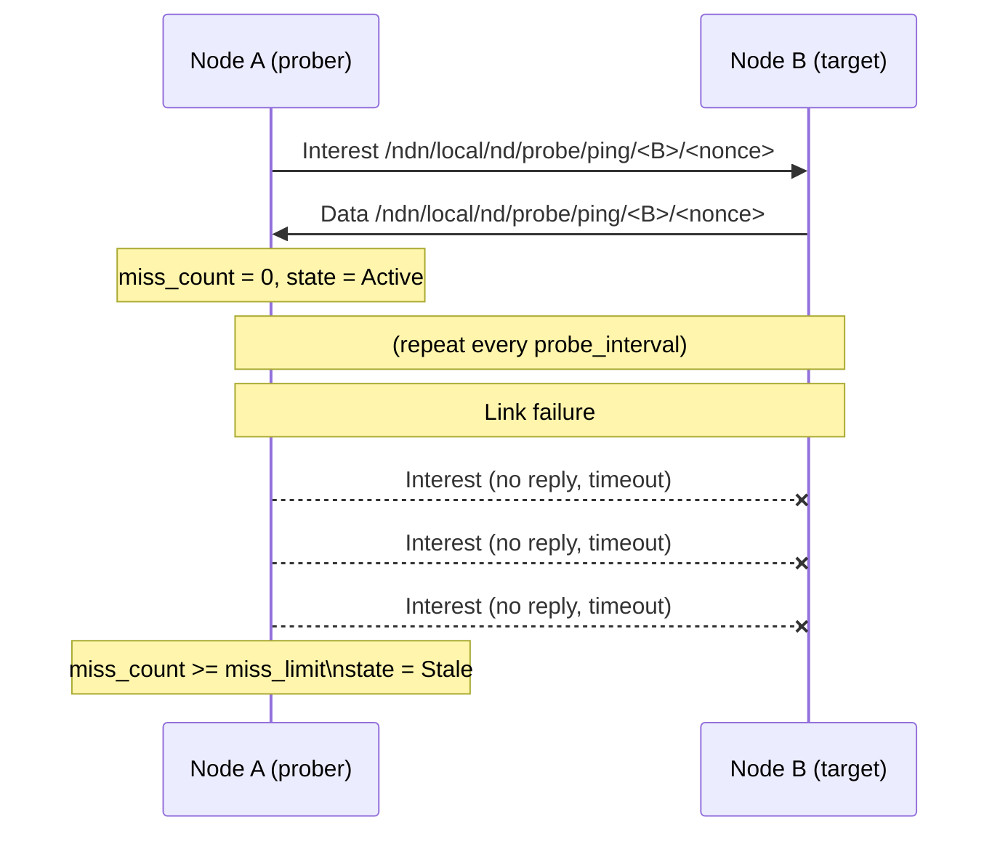
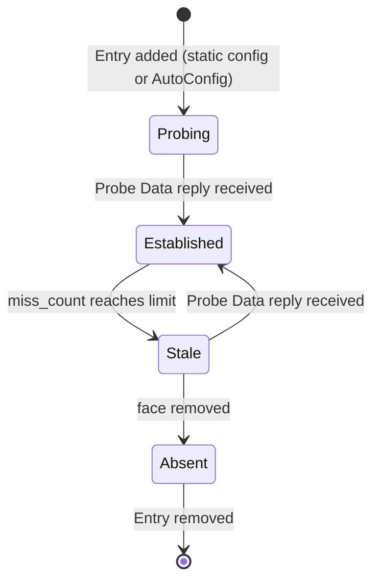

# Discovery Protocols

## Finding Neighbors and Content in Named Data Networking

When an ndn-fwd starts up it knows nothing about its surroundings.  It has faces
configured — a UDP socket, a raw Ethernet interface, or a shared-memory channel
— but no idea who else is reachable.  Discovery in ndn-rs solves this in two
layers: first find a hub or neighbor, then learn what content they serve.

## The Discovery Trait

All discovery protocols share a single interface.  `DiscoveryProtocol` lets the
engine call into any implementation at well-defined points — when faces come up,
when packets arrive, and on periodic ticks.

```rust
trait DiscoveryProtocol: Send + Sync {
    fn protocol_id(&self) -> ProtocolId;
    fn claimed_prefixes(&self) -> &[Name];
    fn tick_interval(&self) -> Duration;

    fn on_face_up(&self, face_id: FaceId, ctx: &dyn DiscoveryContext);
    fn on_face_down(&self, face_id: FaceId, ctx: &dyn DiscoveryContext);
    fn on_inbound(&self, raw: &Bytes, incoming_face: FaceId, meta: &InboundMeta,
                  ctx: &dyn DiscoveryContext) -> bool;
    fn on_tick(&self, now: Instant, ctx: &dyn DiscoveryContext);
}
```

The engine calls `on_inbound` after TLV decode but _before_ the forwarding
pipeline.  If a protocol returns `true`, the packet is consumed and never enters
the Interest/Data pipeline.

Multiple protocols run simultaneously via `CompositeDiscovery`, which fans out
every callback to each registered protocol and routes inbound packets by claimed
name prefix.

## Layer 1: Hub Discovery and Neighbor Liveness

### NDN AutoConfig (hub discovery)

NDN AutoConfig is the spec-defined mechanism for finding a gateway router ("hub")
when no static configuration is provided.  It proceeds in stages, trying each
until one succeeds:

**Stage 1 — Multicast** (implemented):  
Issue `/localhop/ndn-autoconf/hub` on every face with `CanBePrefix=true`,
`MustBeFresh=true`, `InterestLifetime=4 s`.  A hub running
`ndn-autoconfig-server` replies with a versioned Data containing its FaceUri in
a `nfd::Uri` TLV (type 0x72).

Reference: `NFD/tools/ndn-autoconfig/multicast-discovery.cpp:38,131-133` (Interest),
`NFD/tools/ndn-autoconfig-server/program.cpp:56` (Data content format).

**Stage 3 — NDN-FCH** (implemented, optional):  
HTTP GET to a configured NDN-FCH URL; response body is the hub hostname (plain
text).  The client prepends `udp://` to form the FaceUri.

Reference: `NFD/tools/ndn-autoconfig/ndn-fch-discovery.cpp:141-196`.

**Stages 2, 4** (DNS-SRV, identity-name) — deferred; require OS DNS resolver
and keychain integration respectively.

The `AutoConfigDiscovery` struct implements `DiscoveryProtocol`:

```rust
// Create hub-discovery protocol, optionally with NDN-FCH fallback.
let autoconfig = AutoConfigDiscovery::with_fch(Some("http://ndn-fch.named-data.net/".into()));
let hub_rx = autoconfig.hub_uri_rx(); // watch::Receiver<Option<String>>

// Add to the composite and start the engine.
// When a hub replies, hub_rx fires with Some("udp://hub.example.com:6363").
```

The protocol is stateless across restarts — it retries multicast hub discovery
every 30 s until a hub is found.



### Neighbor Liveness Probe

Once neighbors are known (via static configuration or hub connection), their
reachability is monitored with an Interest-based probe exchange:

- **Probe Interest**: `/ndn/local/nd/probe/ping/<neighbor_name>/<nonce>`
- **Probe Data**: same name, `DigestSha256`, `FreshnessPeriod=0`
- Three consecutive missed replies transition the neighbor to `Stale`.

The `NeighborProbeProtocol` implements `DiscoveryProtocol` and:

1. Claims `/ndn/local/nd/probe/ping` — both incoming probe Interests for the
   local node (replies are sent automatically) and probe Data responses from
   neighbors route through the same claimed prefix.
2. Tracks per-neighbor probe state (nonce, miss count, last probe time) in a
   local `HashMap` separate from the engine's `NeighborTable`.
3. Emits `NeighborUpdate::SetState` transitions on the shared neighbor table.



### Combining Both

```rust
let composite = CompositeDiscovery::new(vec![
    Arc::new(AutoConfigDiscovery::new()),
    Arc::new(NeighborProbeProtocol::new(
        local_name.clone(),
        Duration::from_secs(10), // probe_interval
        3,                        // miss_limit
    )),
    Arc::new(SvsServiceDiscovery::new(...)),
]).unwrap();
```

## The Neighbor Lifecycle

As probes succeed and fail, each neighbor transitions through well-defined states:



The neighbor table is engine-owned, not protocol-owned.  It survives protocol
swaps at runtime and is shared across all simultaneous discovery protocols.

```rust
pub struct NeighborEntry {
    pub node_name: Name,
    pub state: NeighborState,
    /// (face_id, source_mac, interface_name) — peer may be multi-homed.
    pub faces: Vec<(FaceId, MacAddr, String)>,
    pub rtt_us: Option<u32>,
    pub pending_nonce: Option<u32>,
}
```

All mutations go through `NeighborUpdate` variants applied via
`DiscoveryContext::update_neighbor` — no partial updates.

## Layer 2: What Content Do They Serve?

Once neighbors are established, `ServiceDiscoveryProtocol` handles the second
layer.  Producers publish `ServiceRecord`s; the protocol disseminates them via
browse Interests to `/ndn/local/sd/services/`.

When a service record arrives, the protocol auto-populates the FIB:

```
Producer publishes /app/video
→ Browse Data reaches Router
→ FIB: /app/video → face_to_producer
→ Consumer's Interest for /app/video/frame/1 is forwarded automatically
```

SVS sync (`SvsServiceDiscovery`) can push record changes to all group members
via `/ndn/local/sd/updates/` without polling.

## What Was Removed

The previous `EpidemicGossip` implementation disseminated neighbor membership
via pull-gossip (Interest → neighbor-list snapshot Data).  This had no NDN
analog: reachability in NDN is carried by the routing protocol (NLSR/DV) via
LSA propagation, not a separate gossip layer.  `EpidemicGossip` has been
removed.

The SWIM hello machinery (`hello/` directory) remains for backward compatibility
while `ndn-faces` and `ndn-mobile` migrate to `NeighborProbeProtocol`.  It is
not the spec-aligned path.

## Runtime Configuration

Probe timing can be tuned at protocol construction:

| Parameter | Description |
|-----------|-------------|
| `probe_interval` | How often to send a probe to each neighbor |
| `miss_limit` | Consecutive missed probes before `Stale` |

AutoConfig retry interval is fixed at 30 s.

## See Also

- [Routing Protocols](../protocols/nlsr.md) — NLSR neighbor liveness is separate
  from this discovery layer (routing protocol level, not forwarder level)
- `docs/notes/g06-autoconfig-design-2026-05-08.md` — design rationale and wire
  format citations
