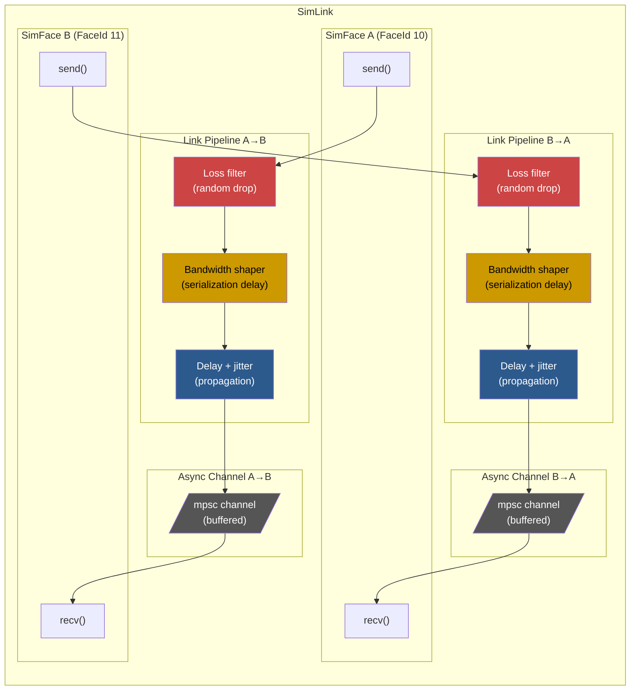
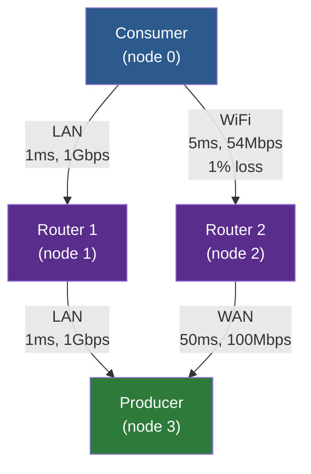

# Simulation

## The Problem: Testing Distributed Protocols Without Distributed Hardware

How do you test a distributed networking protocol without deploying real hardware? The NDN research community's answer has been Mini-NDN, which uses Mininet to spin up heavyweight OS-level containers -- each running its own forwarder process, its own IP stack, its own filesystem. It works, but it's slow to set up, hard to reproduce exactly, and nearly impossible to step through with a debugger when something goes wrong at the protocol level.

ndn-rs takes a different approach: simulate the entire network in a single process.

The `ndn-sim` crate creates virtual forwarder nodes connected by virtual links, all running cooperatively on the Tokio runtime. Each node is a real `ForwarderEngine` -- the exact same code that runs in production -- but its faces are backed by async channels instead of sockets. The links between nodes model real-world impairments: propagation delay, bandwidth limits, random loss, jitter. Because everything runs in one process with one address space, you get deterministic control, easy debugging, and the ability to inspect any node's FIB, PIT, or Content Store at any point during the simulation.

> **Key insight:** The simulation doesn't approximate the forwarder -- it *is* the forwarder. `SimFace` implements the same `Face` trait as `UdpFace` or `TcpFace`. Any bug you find in simulation exists in production, and any fix you verify in simulation works in production. There's no simulation-vs-reality gap.

## SimFace: A Face That Goes Nowhere (On Purpose)

At the lowest level, a `SimFace` is a `Face` implementation backed by Tokio MPSC channels. Each `SimFace` is one endpoint of a `SimLink`. When a forwarder engine calls `send()` on a `SimFace`, the packet doesn't touch a socket -- it enters the link's impairment pipeline, where it may be delayed, dropped, or bandwidth-shaped before emerging at the other end.

```rust
impl Face for SimFace {
    fn id(&self) -> FaceId { self.id }
    fn kind(&self) -> FaceKind { FaceKind::Internal }

    async fn recv(&self) -> Result<Bytes, FaceError> {
        self.rx.lock().await.recv().await
            .ok_or(FaceError::Closed)
    }

    async fn send(&self, pkt: Bytes) -> Result<(), FaceError> {
        // Apply loss, bandwidth shaping, delay...
    }
}
```

From the engine's perspective, this is just another face. It doesn't know (or care) that the "network" is a chain of Tokio operations in the same process.

## SimLink: Virtual Links That Behave Like Real Ones

The interesting part isn't the channel -- it's what happens between `send()` and the packet arriving at the remote `recv()`. A `SimLink` models delay, loss, bandwidth limits, and jitter, all running on Tokio timers. Each direction of a link runs an independent impairment pipeline, so you can model asymmetric links (think satellite: fast downlink, slow uplink).



The send path applies impairments in a deliberate order:

1. **Loss** -- a random roll against `loss_rate`. If the packet is going to be dropped, there's no reason to simulate its serialization or propagation. It vanishes silently, just like a real radio frame lost to interference.
2. **Bandwidth shaping** -- a serialization delay computed from the packet's size and the link's `bandwidth_bps`. A `next_tx_ready` cursor serializes transmissions to model link capacity: a second packet arriving while the link is "busy" waits until the first has finished transmitting.
3. **Delay + jitter** -- a base propagation delay plus uniform random jitter in `[0, max_jitter]`. This models the physical reality that packets don't all take exactly the same time to traverse a link.

> **Implementation note:** When delay is non-zero, delivery is handled by a spawned background task so `send()` returns immediately. This models store-and-forward behavior -- the sending forwarder doesn't block waiting for the packet to "arrive," just as a real NIC doesn't stall the CPU while bits traverse a cable.

Creating a link is straightforward. For a symmetric link (same properties in both directions):

```rust
let (face_a, face_b) = SimLink::pair(
    FaceId(10), FaceId(11),
    LinkConfig::wifi(),
    128,  // channel buffer size
);
```

For asymmetric links where each direction has different characteristics:

```rust
let (face_a, face_b) = SimLink::pair_asymmetric(
    FaceId(10), FaceId(11),
    config_a_to_b,
    config_b_to_a,
    128,
);
```

### Link Presets: Common Network Types

Rather than forcing you to pick delay and bandwidth numbers from scratch, `LinkConfig` ships presets for common link types:

| Preset | Delay | Jitter | Loss | Bandwidth |
|--------|-------|--------|------|-----------|
| `direct()` | 0 | 0 | 0% | Unlimited |
| `lan()` | 1 ms | 100 us | 0% | 1 Gbps |
| `wifi()` | 5 ms | 2 ms | 1% | 54 Mbps |
| `wan()` | 50 ms | 5 ms | 0.1% | 100 Mbps |
| `lossy_wireless()` | 10 ms | 5 ms | 5% | 11 Mbps |

And when the presets don't fit, custom configurations are just a struct literal away:

```rust
let satellite = LinkConfig {
    delay: Duration::from_millis(300),
    jitter: Duration::from_millis(20),
    loss_rate: 0.005,
    bandwidth_bps: 10_000_000,
};
```

> **Example:** A geostationary satellite link has roughly 300ms one-way delay and modest bandwidth. You can model this directly without writing any simulation-specific code -- just plug in the numbers and the link behaves accordingly.

## Topology Builder: Describe Your Network, Let the Simulation Wire It Up

Working with individual `SimLink`s and `SimFace`s is fine for unit tests, but for topology-level experiments you want something more declarative. The `Simulation` type lets you describe a network as a graph of nodes and links, and it handles all the plumbing: creating engines, wiring up faces, installing FIB routes.

```rust
let mut sim = Simulation::new();

// Add forwarding nodes
let producer = sim.add_node(EngineConfig::default());
let router   = sim.add_node(EngineConfig::default());
let consumer = sim.add_node(EngineConfig::default());

// Connect them
sim.link(consumer, router, LinkConfig::lan());
sim.link(router, producer, LinkConfig::wifi());

// Pre-install FIB routes
sim.add_route(consumer, "/ndn/data", router);
sim.add_route(router, "/ndn/data", producer);

// Start all engines
let mut running = sim.start().await?;
```

That's it. Five lines of topology description, and you have a three-node network with realistic link characteristics and working forwarding tables. The builder handles the tedious parts: assigning face IDs, creating bidirectional links, translating node-level routes into face-level FIB entries.

### What Happens When You Call `start()`

When `start()` is called, the builder performs four steps:

1. Instantiates all `ForwarderEngine`s via `EngineBuilder`
2. Creates `SimLink` pairs and adds the faces to each engine
3. Installs FIB routes using the face map (translating `NodeId` pairs to `FaceId`s)
4. Returns a `RunningSimulation` handle

### Example Topologies

A simple linear chain -- consumer, router, producer -- is the most common test topology:


But the power of simulation really shows with multi-path topologies. A diamond topology gives a consumer two paths to the producer, with different characteristics on each:



This is the topology you want for testing strategy selection. The fast reliable path goes through Router 1 (2ms total, no loss), while the slower path goes through Router 2 (55ms, with WiFi loss on the first hop). Strategies like `BestRoute` or `AsfStrategy` can probe both paths and adapt -- and you can verify that they actually do, because you control every variable.

### Interacting with a Running Simulation

The `RunningSimulation` handle gives you runtime access to the network while it's running:

```rust
// Access individual engines
let engine = running.engine(router);

// Add routes at runtime
running.add_route(consumer, "/ndn/new-prefix", router)?;

// Get the face connecting two nodes
let face_id = running.face_between(consumer, router);

// Shut down all engines
running.shutdown().await;
```

> **Important:** The engines in a running simulation are real `ForwarderEngine` instances. You can access their FIB, PIT, and Content Store directly for assertions. This means your integration tests can verify not just end-to-end behavior ("did the consumer get the data?") but internal state ("did the intermediate router cache it? did the PIT entry get cleaned up?").

## Event Tracing: Replay Every Packet's Journey

When something goes wrong in a distributed protocol, the hardest part is usually figuring out *where* it went wrong. A consumer didn't get its data -- but was the Interest forwarded? Did it reach the producer? Did the Data come back but get dropped by a lossy link? Was there a PIT entry at the intermediate router?

The `SimTracer` captures structured, timestamped events at every node, so you can reconstruct the complete journey of every packet through the network after the fact.

```rust
let tracer = SimTracer::new();

// Record events with automatic timestamping
tracer.record_now(
    0,                          // node index
    Some(1),                    // face id
    EventKind::InterestIn,      // event classification
    "/ndn/test/data",           // NDN name
    None,                       // optional detail
);

// After simulation: analyze
let all_events = tracer.events();
let node0_events = tracer.events_for_node(0);
let cache_hits = tracer.events_of_kind(&EventKind::CacheHit);

// Export to JSON
let json = tracer.to_json();
```

### Event Kinds

The tracer captures events across the full lifecycle of a packet:

| Kind | Description |
|------|-------------|
| `InterestIn` / `InterestOut` | Interest received / forwarded |
| `DataIn` / `DataOut` | Data received / sent |
| `CacheHit` / `CacheInsert` | Content Store events |
| `PitInsert` / `PitSatisfy` / `PitExpire` | PIT lifecycle |
| `NackIn` / `NackOut` | Nack events |
| `FaceUp` / `FaceDown` | Face lifecycle |
| `StrategyDecision` | Strategy forwarding decision |
| `Custom(String)` | User-defined events |

The JSON export produces a compact array of events, ordered by timestamp, that can be loaded into visualization tools or processed by scripts:

```json
[
  {"t":1000,"node":0,"face":1,"kind":"interest-in","name":"/ndn/test/data"},
  {"t":1050,"node":0,"face":null,"kind":"cache-hit","name":"/ndn/test/data"},
  {"t":5200,"node":1,"face":2,"kind":"data-out","name":"/ndn/test/data","detail":"fresh"}
]
```

> **Performance:** The tracer uses interior mutability (`Mutex<Vec<Event>>`) and records monotonic nanosecond timestamps. The overhead per event is a mutex lock and a struct push -- negligible compared to the simulated network delays. For high-throughput simulations, you can selectively enable tracing on specific nodes or event kinds to reduce noise.

## Putting It Together: Common Use Cases

### Testing Forwarding Strategies

Build a topology with multiple paths and verify that a custom strategy selects the optimal one under varying conditions. This is one of the most common uses of the simulation framework -- strategies are hard to test in isolation because they depend on the full forwarding pipeline, FIB state, and PIT behavior.

```rust
let mut sim = Simulation::new();
let c = sim.add_node(EngineConfig::default());
let r1 = sim.add_node(EngineConfig::default());
let r2 = sim.add_node(EngineConfig::default());
let p = sim.add_node(EngineConfig::default());

// Two paths: fast but lossy vs. slow but reliable
sim.link(c, r1, LinkConfig { delay: Duration::from_millis(5), loss_rate: 0.1, ..Default::default() });
sim.link(c, r2, LinkConfig { delay: Duration::from_millis(20), loss_rate: 0.0, ..Default::default() });
sim.link(r1, p, LinkConfig::lan());
sim.link(r2, p, LinkConfig::lan());

sim.add_route(c, "/ndn/data", r1);
sim.add_route(c, "/ndn/data", r2);
// ... start, send Interests, measure satisfaction rate
```

> **Example:** With 10% loss on the fast path, an adaptive strategy should initially try both paths, observe that the fast path drops packets, and gradually shift traffic to the slow-but-reliable path. The simulation lets you measure exactly when and how the strategy converges.

### Evaluating Caching Policies

Deploy a tree topology and measure cache hit rates under different Content Store implementations. Because each node's `EngineConfig` is independent, you can mix and match CS configurations within the same simulation:

```rust
// Configure each node with a different CS size
let config_small = EngineConfig { cs_capacity: 100, ..Default::default() };
let config_large = EngineConfig { cs_capacity: 10_000, ..Default::default() };
```

Use the tracer's `CacheHit` and `CacheInsert` events to measure hit rates at each node, and compare LRU vs. sharded vs. persistent Content Store backends under identical workloads.

### Measuring Convergence After Network Events

Test how quickly the discovery protocol establishes neighbor relationships and populates the FIB after network partitions and merges:

```rust
// Start with all nodes connected
let mut running = sim.start().await?;

// Simulate partition: remove the link face
// (cancel the face task to simulate link failure)

// Wait and measure: how long until discovery re-establishes routes?
```

### Bandwidth and Latency Profiling

Use asymmetric links to model real-world conditions where upload and download characteristics differ dramatically:

```rust
sim.link_asymmetric(ground, satellite,
    LinkConfig { delay: Duration::from_millis(300), bandwidth_bps: 1_000_000, ..Default::default() },
    LinkConfig { delay: Duration::from_millis(300), bandwidth_bps: 10_000_000, ..Default::default() },
);
```

> **Example:** A satellite ground station has 1 Mbps uplink but 10 Mbps downlink, both with 300ms propagation delay. By modeling this asymmetry, you can verify that Interest packets (small, mostly uplink) flow smoothly while large Data responses (downlink) don't overwhelm the return path.
