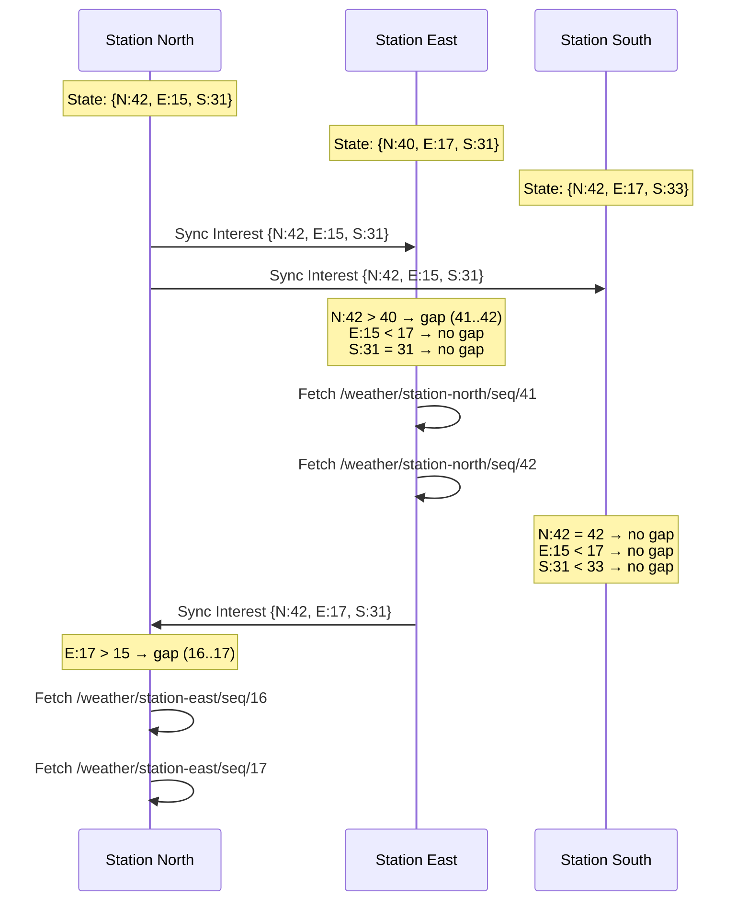
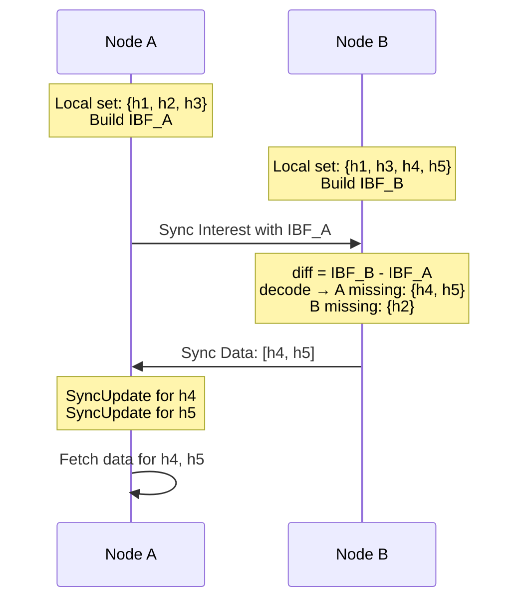

# Sync Protocols

## The Problem: Keeping Distributed Datasets in Agreement

Imagine three weather stations scattered across a valley. Each one periodically records temperature, humidity, and wind speed under its own NDN name prefix -- `/weather/station-north/temp/42`, `/weather/station-east/humidity/17`, and so on. Every station needs every other station's data. In the IP world, you'd build a database replication layer on top of TCP connections, manage reconnections, handle ordering, and worry about consistency. You'd essentially be reinventing a distributed database.

In NDN, the network already knows how to fetch named data. The missing piece is much narrower: each node needs to learn **which names exist** on other nodes. Once it knows a name exists, it can fetch the data using ordinary Interests. That's exactly what sync protocols do -- they are lightweight set-reconciliation protocols that tell each node "here are the names I have that you don't."

This turns out to be a profound simplification. Sync doesn't move data. It moves **knowledge about data**, and lets NDN's native Interest/Data exchange handle the rest.

ndn-rs ships two sync protocols in the `ndn-sync` crate: **State Vector Sync (SVS)** for small groups with frequent updates, and **Partial Sync (PSync)** for large namespaces with sparse changes. Both share a common `SyncHandle` API so applications can switch protocols without changing their code.

## State Vector Sync: The Simple Protocol

SVS is the easiest sync protocol to understand because it works exactly the way you'd explain it on a whiteboard. Every node maintains a **state vector** -- a table mapping each known node to the highest sequence number it has seen from that node.

### The Data Structure

At the core is `SvsNode`, which wraps a `HashMap<String, u64>` behind a Tokio `RwLock`. Each entry maps a node's name (as a canonical string key) to its latest known sequence number:

```text
State Vector for station-north:
  /weather/station-north  -> seq 42   (that's us)
  /weather/station-east   -> seq 17   (last we heard)
  /weather/station-south  -> seq 31   (last we heard)
```

The node starts at sequence zero. Each time the local application publishes new data, it calls `advance()`, which atomically increments the local sequence number.

### The Protocol

The SVS protocol loop is elegant in its simplicity. Every node periodically multicasts a Sync Interest that carries its entire state vector encoded in the Interest name. When a peer receives it, it compares the remote vector against its own. Any entry where the remote sequence number is higher than the local one represents a gap -- data the local node hasn't seen yet.



The merge operation is the heart of the protocol. `SvsNode::merge()` takes a received state vector and returns a list of `(node_key, gap_from, gap_to)` tuples. Each tuple says: "this peer published data from sequence `gap_from` to `gap_to` that we haven't seen." The local vector is updated in the same operation, so duplicate detections are impossible.

> **Key design detail:** The state vector is encoded on the wire as `<fnv1a-hash:8><seq:8>` pairs -- 16 bytes per node. For a group of 50 nodes, that's 800 bytes, which fits comfortably in a single Interest packet. This is why SVS works well for small-to-medium groups but struggles as group size grows into the hundreds.

### Wire Format

Sync Interests follow the naming convention `/<group-prefix>/svs/<encoded-state-vector>`. The state vector component is a binary blob of concatenated hash-sequence pairs. A jitter of 0--200ms is added to the one-second sync interval to prevent Interest collisions when nodes start simultaneously.

When the local application publishes new data, the protocol doesn't wait for the next tick. It immediately increments the sequence number and sends a Sync Interest, so peers learn about the new data within milliseconds rather than waiting up to a full interval.

## Partial Sync: The Scalable Protocol

SVS has an elegant simplicity, but it carries a fundamental cost: every Sync Interest must encode the entire state vector. As the number of publishers grows to thousands or the namespace becomes very large, the vector exceeds what fits in a name component. PSync solves this with a technique borrowed from database reconciliation: **Invertible Bloom Filters** (IBFs).

### Invertible Bloom Filters

An IBF is a probabilistic data structure that can encode a set of elements in a fixed amount of space, regardless of the set size. More importantly, when you subtract one IBF from another, the result encodes the **symmetric difference** between the two sets -- exactly the elements that one side has and the other lacks.

Each cell in the IBF stores three fields:

- **`xor_sum`** -- XOR of all element hashes mapped to this cell
- **`hash_sum`** -- XOR of a secondary hash of each element (for verification)
- **`count`** -- number of elements mapped to this cell

A cell is "pure" -- meaning it holds exactly one element -- when `count` is +1 or -1 and the `hash_sum` verifies against the `xor_sum`. The decoding algorithm repeatedly finds pure cells, extracts their element, and removes it from the filter. If all cells empty out, the decode succeeded.

> **Why the hash_sum check?** Without it, two elements could cancel each other's `xor_sum` but leave `count == 1`, producing a false positive. The independent `hash_sum` catches this: the probability that both `xor_sum` and `hash_sum` happen to match a valid element when they shouldn't is vanishingly small.

### The Protocol

PSync's protocol flow has two phases: the requester sends an IBF in a Sync Interest, and the responder subtracts it from their local IBF, decodes the difference, and replies with the hashes the requester is missing.



The `PSyncNode` maintains a local `HashSet<u64>` of name hashes. When reconciling, it builds a fresh IBF from its set, subtracts the peer's IBF, and decodes the result. The default configuration uses 80 cells with k=3 hash functions, which reliably handles set differences of up to about 40 elements. If the difference is too large for the IBF to decode, the operation returns `None` and the node falls back to a larger IBF or full enumeration.

### Wire Format

Sync Interests use the name `/<group-prefix>/psync/<ibf-encoded>`, where the IBF is encoded as `<xor_sum:8><hash_sum:8><count:8>` triples -- 24 bytes per cell. With the default 80 cells, the IBF component is 1,920 bytes. This is fixed regardless of whether the local set contains 10 elements or 10,000.

Sync Data replies carry concatenated 8-byte hashes of names the requester is missing. The requester emits a `SyncUpdate` for each hash, which the application uses to fetch the actual named data.

Name hashing uses FNV-1a over concatenated component values, with a `0xFF` separator between components to prevent ambiguity (so `/a/bc` and `/ab/c` hash to different values).

## When to Use Which

The choice between SVS and PSync comes down to group size and update frequency:

| Characteristic | SVS | PSync |
|---|---|---|
| **Wire overhead per Interest** | 16 bytes x nodes | 24 bytes x IBF cells (fixed) |
| **Scales with** | Group size (linear) | Set difference (fixed overhead) |
| **Sweet spot** | <100 nodes, frequent updates | Large namespaces, sparse updates |
| **Detects** | Exact sequence gaps | Set differences (no ordering) |
| **Typical use** | Chat rooms, IoT sensor groups, small clusters | Content distribution, routing tables, large pub/sub |

**Use SVS when** the group is small and updates are frequent. SVS gives you exact sequence numbers, so you know precisely which publications you missed and can fetch them in order. A chat application with 10 participants, a sensor network with 50 devices, or a coordination protocol among a handful of edge routers are all natural fits.

**Use PSync when** the namespace is large but the set difference at any given moment is small. A content distribution network with thousands of named objects, a link-state routing protocol exchanging LSA hashes, or a package repository synchronizing its catalog across mirrors -- these all benefit from PSync's fixed-size IBF encoding.

## Integration with ndn-rs

### The SyncHandle API

Both protocols expose the same `SyncHandle` type, which provides two operations: receiving notifications about new remote data, and announcing local publications. The handle owns a cancellation token; dropping it (or calling `leave()`) cleanly shuts down the background sync task.


### Joining a Sync Group

To join an SVS group, provide the group prefix, your local name, and a pair of channels for sending and receiving packets:

```rust
use ndn_sync::{SvsConfig, join_svs_group};

let handle = join_svs_group(
    "/ndn/svs/chat".parse().unwrap(),   // group prefix
    "/ndn/svs/chat/alice".parse().unwrap(), // local name
    send_tx,  // mpsc::Sender<Bytes> for outgoing packets
    recv_rx,  // mpsc::Receiver<Bytes> for incoming packets
    SvsConfig::default(),
);
```

PSync is similar but doesn't require a local name (the node is identified by its IBF contents):

```rust
use ndn_sync::{PSyncConfig, join_psync_group};

let handle = join_psync_group(
    "/ndn/psync/catalog".parse().unwrap(),
    send_tx,
    recv_rx,
    PSyncConfig::default(),
);
```

### Publishing and Subscribing

Once you have a handle, the pattern is the same for both protocols:

```rust
// Announce a new publication
handle.publish("/ndn/svs/chat/alice/msg/42".parse().unwrap()).await?;

// Receive notifications about remote publications
while let Some(update) = handle.recv().await {
    println!("New data from {}: {} (seq {}..{})",
        update.publisher, update.name, update.low_seq, update.high_seq);
    // Fetch the actual data using ordinary Interests...
}
```

The `SyncUpdate` struct tells you who published, the name prefix to fetch under, and (for SVS) the sequence range you missed. For PSync, where there's no inherent ordering, `low_seq` and `high_seq` are both zero -- the update simply tells you a new name hash appeared.

### Connecting to InProcFace

In a typical ndn-rs deployment, the send/recv channels connect to an `InProcFace`. The application registers the sync group prefix with the router, and the InProcFace forwards matching Interests to the recv channel while the send channel pushes outgoing Interests through the router's forwarding pipeline. The sync protocol itself is oblivious to the transport -- it just reads from and writes to `mpsc` channels.

> **Configuration knobs:** Both `SvsConfig` and `PSyncConfig` let you tune the sync interval (default 1 second), jitter range (default 200ms), and notification channel capacity (default 256). PSync additionally exposes `ibf_size` (default 80 cells). Increasing the IBF size allows larger set differences to decode successfully, at the cost of larger Sync Interests.

### Leaving a Group

The `SyncHandle` implements `Drop`, so simply dropping the handle cancels the background task. For explicit cleanup, call `handle.leave()`, which consumes the handle and cancels the task immediately.
