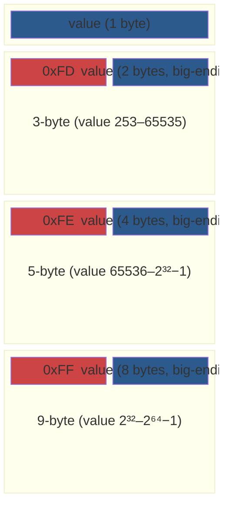
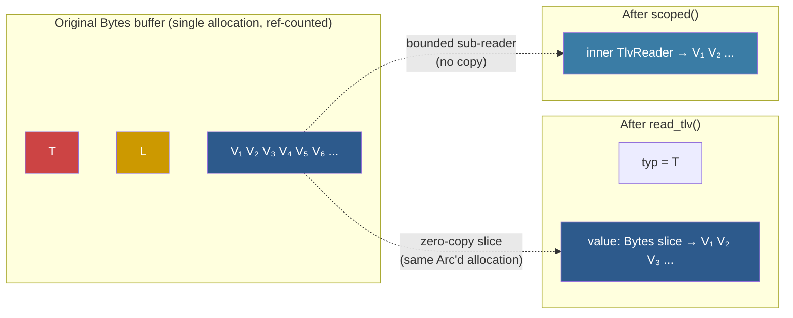
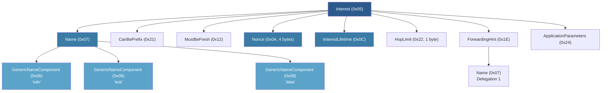
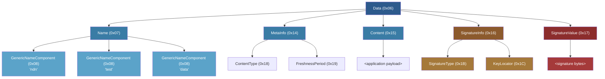

# NDN TLV Encoding

## From Bytes on the Wire to Structured Packets

Every NDN packet -- Interest, Data, Nack -- is just a sequence of bytes when it arrives at a network interface. Before the forwarder can look up a name in the FIB, check the PIT, or consult a strategy, those raw bytes need to become structured data. The question is: how do you parse them efficiently, without copying memory you don't need to, and without breaking on malformed input?

This is the job of the `ndn-tlv` crate, the lowest layer in the ndn-rs stack. It implements NDN's Type-Length-Value wire format: a recursive encoding where every element starts with a type number, followed by a length, followed by that many bytes of value. The value itself can contain more TLV elements, nesting arbitrarily deep. An Interest packet is a TLV element whose value contains the Name (another TLV element, whose value contains name components, each of which is yet another TLV element), plus optional fields like Nonce and Lifetime.

The entire crate is built around one principle: **parse without copying**. Every slice of decoded data points back into the original byte buffer. When the Content Store serves a cache hit, the bytes that go out on the wire are the same bytes that came in -- no serialization round-trip, no intermediate allocations.

> **📊 Performance:** Zero-copy parsing means a Content Store hit can serve cached data by incrementing a reference count and handing out a `Bytes` slice. No memcpy, no allocation. On a forwarder handling millions of packets per second, this is the difference between keeping up and falling behind.

## The VarNumber Trick: Compact Headers for a Wide Range

Before we can parse TLV elements, we need to understand how NDN encodes the Type and Length fields themselves. Both are variable-width unsigned integers called VarNumbers, and the encoding is surprisingly elegant.

The problem: NDN type numbers range from small values like `0x05` (Interest) and `0x06` (Data) up to application-defined types that could be any 64-bit value. Fixed-width fields would waste space -- most types and lengths fit in a single byte, but the encoding needs to handle the rare large values too.

NDN's solution is a compact variable-width encoding. If the value fits in one byte (0 through 252), it's encoded as-is. For larger values, a marker byte announces the width, followed by the value in big-endian:

| Value range         | Wire bytes | Format                           |
|---------------------|------------|----------------------------------|
| 0 -- 252            | 1          | Single byte                      |
| 253 -- 65535        | 3          | `0xFD` + 2-byte big-endian       |
| 65536 -- 2^32 - 1   | 5          | `0xFE` + 4-byte big-endian       |
| 2^32 -- 2^64 - 1    | 9          | `0xFF` + 8-byte big-endian       |



In practice, the vast majority of TLV elements use the 1-byte form. A name component of type `0x08` with a 4-byte value costs just 6 bytes of overhead (1 for type, 1 for length, 4 for value). The multi-byte forms exist for the rare cases where a packet carries a large payload or an application uses a high-numbered type.

> **⚠️ Spec requirement:** The encoding is *canonical* -- the smallest representation that fits the value must be used. Encoding the value 100 with the 3-byte form (`0xFD 0x00 0x64`) is illegal even though it would decode correctly. ndn-rs rejects non-minimal encodings with `TlvError::NonMinimalVarNumber`. This prevents ambiguity: every value has exactly one valid encoding, which matters for signature verification (you don't want two different wire encodings of the same logical packet producing different signature digests).

The three core functions that implement this in `ndn-tlv` are straightforward:

```rust
/// Read a VarNumber, returning (value, bytes_consumed).
pub fn read_varu64(buf: &[u8]) -> Result<(u64, usize), TlvError>;

/// Write a VarNumber, returning bytes written.
pub fn write_varu64(buf: &mut [u8], value: u64) -> usize;

/// Compute encoded size without allocating.
pub fn varu64_size(value: u64) -> usize;
```

The `varu64_size` function is particularly useful during encoding: you can calculate the total wire size of a packet before writing a single byte, which lets you pre-allocate the exact buffer size needed.

## TlvReader: Parsing Without Copying a Single Byte

With VarNumbers understood, we can now follow a packet through the parsing pipeline. A raw `Bytes` buffer arrives from the network. We need to extract structured fields -- the packet type, the name, the nonce -- but we want to avoid copying any of the underlying data.

`TlvReader` makes this possible by wrapping a `Bytes` buffer and yielding sub-slices that share the same reference-counted allocation. When you call `read_tlv()`, it reads the type and length VarNumbers, then returns a `Bytes` slice pointing into the original buffer. No `memcpy`, no new allocation -- just a pointer, a length, and an incremented reference count.

```rust
let raw: Bytes = receive_from_network();
let mut reader = TlvReader::new(raw);

// Read a complete TLV element: (type, value_bytes)
let (typ, value) = reader.read_tlv()?;

// value is a Bytes slice into the original allocation
// -- zero copy, reference counted

// Peek without advancing
let next_type = reader.peek_type()?;

// Scoped sub-reader for nested TLV parsing
let mut inner = reader.scoped(value.len())?;
```

The diagram below shows what's happening in memory. There's one allocation, shared across every slice:



> **💡 Key insight:** The `scoped()` method is what makes nested TLV parsing safe. It returns a sub-reader that is bounded to exactly `len` bytes. If the inner parsing tries to read beyond the declared length of the enclosing element, it gets an error instead of silently consuming bytes from the next sibling element. This turns a class of subtle parsing bugs into hard failures.

The four key methods tell the full story of how parsing works:

- **`read_tlv()`** reads type + length + value, advancing the cursor and returning `(u64, Bytes)`. The returned `Bytes` is a zero-copy slice into the original buffer.
- **`peek_type()`** peeks at the next type number without advancing, so the parser can decide which field comes next without committing.
- **`scoped(len)`** returns a sub-reader bounded to `len` bytes, for safely descending into nested TLV structures.
- **`skip_unknown(typ)`** handles forward compatibility by skipping unrecognized TLV elements -- but only if they're non-critical.

> **⚠️ Spec requirement:** The critical-bit rule from NDN Packet Format v0.3 section 1.3 determines which unknown types can be safely skipped. Types 0 through 31 are always critical (grandfathered from earlier spec versions). For types 32 and above, odd numbers are critical and even numbers are non-critical. `skip_unknown` enforces this automatically: encountering an unknown critical type is a hard error, while unknown non-critical types are silently skipped. This is how NDN achieves forward compatibility -- new optional fields can be added to packets without breaking older parsers.

## What Gets Parsed, and When

Not every field in a packet needs to be decoded immediately. Consider an Interest arriving at a forwarder. The pipeline always needs the Name (for FIB lookup), but the Nonce, Lifetime, and ApplicationParameters might never be accessed -- especially on a Content Store hit, where the matching Data is returned without the Interest ever reaching the strategy layer.

An NDN Interest packet has the following wire structure:



In ndn-rs, the `Interest` struct uses `OnceLock<T>` for lazy decoding. The Name is always decoded eagerly -- every pipeline stage needs it. But fields like Nonce, Lifetime, and ApplicationParameters are decoded on first access. The raw `Bytes` slices for those fields are stored during the initial parse, and the actual decoding happens only when (and if) something reads the field. This means a Content Store hit can short-circuit before paying the cost of decoding the Nonce or signature fields.

> **🔧 Implementation note:** `OnceLock<T>` is perfect here because it provides interior mutability with initialization-once semantics. The first access decodes the field and stores the result; subsequent accesses return the cached value. Since the underlying `Bytes` slice is immutable and the decode is deterministic, this is safe even across threads.

## The Data Packet and Its Signed Region

A Data packet (type `0x06`) is more complex because it carries a cryptographic signature. The signed region spans from the Name through the SignatureInfo (inclusive), and the SignatureValue covers that region:



Understanding the signed region is critical for both parsing and encoding:

```text
Data (0x06)
+-- Name (0x07)
|   +-- NameComponent (0x08) ...
+-- MetaInfo (0x14)
|   +-- ContentType (0x18)
|   +-- FreshnessPeriod (0x19)
+-- Content (0x15)
|   +-- <application payload>
+-- SignatureInfo (0x16)        --|
|   +-- SignatureType (0x1B)      |  signed region
|   +-- KeyLocator (0x1C)         |
+-- SignatureValue (0x17)       --|  covers above
```

> **💡 Key insight:** Because the signature covers the wire-format bytes (not some abstract representation), zero-copy parsing is essential for verification. The forwarder can verify a signature directly against the original buffer without re-encoding anything. And because `Bytes` slices share the underlying allocation, the `TlvWriter::snapshot()` method can capture the signed region as a cheap sub-slice rather than a copy.

## TlvWriter: Building Packets for the Wire

Parsing is only half the story. When a producer creates a Data packet, or the forwarder generates a Nack, bytes need to flow in the other direction: from structured fields to wire format.

`TlvWriter` is backed by a growable `BytesMut` buffer. It handles the bookkeeping of emitting type and length VarNumbers, nesting elements correctly, and capturing byte ranges for signing:

```rust
let mut w = TlvWriter::new();

// Flat TLV element
w.write_tlv(0x08, b"component");

// Nested TLV -- closure writes inner content,
// write_nested wraps it with the correct outer type + length
w.write_nested(0x07, |inner| {
    inner.write_tlv(0x08, b"ndn");
    inner.write_tlv(0x08, b"test");
});

// Raw bytes (pre-encoded content, e.g. signed regions)
w.write_raw(&pre_encoded);

// Snapshot for signing: capture bytes from offset
let signed_region = w.snapshot(start_offset);

let wire_bytes: Bytes = w.finish();
```

The `write_nested` method solves a classic chicken-and-egg problem in TLV encoding. The outer element's length field must contain the total size of the inner content, but you don't know that size until you've written the inner content. `write_nested` handles this by writing the inner content to a temporary buffer first, then emitting the outer type, the minimal-length VarNumber for the inner size, and finally the inner bytes. The caller just writes inner elements in a closure and the framing happens automatically.

> **🔧 Implementation note:** The `snapshot` method is how signing works during encoding. A producer writes fields from Name through SignatureInfo, captures a `snapshot` of that byte range, computes the signature over it, and then writes the SignatureValue. The snapshot is a `Bytes` slice into the writer's buffer -- no copy needed.

## Stream Transports: Reassembling Packets from TCP

On datagram transports like UDP, each received message is exactly one NDN packet. But on stream transports like TCP and Unix sockets, packets arrive as a continuous byte stream with no built-in framing. A single `read()` call might return half a packet, or two and a half packets.

`TlvCodec` solves this by implementing Tokio's `Decoder` and `Encoder` traits. It reassembles complete NDN packets from the byte stream by peeking at the type and length VarNumbers, then buffering until the full value has arrived:

```rust
// Used internally by TcpFace and other stream-based faces
let framed = Framed::new(tcp_stream, TlvCodec);

// Decoder yields complete Bytes frames (one NDN packet each)
while let Some(frame) = framed.next().await {
    let pkt: Bytes = frame?;
    // pkt is a complete TLV element: type + length + value
}
```

> **📊 Performance:** The decoder pre-allocates buffer space based on the declared length as soon as it reads the length VarNumber. This avoids repeated reallocations as bytes trickle in for large packets. A 64 KB Data packet arriving over a slow TCP connection results in one allocation, not dozens of growing reallocs.

## Serial Links Need a Different Approach

Everything described so far assumes a reliable transport -- either datagrams with clear boundaries (UDP) or a byte stream where TLV length-prefix framing can work (TCP). Serial links like UART and RS-485 break both assumptions. There are no message boundaries, and byte-level errors (noise, dropped bytes) can desynchronize the parser. If a single byte of the length field is corrupted, a TLV parser will try to read millions of bytes and never recover.

`SerialFace` uses Consistent Overhead Byte Stuffing (COBS) to solve this problem. COBS provides unambiguous frame boundaries using a simple trick: the `0x00` byte is reserved as a frame delimiter, and any `0x00` bytes within the actual data are replaced with a run-length encoding scheme.

The process works in three steps:

1. Each NDN TLV packet is COBS-encoded, replacing all `0x00` bytes with a run-length scheme that the receiver can reverse.
2. A `0x00` sentinel byte marks the end of each frame.
3. The receiver accumulates bytes until it sees `0x00`, COBS-decodes the frame, and passes the resulting TLV bytes to `TlvCodec` for normal NDN parsing.

If a byte is corrupted or dropped, the worst that happens is the current frame is garbled -- the receiver discards it and resynchronizes at the next `0x00` boundary. The damage is contained to a single packet rather than cascading through all subsequent parsing.

> **📊 Performance:** The overhead of COBS encoding is at most 1 byte per 254 bytes of payload -- negligible for typical NDN packets. A 1 KB Interest costs at most 4 extra bytes of framing overhead. The tradeoff is worth it: on unreliable serial links, the alternative is a parser that can lose synchronization and never recover.

## Running Without std

The `ndn-tlv` crate supports `no_std` environments (with an allocator). Disabling the default `std` feature (`default-features = false` in Cargo.toml) enables `#![no_std]` mode. An allocator is still required because `TlvWriter` uses `BytesMut` for its growable buffer.

> **🔧 Implementation note:** This makes `ndn-tlv` suitable for embedded NDN nodes -- microcontrollers running a minimal NDN stack can use the same TLV parsing code as the full forwarder. The zero-copy design actually matters *more* in embedded contexts, where memory is scarce and every unnecessary allocation counts.
