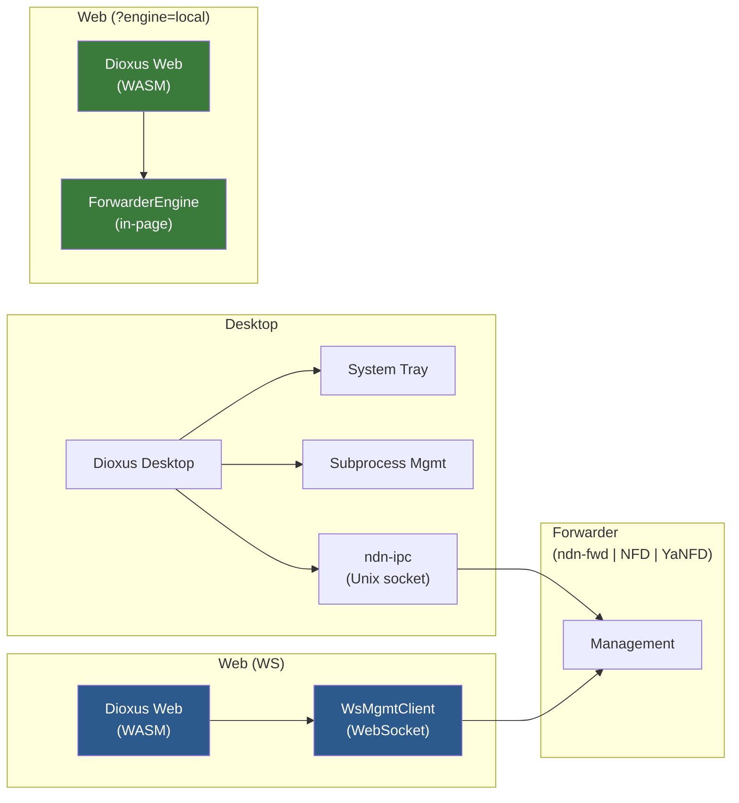

# Dashboard

The NDN Dashboard is a full management UI for any NFD-spec forwarder, available as a **desktop app** (native window + system tray), a **web app** (pure Rust compiled to WASM), and — new — a **browser-engine** mode where the dashboard itself hosts the forwarder in-page.

> All management commands speak the NFD-spec management protocol. The dashboard never reimplements protocol logic.

## Forwarder interop

The dashboard manages any of the three production-grade NDN forwarders that speak NFD-spec management:

| Project | Forwarder binary | CLI flag |
|---------|------------------|----------|
| ndn-rs  | `ndn-fwd`        | `--forwarder=ndn-fwd` (or `ndn-rs`) |
| ndn-cxx | `NFD`            | `--forwarder=nfd` (or `ndn-cxx`) |
| ndnd    | `YaNFD`          | `--forwarder=yanfd` (or `ndnd`) |

Selection is **runtime**: a single `ndn-dashboard` binary works against any of them. With no `--forwarder` flag, the dashboard auto-detects by probing each profile's default socket in order. Override the socket with `--socket=/custom/path`. See `docs/notes/dashboard-multi-forwarder-2026-05-10.md` for the full design.

ndn-rs-specific UI panels (demo CA, SafeBag export, TokenChallenge invite tokens, IssuancePolicy gate) appear automatically when connected to `ndn-fwd`; against NFD or YaNFD the dashboard falls back to the spec-baseline UI.

## Quick Start

### Desktop

```bash
cargo build -p ndn-dashboard --release
./target/release/ndn-dashboard                          # auto-detect
./target/release/ndn-dashboard --forwarder=nfd          # force NFD
./target/release/ndn-dashboard --forwarder=ndn-fwd \
    --socket=/var/run/foo.sock                          # custom socket
```

Auto-detect probes `/run/ndn-fwd/ndn-fwd.sock` (ndn-fwd), `/var/run/nfd.sock` (NFD), then `/run/nfd/nfd.sock` (YaNFD); first existing path wins.

### Web (WASM)

```bash
dx serve --features web --platform web
```

Connects to the router via WebSocket (`ws://localhost:9696` by default). The router must have a WebSocket face listener enabled. Override via query string:

```text
?forwarder=nfd&ws=ws://nfd.example:9696/ws/      # remote NFD via WS
?engine=local                                     # in-page engine (see below)
```

The web version uses the same TLV codec and packet types as the native build, demonstrating ndn-rs portability.

### Browser-engine mode (Phase 7)

```bash
dx serve --features browser-engine --platform web
# then load http://localhost:8080/?engine=local
```

In this mode the dashboard hosts its own `ndn_engine::ForwarderEngine` inside the browser tab via `WasmEngineBuilder` — PIT, FIB, CS, dispatcher, expiry tasks all run in-page. No remote forwarder, no WebSocket. Useful for browser-only deployments, demos, and self-hosters who'd rather not run a separate `ndn-fwd` process.

What works today: engine startup, faces/FIB/CS introspection panels, mutations through the engine API directly. What's deferred: NFD-spec wire mgmt parity (the wire-format mgmt server lives in the `ndn-fwd` binary and would need its own session to port) and upstream face dialing (WebTransport / WebRTC connect-out from the dashboard's in-page engine — reference impl at `crates/tooling/dioxus-demo/src/engine.rs`).

## Features

| View | What it does |
|------|-------------|
| **Overview** | Forwarder status, per-face throughput sparklines (3-min history), CS stats |
| **Routes** | FIB management: add/remove/inspect entries, cost adjustment |
| **Strategy** | Per-prefix forwarding strategy assignment |
| **Faces** | Face creation/destruction, URI inspection, counter display |
| **Fleet** | Discovered neighbors, NDNCERT enrollment, discovery config |
| **Routing** | DVR protocol status and runtime configuration |
| **Security** | Trust anchors, certificate management, trust schema rules |
| **Logs** | Live structured log stream with regex filtering, adjustable level |
| **Tools** | Embedded ping, iperf, peek, put with real-time results |
| **Config** | Full TOML configuration export/import with categorized knobs |
| **Session** | Command recording and replay for scripting |

## Architecture



The desktop build includes system tray integration, subprocess management (start/stop `ndn-fwd`), and embedded tool servers. The web build omits these (no OS-level access in a browser) but retains full monitoring and management capability.

### Feature Gates

| Feature | Desktop | Web (WS) | Browser-engine |
|---------|---------|----------|----------------|
| Router start/stop | `forwarder_proc.rs` (profile-aware) | — | Engine starts in-page |
| System tray | `tray-icon` crate | — | — |
| Embedded tools (ping, iperf) | `ndn-tools-core` | — | — |
| Settings persistence | `~/.config/ndn-dashboard/` | `localStorage` | `localStorage` |
| Management transport | Unix socket (`ndn-ipc`) | WebSocket (`gloo-net`) | Direct engine API |
| TLV codec | `ndn-tlv` + `ndn-packet` | Same crates, WASM | Same crates, WASM |
| Multi-forwarder | `--forwarder=` | `?forwarder=` | implicit `ndn-fwd` (we ship the engine) |

### Polling Model

The dashboard polls the router every 3 seconds via NDN management Interests on `/localhost/nfd/`. All responses are decoded using `ndn-config` types (`FaceStatus`, `FibEntry`, `StrategyChoice`, etc.) and converted to display-friendly Dioxus signals.

## Configuration

Dashboard settings are persisted separately from router config:

- **Desktop:** `~/.config/ndn-dashboard/settings.json`
- **Web:** Browser `localStorage` under key `ndn-dashboard-settings`

Settings include node prefix, tool server configuration, experimental feature toggles, and UI preferences.

## Building for Web

The web target compiles the entire dashboard — including NDN packet encoding, management protocol, and reactive UI — to WebAssembly:

```bash
# Install Dioxus CLI
cargo install dioxus-cli

# Serve locally with hot reload
cd crates/tooling/ndn-dashboard
dx serve --features web --platform web

# Production build
dx build --features web --platform web --release
```

The output in `dist/` is a static site that can be deployed anywhere. The [live version](../dashboard/) is deployed to GitHub Pages alongside the wiki and explorer.
