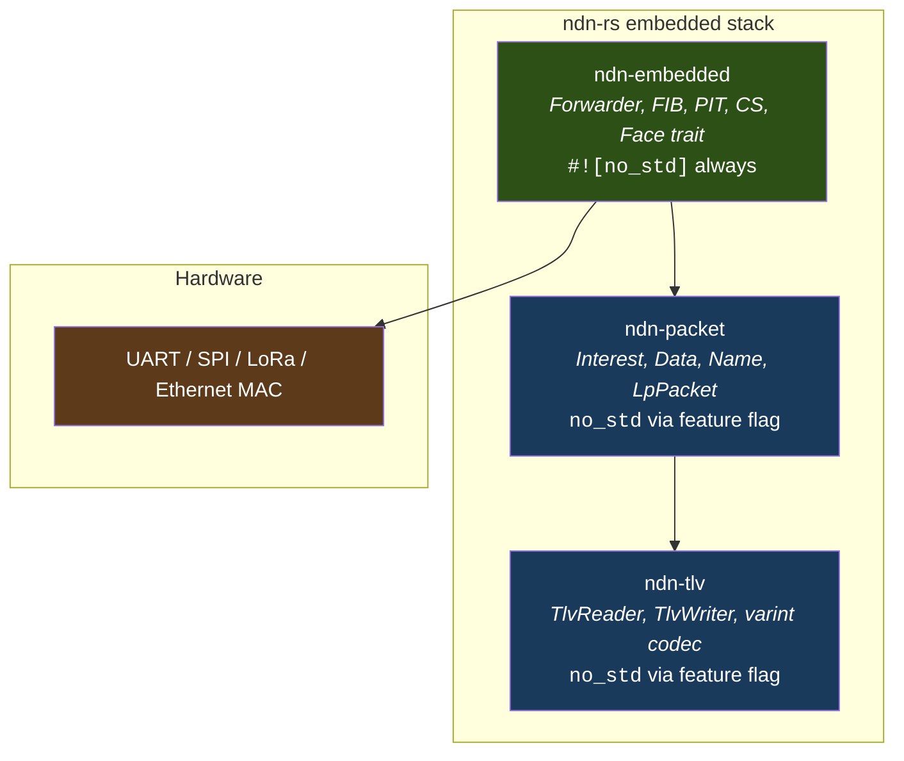
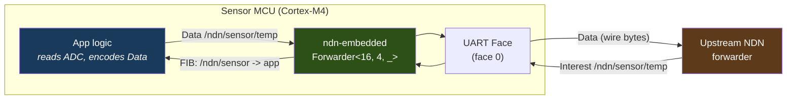

# Running ndn-rs on Embedded Targets

NFD requires a full Linux userspace. ndnd requires Go's runtime with garbage collection. ndn-rs runs on a Cortex-M4 with 256 KB of RAM. Here is how.

The ndn-rs workspace was designed from the start to support bare-metal embedded targets alongside the full-featured Tokio-based forwarder. Three crates form the embedded stack: `ndn-tlv` and `ndn-packet` compile with `no_std` (they just need an allocator), and `ndn-embedded` provides a minimal forwarding engine that requires no heap allocator at all in its default configuration. No async runtime, no threads, no dynamic dispatch on the hot path -- just a polling loop and fixed-size data structures.



## The no_std stack

### ndn-tlv

`ndn-tlv` compiles without `std` when you disable the default feature:

```toml
ndn-tlv = { version = "...", default-features = false }
```

In this mode the crate still requires an allocator (for `bytes::Bytes` and `BytesMut`), but drops all `std`-specific dependencies. Everything works: `TlvReader` for zero-copy parsing, `TlvWriter` for encoding, and the `read_varu64` / `write_varu64` varint codec.

### ndn-packet

`ndn-packet` follows the same pattern:

```toml
ndn-packet = { version = "...", default-features = false }
```

With `std` disabled, the crate drops two modules that require OS-level support:

| Module | Requires `std` | Why |
|--------|---------------|-----|
| `encode` | Yes | Uses `BytesMut` in ways that depend on `std` I/O traits |
| `fragment` | Yes | NDNLPv2 fragment reassembly needs `ring` for integrity checks |

Everything else compiles: `Interest`, `Data`, `Name`, `NameComponent`, `MetaInfo`, `SignatureInfo`, `LpPacket`, `Nack`. Names use `SmallVec<[NameComponent; 8]>`, so typical 4-8 component names stay on the stack.

> **Note**: Both crates still require an allocator (`extern crate alloc`) because `bytes::Bytes` uses heap memory internally. If your target has no heap allocator, use `ndn-embedded` directly -- its `wire` module encodes packets into caller-supplied `&mut [u8]` buffers with zero allocation.

## The embedded forwarder

The `ndn-embedded` crate is the heart of the embedded story. It is `#![no_std]` unconditionally -- there is no `std` feature to enable. It provides a single-threaded, synchronous `Forwarder` that processes one packet at a time in a polling loop.

### Feature flags

| Feature | Default | Description |
|---------|---------|-------------|
| `alloc` | off | Enables heap-backed collections via `hashbrown` (requires a global allocator) |
| `cs` | off | Enables the optional `ContentStore` for caching Data packets |
| `ipc` | off | Enables app-to-forwarder SPSC queues |

In the default configuration (no features enabled), `ndn-embedded` requires **no heap allocator**. All data structures are backed by `heapless::Vec` with compile-time capacity limits.

### How it works

The `Forwarder` is parameterized by three const generics and a clock type:

```rust
pub struct Forwarder<const P: usize, const F: usize, C: Clock> {
    pub pit: Pit<P>,    // P = max pending Interests
    pub fib: Fib<F>,    // F = max routes
    clock: C,           // monotonic millisecond counter
}
```

The processing model is straightforward. Your MCU main loop calls two methods:

- **`process_packet(raw, incoming_face, faces)`** -- decodes one raw TLV packet, dispatches it as Interest or Data, performs FIB lookup / PIT insert / PIT satisfy, and calls `face.send()` on the appropriate outbound face.
- **`run_one_tick()`** -- purges expired PIT entries using the supplied clock.

There is no async runtime, no task spawning, no channel multiplexing. The forwarder runs synchronously in whatever context you call it from -- a bare `loop {}`, an RTOS task, or an Embassy executor.

### Face abstraction

Faces use the `nb::Result` convention from `embedded-hal`:

```rust
pub trait Face {
    type Error: core::fmt::Debug;
    fn recv(&mut self, buf: &mut [u8]) -> nb::Result<usize, Self::Error>;
    fn send(&mut self, buf: &[u8]) -> nb::Result<(), Self::Error>;
    fn face_id(&self) -> FaceId;  // u8, 0-254
}
```

A face wraps whatever transport your MCU has: UART, SPI, LoRa, raw Ethernet MAC, or a memory-mapped buffer for inter-core communication. The `ErasedFace` trait provides dynamic dispatch so the forwarder can iterate over a heterogeneous slice of faces.

For serial links (UART, SPI, I2C), `ndn-embedded` includes a COBS framing module (`cobs`) that eliminates 0x00 bytes from the payload and uses 0x00 as a frame delimiter. This is compatible with the desktop stack's `ndn-face-serial` framing.

### Clock

The `Clock` trait supplies the monotonic millisecond counter for PIT expiry:

```rust
pub trait Clock {
    fn now_ms(&self) -> u32;  // wraps after ~49 days
}
```

Three implementations are provided:

- **`NoOpClock`** -- always returns 0. PIT entries never expire (useful when you rely on FIFO eviction from a small PIT).
- **`FnClock(fn() -> u32)`** -- wraps a function pointer to your hardware timer (SysTick, TIM2, etc.).
- **Your own impl** -- for Embassy, RTIC, or any other framework.

### Wire encoding without allocation

The `wire` module encodes Interest and Data packets directly into `&mut [u8]` stack buffers, bypassing `ndn-packet`'s `BytesMut`-based encoder entirely:

```rust
let mut buf = [0u8; 256];
// From raw components:
let n = wire::encode_interest(&mut buf, &[b"ndn", b"sensor", b"temp"], 42, 4000, false, false)
    .expect("buf too small");
// Or from a name string:
let n = wire::encode_interest_name(&mut buf, "/ndn/sensor/temp", 42, 4000, false, false)
    .expect("buf too small");
// Data packets:
let n = wire::encode_data_name(&mut buf, "/ndn/sensor/temp", b"23.5")
    .expect("buf too small");
```

Data packets are encoded with a DigestSha256 signature stub (type 0, 32 zero bytes). This produces well-formed packets that NDN forwarders accept and cache.

## Supported targets

The embedded CI (`.github/workflows/embedded.yml`) validates the following builds on every push:

| Target | Architecture | Example boards |
|--------|-------------|----------------|
| `thumbv7em-none-eabihf` | ARM Cortex-M4F | STM32F4, nRF52840, LPC4088 |

The crate is designed to also support RISC-V (`riscv32imac-unknown-none-elf`) and ESP32 (`xtensa-esp32-none-elf`) targets. The CI currently cross-compiles against `thumbv7em-none-eabihf`; additional targets can be added as the ecosystem matures.

### Cross-compiling

Install the target toolchain and build:

```bash
# ARM Cortex-M4F (the CI-tested target)
rustup target add thumbv7em-none-eabihf
cargo build -p ndn-embedded --target thumbv7em-none-eabihf

# With optional content store
cargo build -p ndn-embedded --features cs --target thumbv7em-none-eabihf

# With heap allocator support
cargo build -p ndn-embedded --features alloc --target thumbv7em-none-eabihf

# RISC-V
rustup target add riscv32imac-unknown-none-elf
cargo build -p ndn-embedded --target riscv32imac-unknown-none-elf
```

The `ndn-tlv` and `ndn-packet` crates can be cross-compiled independently if you only need packet encoding/decoding without the forwarder:

```bash
cargo check -p ndn-tlv --no-default-features --target thumbv7em-none-eabihf
cargo check -p ndn-packet --no-default-features --target thumbv7em-none-eabihf
```

## Memory budget

Every data structure in `ndn-embedded` has a compile-time size. There are no surprise heap allocations. Here is how to estimate your RAM usage.

### PIT

Each `PitEntry` is 24 bytes:

| Field | Type | Size |
|-------|------|------|
| `name_hash` | `u64` | 8 bytes |
| `incoming_face` | `u8` | 1 byte |
| `nonce` | `u32` | 4 bytes |
| `created_ms` | `u32` | 4 bytes |
| `lifetime_ms` | `u32` | 4 bytes |
| *(padding)* | | 3 bytes |

A `Pit<64>` costs **64 x 24 = 1,536 bytes**. For a simple sensor node, `Pit<16>` (384 bytes) is plenty. The PIT uses FIFO eviction when full -- the oldest pending Interest is dropped first.

### FIB

Each `FibEntry` is 16 bytes:

| Field | Type | Size |
|-------|------|------|
| `prefix_hash` | `u64` | 8 bytes |
| `prefix_len` | `u8` | 1 byte |
| `nexthop` | `u8` | 1 byte |
| `cost` | `u8` | 1 byte |
| *(padding)* | | 5 bytes |

A `Fib<8>` costs **8 x 16 = 128 bytes**. Most embedded nodes need only 2-4 routes (one default route, one per local prefix).

### Content Store (optional)

The `ContentStore<N, MAX_LEN>` stores raw Data packet bytes in fixed-size arrays:

```
RAM = N * (MAX_LEN + 24 bytes overhead)
```

For example, `ContentStore<4, 256>` costs about **4 x 280 = 1,120 bytes**. Enable the `cs` feature only if your node re-serves the same Data packets (e.g., a gateway caching upstream responses). Pure sensor nodes that produce unique readings every cycle should skip it.

### Typical configurations

| Node type | PIT | FIB | CS | Total (approx.) |
|-----------|-----|-----|----|------------------|
| Sensor leaf | `Pit<16>` | `Fib<4>` | none | ~500 bytes |
| Sensor + cache | `Pit<32>` | `Fib<8>` | `CS<4, 256>` | ~2.2 KB |
| Edge gateway | `Pit<128>` | `Fib<16>` | `CS<16, 512>` | ~12 KB |

All of these fit comfortably in a Cortex-M4 with 64-256 KB of SRAM, leaving the bulk of memory for application logic, DMA buffers, and the stack.

> **Tip**: The `Forwarder` struct itself is generic over `P` and `F`, so you can tune capacities per deployment without changing any code -- just adjust the const generics at the instantiation site.

## Example: sensor node producing temperature data

The following example shows a minimal sensor node that produces NDN Data packets containing temperature readings. It has two faces: a UART link to an upstream forwarder, and a local "app" face that generates Data in response to incoming Interests.



```rust
#![no_std]
#![no_main]

use ndn_embedded::{Forwarder, Fib, FnClock, wire};
use ndn_embedded::face::{Face, FaceId};

// -- Hardware-specific face implementation (pseudocode) --

struct UartFace {
    // Your UART peripheral handle goes here
}

impl Face for UartFace {
    type Error = ();

    fn recv(&mut self, buf: &mut [u8]) -> nb::Result<usize, ()> {
        // Read from UART RX ring buffer; return WouldBlock if empty.
        // In practice, use COBS framing (ndn_embedded::cobs) to
        // delimit packets on the byte stream.
        Err(nb::Error::WouldBlock)
    }

    fn send(&mut self, buf: &[u8]) -> nb::Result<(), ()> {
        // Write to UART TX; COBS-encode before sending.
        Ok(())
    }

    fn face_id(&self) -> FaceId { 0 }
}

// -- Clock from SysTick --

fn read_systick_ms() -> u32 {
    // Read your MCU's millisecond counter
    0
}

// -- Main loop --

#[cortex_m_rt::entry]
fn main() -> ! {
    // Initialize hardware (UART, ADC, SysTick, etc.)
    let mut uart_face = UartFace { /* ... */ };

    // Set up the FIB: route everything under /ndn to face 0 (upstream).
    let mut fib = Fib::<4>::new();
    fib.add_route("/ndn", 0);

    // Create the forwarder with a 16-entry PIT and hardware clock.
    let clock = FnClock(read_systick_ms);
    let mut fw = Forwarder::<16, 4, _>::new(fib, clock);

    // Packet buffers
    let mut rx_buf = [0u8; 512];
    let mut tx_buf = [0u8; 512];

    loop {
        // 1. Poll the UART face for incoming packets.
        if let Ok(n) = uart_face.recv(&mut rx_buf) {
            let mut faces: [&mut dyn ndn_embedded::face::ErasedFace; 1] =
                [&mut uart_face];
            fw.process_packet(&rx_buf[..n], 0, &mut faces);
        }

        // 2. If we received an Interest for our prefix, produce Data.
        //    (In a real application, you'd check whether the Interest
        //    matched /ndn/sensor/temp and read the ADC.)
        let temperature = b"23.5";
        if let Some(n) = wire::encode_data_name(
            &mut tx_buf,
            "/ndn/sensor/temp",
            temperature,
        ) {
            let _ = uart_face.send(&tx_buf[..n]);
        }

        // 3. Expire stale PIT entries.
        fw.run_one_tick();
    }
}
```

This is a simplified sketch. A production sensor node would:

- Use COBS framing (`ndn_embedded::cobs`) to delimit NDN packets on the UART byte stream.
- Only produce Data when an Interest actually matches (check the PIT or inspect the Interest name).
- Use a hardware RNG or counter for the Interest nonce when the node itself sends Interests upstream.
- Optionally enable the content store (`features = ["cs"]`) if the same reading is requested multiple times within its freshness period.

The key point is that the entire NDN stack -- TLV parsing, FIB longest-prefix match, PIT loop detection, packet forwarding -- runs in under 2 KB of RAM with no heap allocator, no async runtime, and no operating system.
