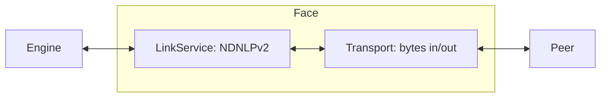

# Implementing a face

A face is the NDN-layer link to a peer. It owns a `Transport` (raw
byte send/recv) and a `LinkService` (NDNLPv2 framing). This guide
walks through writing a new face transport and wiring it into the
engine.

The trait surface is [Extend tier → Face](../api/extend.md#face);
the catalog of shipped transports is in
[Face transports](../reference/face-transports.md).

## When to add a new face

- Your transport (a new wireless link, a new IPC channel, a new
  overlay) isn't already covered by the in-tree faces.
- You need a face with non-standard framing (e.g. wrapping NDN in a
  different envelope).

For most NDN-over-Internet work, UDP or TCP already exists. For
browser deployments WebTransport and WebRTC ship; for in-process
work the `InProc` face ships.

## The two halves



- `Transport` moves byte slices to/from a peer. It knows nothing of
  NDN packets — only `Bytes`.
- `LinkService` frames byte sequences into NDN-layer packets:
  applies/strips NDNLPv2 headers, handles fragmentation, sets
  IncomingFaceId, marks congestion.
- `Face = Transport + LinkService` is the composition the engine
  sees.

## Writing the transport

`Transport` is defined in `crates/ndn-transport/src/transport.rs`.
Send and receive return `impl Future` (write them as `async fn`);
the trait is **not** `#[async_trait]`. Both `send_bytes` and
`recv_bytes` take `&self` — `send_bytes` may be called concurrently
and must synchronise internally, while `recv_bytes` has a single
consumer (the face's own reader task).

```rust,ignore
use ndn_transport::{Transport, FaceId, FaceKind, FaceError};
use bytes::Bytes;

pub struct MyTransport {
    id: FaceId,
    // ... your socket / handle / whatever
}

impl Transport for MyTransport {
    fn id(&self) -> FaceId { self.id }
    fn kind(&self) -> FaceKind { FaceKind::Udp /* the closest classification */ }

    // Optional; default `None`. Used for management-protocol display.
    fn remote_uri(&self) -> Option<String> { Some("my4://peer".into()) }
    fn local_uri(&self) -> Option<String> { None }

    async fn send_bytes(&self, wire: Bytes) -> Result<(), FaceError> {
        // hand `wire` to your link
        Ok(())
    }

    async fn recv_bytes(&self) -> Result<Bytes, FaceError> {
        // pull the next frame; `Err(FaceError::Closed)` when the link ends
        todo!()
    }
}
```

To tear a transport down, drop it (and cancel the face's tasks via
the `CancellationToken` you pass at wiring time) — there is no
shutdown method on the trait. `FaceError` has three variants:
`Closed`, `Io`, and `Full`.

`send_bytes`/`recv_bytes` are the only required I/O methods. The trait
also provides defaulted hooks you may override: `send_batch` (a
`sendmmsg`-style burst), `recv_bytes_with_addr` (multicast sender
address), `send_mtu` / `set_send_mtu` (link MTU and LP fragmentation
threshold), and `set_persistency`.

### `FaceKind` vs `FacePersistency`

`FaceKind` classifies the **link**; the engine uses it to pick a
default `LinkService` and resolve face scope. Variants include `Udp`,
`Tcp`, `Unix`, `App`, `Shm`, `Ethernet`, `Serial`, `Bluetooth`, and
the browser kinds. `FacePersistency` is a separate axis —
`OnDemand`, `Persistent`, or `Permanent` — supplied when you wire the
face into the engine, not returned from the transport.

## Picking a LinkService

| LinkService | When to use |
|---|---|
| `LpLinkService` | Anything reachable over a lossy or fragmented link. Handles NDNLPv2 framing, fragmentation, IncomingFaceId. Default for wire kinds. |
| `PassthroughLinkService` | Reliable, ordered, MTU-large links where you want bytes-in/bytes-out (e.g. shared memory, in-process). Default for local kinds. |

`default_link_service_for_kind` returns the right one for your
`FaceKind`. The convenience constructor `Face::from_transport` uses
it; `Face::new` lets you choose explicitly.

## Assembling the face

`Face::new(transport: Arc<dyn ErasedTransport>, link_service: Arc<dyn
LinkService>)` (`crates/ndn-transport/src/face.rs:367`) composes the
two halves. `ErasedTransport` is the object-safe view of `Transport`,
auto-implemented for every `Transport`, so any concrete transport
becomes `Arc<dyn ErasedTransport>` just by wrapping it in `Arc`:

```rust,ignore
use std::sync::Arc;
use ndn_transport::{Face, LpLinkService};

let face = Face::new(
    Arc::new(MyTransport { /* ... */ }),
    Arc::new(LpLinkService::default()),
);

// Or let the kind pick the LinkService for you:
let face = Face::from_transport(MyTransport { /* ... */ });
```

## Wiring a face into the engine

There is no general `FaceListener` trait. Each transport owns its own
accept/dial loop and hands the resulting transport to the engine. The
engine accepts a bare `Transport` and composes the `Face` for you:

- `EngineBuilder::face(transport)` — add a face at build time.
- `engine.add_face(transport, cancel)` — add one at runtime
  (`cancel` is a `tokio_util::sync::CancellationToken` that stops the
  face's tasks). `add_face_with_persistency` sets the
  `FacePersistency` explicitly.

For a listening transport, run an accept loop and call `add_face` per
connection. `IpcListener` in
`crates/ndn-face-native/src/local/ipc.rs` is the in-tree pattern: its
`accept(face_id)` returns one face per connection, which the owning
task then wires in.

```rust,ignore
use ndn_engine::EngineBuilder;
use tokio_util::sync::CancellationToken;

# async fn run(transport: MyTransport) -> anyhow::Result<()> {
let (engine, _shutdown) = EngineBuilder::new(Default::default())
    .face(transport)            // one initial face
    .build()
    .await?;

// Later, accept loops add more faces at runtime:
// engine.add_face(next_transport, CancellationToken::new());
# Ok(()) }
```

## Wasm-compatibility check

The dashboard's browser engine builds for `wasm32-unknown-unknown`.
If your face is intended to run in-browser, vet every dependency for
wasm support (no `mio`, no raw sockets, no `tokio::net`). The
`ndn-face-webtransport-wasm` and `ndn-face-webrtc` crates are the
in-tree reference for browser faces. Browser engines are assembled
with `WasmEngineBuilder::add_face(Arc<Face>)` — mirror your builder
method there if the face is meant to run in-browser.

## Built-in references

| Face | Crate | Transport shape |
|---|---|---|
| UDP | `crates/ndn-face-native/src/net/udp.rs` | UDP socket per peer. |
| TCP | `crates/ndn-face-native/src/net/tcp.rs` | TCP connection. |
| IPC | `crates/ndn-face-native/src/local/ipc.rs` | Unix socket / named pipe. |
| InProc | `crates/ndn-face-native/src/local/in_proc.rs` | In-process channel. |
| Shm | `crates/ndn-face-native/src/local/shm.rs` | Shared-memory ring (spsc-shm). |
| Ether | `crates/ndn-face-native/src/l2/ether.rs` | Raw Ethernet. |
| Bluetooth | `crates/ndn-face-native/src/l2/bluetooth/mod.rs` | BLE L2CAP. |
| Serial | `crates/ndn-face-native/src/serial/mod.rs` | UART. |
| WebTransport | `crates/ndn-face-webtransport*` | QUIC datagrams. |
| WebRTC | `crates/ndn-face-webrtc/` | Datachannel. |
| SharedWorker | `crates/ndn-face-shared-worker/` | Per-origin engine sharing. |
| BoltFFI | `crates/ndn-boltffi/` | FFI bridge. |

## See also

- [Extend tier → Face](../api/extend.md#face) — trait inventory.
- [Face transports](../reference/face-transports.md) — catalog with
  feature flags and use cases.
- `crates/ndn-transport/` — `Transport`, `LinkService`, and
  `Face` definitions.
