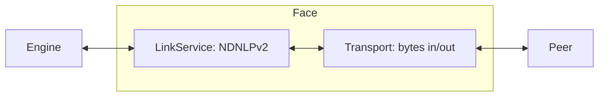

# Implementing a face

A face is the NDN-layer link to a peer. It owns a `Transport` (raw
byte send/recv) and a `LinkService` (NDNLPv2 framing). This guide
walks through writing a new face transport and wiring it into the
engine.

The trait surface is [Extend tier → Face](../api/extend.md#face);
the catalog of shipped transports is in
[Face transports](../reference/face-transports.md).

## When to add a new face

- Your transport (a new wireless link, a new IPC channel, a new
  overlay) isn't already covered by the twelve in-tree faces.
- You need a face with non-standard framing (e.g. wrapping NDN in a
  different envelope).

For most NDN-over-Internet work, UDP or TCP already exists. For
browser deployments WebTransport and WebRTC ship; for in-process
work `InProcFace` ships.

## The two halves



- `Transport` moves byte slices to/from a peer. It knows nothing of
  NDN packets — only `Bytes`.
- `LinkService` framings byte sequences into NDN-layer packets:
  applies/strips NDNLPv2 headers, handles fragmentation, sets
  IncomingFaceId, marks congestion.
- `Face = Transport + LinkService` is the composition the engine
  sees.

## Writing the transport

```rust,ignore
use ndn_transport::{Transport, FaceId, FaceAddr, FaceKind, FaceEvent};
use bytes::Bytes;
use async_trait::async_trait;

pub struct MyTransport {
    id: FaceId,
    // ... your socket / handle / whatever
}

#[async_trait]
impl Transport for MyTransport {
    fn face_id(&self) -> FaceId { self.id }
    fn local(&self) -> FaceAddr { /* ... */ }
    fn remote(&self) -> FaceAddr { /* ... */ }
    fn kind(&self) -> FaceKind { FaceKind::OnDemand }

    async fn send(&mut self, bytes: Bytes) -> Result<(), TransportError> {
        // hand bytes to your link
    }

    async fn recv(&mut self) -> Option<Bytes> {
        // pull bytes from your link; None on close
    }

    async fn close(&mut self) -> Result<(), TransportError> {
        // tear down
    }
}
```

`FaceKind` classification:

- `Local` — application-side connections (Unix socket, in-process).
- `OnDemand` — created on first packet (e.g. NDN-over-UDP responder).
- `Persistent` — survives idle periods.
- `Permanent` — operator-pinned; reconnect on failure.

`FaceAddr` carries the transport-specific address (URL, socket addr,
ID). The engine uses it for management-protocol display only.

## Picking a LinkService

| LinkService | When to use |
|---|---|
| `LpLinkService` (default) | Anything reachable over a lossy or fragmented link. Handles NDNLPv2 framing, fragmentation, IncomingFaceId. |
| `PassthroughLinkService` | Reliable, ordered, MTU-large links where you want bytes-in/bytes-out (e.g. shared memory, in-process). |

Assemble the face:

```rust,ignore
use ndn_transport::{Face, LpLinkService};

let face = Face::new(MyTransport { /* ... */ }, LpLinkService::default());
```

## Building a listener

A listener accepts incoming faces. The pattern is
"return an `(stream, dialer)` pair":

```rust,ignore
use ndn_transport::FaceListener;

pub struct MyListener { /* ... */ }

#[async_trait::async_trait]
impl FaceListener for MyListener {
    async fn accept(&mut self) -> Option<Face<MyTransport, LpLinkService>> {
        // accept a new connection, build a Face
    }
}
```

Engine wiring:

```rust,ignore
use ndn_engine::{EngineBuilder, EngineConfig};

# async fn build_engine() -> anyhow::Result<()> {
let listener = MyListener::bind("/var/run/myface.sock").await?;
let (_engine, _shutdown) = EngineBuilder::new(EngineConfig::default())
    .listener(listener)
    .build()
    .await?;
# Ok(()) }
```

## Wasm-compatibility check

The dashboard's browser engine builds for `wasm32-unknown-unknown`.
If your face is intended to run in-browser, vet every dependency for
wasm support (no `mio`, no raw sockets, no `tokio::net`). The
`ndn-face-webtransport-wasm` and `ndn-face-webrtc` crates are the
in-tree reference for browser faces.

Per project memory `feedback_consider_wasm`: mirror your builder
method on `WasmEngineBuilder` if the face is meant to run in-browser.

## Built-in references

| Face | Crate | Transport shape |
|---|---|---|
| UDP | `crates/ndn-faces/src/net/udp.rs` | UDP socket per peer. |
| TCP | `crates/ndn-faces/src/net/tcp.rs` | TCP connection. |
| Unix | `crates/ndn-faces/src/local/unix.rs` | Local Unix socket. |
| InProc | `crates/ndn-faces/src/local/in_proc.rs` | In-process channel. |
| Shm | `crates/ndn-faces/src/local/shm.rs` | Shared-memory ring (spsc-shm). |
| Ether | `crates/ndn-faces/src/l2/ether.rs` | Raw Ethernet. |
| Bluetooth | `crates/ndn-faces/src/l2/bluetooth/mod.rs` | BLE L2CAP. |
| Serial | `crates/ndn-faces/src/serial/mod.rs` | UART. |
| WebTransport | `crates/ndn-face-webtransport*` | QUIC datagrams. |
| WebRTC | `crates/ndn-face-webrtc/` | Datachannel. |
| SharedWorker | `crates/ndn-face-shared-worker/` | Per-origin engine sharing. |
| BoltFFI | `crates/ndn-boltffi/` | FFI bridge. |

## See also

- [Extend tier → Face](../api/extend.md#face) — trait inventory.
- [Face transports](../reference/face-transports.md) — catalog with
  feature flags and use cases.
- `crates/ndn-transport/` — `Transport`, `LinkService`, and
  `Face` definitions.
