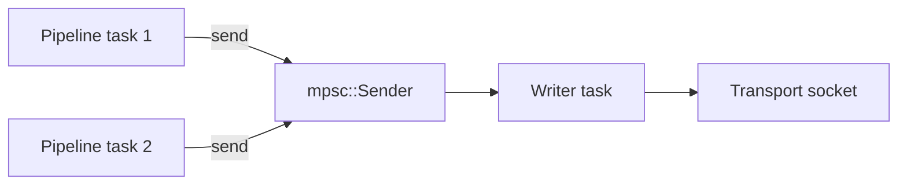
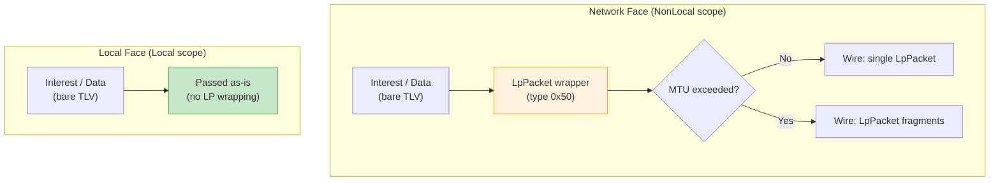

# Implementing a Face

This guide walks through implementing a custom face type for ndn-rs.
Faces are the abstraction over network transports — every link-layer
connection (UDP, TCP, Ethernet, serial, in-process channel) is a face.

A `Face` in ndn-rs is **two traits composed**: a [`Transport`] for
byte-level send/recv, and a [`LinkService`] for NDNLPv2 framing,
fragmentation, congestion-mark handling, and reliability. This mirrors
NFD (`daemon/face/face.hpp`). Custom face types implement
[`Transport`] only; the engine pairs the transport with the default
[`LinkService`] for its [`FaceKind`].

## The Transport Trait

The Transport trait lives in `ndn-transport`
(`crates/spec/ndn-transport/src/transport.rs`):

```rust
pub trait Transport: Send + Sync + 'static {
    fn id(&self) -> FaceId;
    fn kind(&self) -> FaceKind;

    fn remote_uri(&self) -> Option<String> { None }
    fn local_uri(&self) -> Option<String> { None }
    fn link_type(&self) -> LinkType { LinkType::PointToPoint }

    /// Maximum per-frame byte budget. `None` for stream transports
    /// (TCP, Unix). `Some(n)` for datagram-bound transports — the
    /// LinkService fragments outbound packets above this size.
    fn send_mtu(&self) -> Option<usize> { None }

    fn send_bytes(&self, wire: Bytes) -> impl Future<Output = Result<(), FaceError>> + Send;
    fn recv_bytes(&self) -> impl Future<Output = Result<Bytes, FaceError>> + Send;
}
```

Key points:

- **`id()`** returns a `FaceId(u64)` assigned by the `FaceTable`. Call `face_table.alloc_id()` to get one before constructing your transport.
- **`kind()`** returns a `FaceKind` variant. This determines the face's scope (local vs. non-local) and selects the default `LinkService` paired with it.
- **`recv_bytes()`** is called from a single dedicated task per face.
- **`send_bytes()`** may be called concurrently from multiple pipeline tasks. It takes `&self`, so internal synchronization is required if the underlying transport is not inherently concurrent.
- **`send_mtu()`** returns the link MTU. `LpLinkService` uses it to fragment oversized packets.
- **`remote_uri()` / `local_uri()`** are optional and used for NFD management status reporting.

Optional overrides:
- `recv_bytes_with_addr()` — multicast/broadcast transports return the link-layer sender address alongside the wire payload.
- `send_bytes_with_source(wire, source)` — in-process transports (like `InProcFace`) deliver an in-process source-face tag alongside the bytes; mirrors NFD's `IncomingFaceIdTag`.

The engine wraps your `Transport` impl with the default `LinkService`
via `Face::from_transport(t)` — Passthrough for local kinds (Unix,
App, Shm, …), `LpLinkService` for non-local kinds (Udp, Tcp,
Ethernet, …).

```mermaid
stateDiagram-v2
    [*] --> Created: FaceTable.alloc_id()
    Created --> Registered: face_table.insert(face)
    Registered --> Running: tokio::spawn(recv task)
    Running --> Running: recv() / send() loop
    Running --> Closing: error or shutdown signal
    Closing --> Removed: face_table.remove(id)
    Removed --> [*]: FaceId recycled
```

## Adding a FaceKind Variant

If your transport does not fit an existing `FaceKind`, add a new variant:

1. Add the variant to the `FaceKind` enum in `crates/spec/ndn-transport/src/face.rs`
2. Update `scope()` to classify it as `Local` or `NonLocal`
3. Update the `Display` and `FromStr` implementations

```rust
pub enum FaceKind {
    // ... existing variants ...
    MyTransport,
}
```

If your transport is network-facing, return `FaceScope::NonLocal` from `scope()`. If it is same-host IPC, return `FaceScope::Local`.

## Example: A Face Wrapping a Custom Transport

Here is a minimal face wrapping a hypothetical `CustomSocket` type:

```rust
use std::sync::Arc;
use bytes::Bytes;
use tokio::sync::mpsc;
use ndn_transport::{Transport, FaceId, FaceKind, FaceError};

pub struct CustomFace {
    id: FaceId,
    /// Incoming packets buffered by the reader task.
    rx: tokio::sync::Mutex<mpsc::Receiver<Bytes>>,
    /// Sender half for outgoing packets, consumed by a writer task.
    tx: mpsc::Sender<Bytes>,
}

impl CustomFace {
    pub fn new(
        id: FaceId,
        socket: CustomSocket,
        buffer_size: usize,
    ) -> (Self, CustomFaceReader) {
        let (in_tx, in_rx) = mpsc::channel(buffer_size);
        let (out_tx, out_rx) = mpsc::channel(buffer_size);

        let face = Self {
            id,
            rx: tokio::sync::Mutex::new(in_rx),
            tx: out_tx,
        };

        // The reader/writer tasks run separately.
        let reader = CustomFaceReader {
            socket: socket.clone(),
            in_tx,
            out_rx,
        };

        (face, reader)
    }
}

impl Transport for CustomFace {
    fn id(&self) -> FaceId {
        self.id
    }

    fn kind(&self) -> FaceKind {
        FaceKind::Tcp // or your custom variant
    }

    fn remote_uri(&self) -> Option<String> {
        Some("custom://10.0.0.1:9000".to_string())
    }

    async fn recv_bytes(&self) -> Result<Bytes, FaceError> {
        self.rx
            .lock()
            .await
            .recv()
            .await
            .ok_or(FaceError::Closed)
    }

    async fn send_bytes(&self, wire: Bytes) -> Result<(), FaceError> {
        self.tx
            .send(wire)
            .await
            .map_err(|_| FaceError::Closed)
    }
}
```

## Registering with FaceTable

The engine's `FaceTable` manages all active faces. After constructing your face:

```rust
// Allocate an ID from the table.
let id = face_table.alloc_id();

// Construct the face with that ID.
let (face, reader) = CustomFace::new(id, socket, 256);

// Register it. The table wraps it in Arc<dyn ErasedFace>.
face_table.insert(face);

// Spawn the reader/writer task.
tokio::spawn(reader.run());
```

The `FaceTable` uses `DashMap<FaceId, Arc<dyn ErasedFace>>` internally. Pipeline stages clone the `Arc` handle out of the table before calling `send()`, so no table lock is held during I/O. Face IDs are recycled when a face is removed.

## Design Tips

### recv: one task, one consumer

> **💡 Key insight:** `recv()` is called from exactly **one** dedicated task per face. The engine spawns this task automatically. You never need to make `recv()` safe for concurrent callers -- it is inherently single-consumer. This simplifies implementation: you can use a `tokio::sync::Mutex<Receiver>` without worrying about contention.

`recv()` is only ever called from the face's own reader task. The engine spawns one task per face that loops on `recv()` and pushes decoded packets into the shared pipeline channel. You do not need to make `recv()` safe for concurrent callers.

### send: must be `&self` and synchronized

> **⚠️ Important:** `send()` takes `&self`, not `&mut self`. Multiple pipeline tasks may call `send()` concurrently on the same face. You **must** provide internal synchronization. The idiomatic pattern is to hold an `mpsc::Sender` (which is `Clone + Send`) and delegate actual I/O to a dedicated writer task. Do not use a `Mutex<Socket>` directly -- it would serialize all outgoing traffic through a single lock.

`send()` is called from arbitrary pipeline tasks -- potentially many at once. Since the signature is `&self` (not `&mut self`), you must synchronize internally. The standard pattern is an `mpsc::Sender` that buffers outgoing packets for a dedicated writer task:



The `mpsc::Sender::send()` is itself safe to clone and call from multiple tasks.

### Backpressure via mpsc channels

Use bounded `mpsc::channel(capacity)` for both the inbound and outbound paths. This provides natural backpressure:

- **Inbound:** if the pipeline is slow, the reader task blocks on `in_tx.send()` until there is room, applying backpressure to the transport.
- **Outbound:** if the transport is slow, `send()` blocks on `out_tx.send()` until the writer task drains the queue, propagating backpressure to the pipeline.

A capacity of 128--256 packets is a reasonable starting point. Too small and you starve throughput; too large and you add latency during congestion.

### LP encoding convention



Network-facing transports (UDP, TCP, Ethernet, serial) should wrap packets in an NDNLPv2 `LpPacket` envelope before writing to the wire. Local transports (Unix, App, SHM) send the raw packet as-is. The existing `StreamFace` makes this explicit via an `lp_encode` constructor parameter -- follow the same convention based on `FaceKind::scope()`.

> **🎯 Tip:** When in doubt about whether your face needs LP wrapping, check `FaceKind::scope()`. If it returns `NonLocal`, you almost certainly need LP encoding. Study `UdpFace` (simplest network face) or `InProcFace` (simplest local face) as reference implementations for your transport category.

### Error handling

Return `FaceError::Closed` when the underlying transport is permanently gone. Return `FaceError::Io(e)` for transient I/O errors. Return `FaceError::Full` if a non-blocking send would exceed buffer capacity (the pipeline may retry or Nack).

## FaceUri schemes

A face's `remote_uri()` returns a URI whose scheme identifies the
transport. NFD-standard schemes (`udp4://`, `udp6://`, `tcp4://`,
`tcp6://`, `unix://`, `ether://`, `ws://`, `wss://`, `internal://`) are
the lingua franca across NDN implementations; cross-impl tooling
(`nfdc`, ndn-cxx control clients) parses them directly.

ndn-rs additionally emits two schemes that are not in the NFD FaceUri
registry:

- **`shm://...`** — shared-memory SPSC face
  (`crates/spec/ndn-faces/src/local/shm/spsc.rs`). No other NDN
  implementation ships a shared-memory transport; the scheme is
  ndn-rs-proprietary and only meaningful between two ndn-rs
  processes on the same host. Gated behind the `spsc-shm` feature.
- **`serial://<dev>:<baud>`** — serial / COBS-framed face
  (`crates/spec/ndn-faces/src/serial/serial.rs`). The framing matches
  the esp8266ndn convention used by the Arduino / ESP NDN community,
  but the URI scheme itself is not in the registry. Gated behind the
  `serial` feature.

Both schemes are deliberately ndn-rs-specific and stable within the
workspace. Tools that parse FaceUris from other implementations should
treat `shm://` and `serial://` as unknown schemes; the underlying
transports are not interoperable with non-ndn-rs nodes by design (SHM
because there is no peer impl, serial because the framing is a
community convention rather than a spec).

When implementing a new face, prefer one of the NFD-standard schemes
if the transport maps to an existing category. Only invent a new
scheme when the transport has no NFD analogue, and document the
invention here.

## Existing face implementations

Study these for patterns:

| Face | Crate | Notes |
|------|-------|-------|
| `UdpFace` | `ndn-faces` | Datagram transport, simplest network face |
| `TcpFace` | `ndn-faces` | Stream transport via `StreamFace` helper |
| `InProcFace` | `ndn-faces` | In-process channel pair, no serialization |
| `ShmFace` | `ndn-faces` | Shared-memory ring buffer (`shm://`, ndn-rs-only) |
| `NamedEtherFace` | `ndn-faces` | Raw Ethernet via `AF_PACKET` |
| `SerialFace` | `ndn-faces` | UART/serial with COBS framing (`serial://`, ndn-rs-only) |
| `WfbFace` | `ndn-faces` | Wifibroadcast NG integration |
| `WebSocketFace` | `ndn-faces` | WebSocket transport |
| `ComputeFace` | `ndn-compute` | Named function networking |
