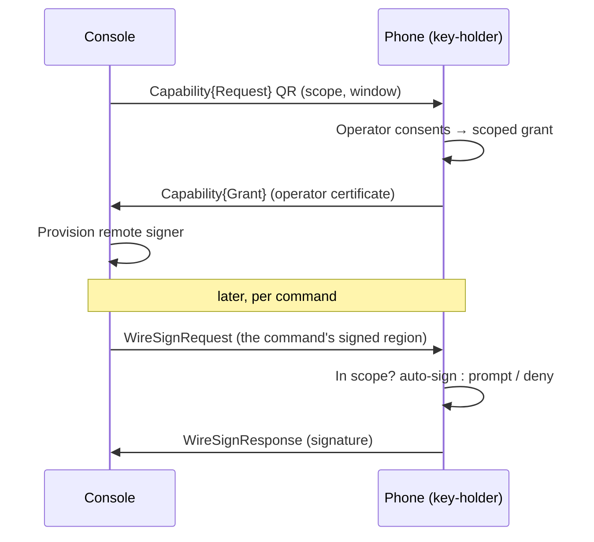

# Remote-signer pairing

Extension extension
Remote-signer pairing is an ndn-rs extension with no NDN community spec
behind it. The wire shapes below (the <code>ndn-trust://</code> envelope, the
sign-request exchange) are specific to ndn-rs.

Remote-signer pairing lets a machine sign its NDN commands with a key that
never leaves another device. A phone (or any key-holder) keeps the private
key; an operator console receives *individual signatures*, on demand, only
within a scope and time window the operator approved on the device.

This is useful when you operate a forwarder from a machine you don't fully
trust — a shared workstation, a kiosk — and don't want a signing key to rest
on it.

## The two layers

Pairing keeps **authority** and **custody** separate:

- **Authority** is a name-bound, signed object — a capability granting the
  console permission to act in a namespace. It never names a host, device,
  or session.
- **Custody** is the device-bound key plus its local consent (a biometric, or
  a live grant). The key is never copied; only signatures cross the wire.

## The flow

1. **Request.** The console shows a `ndn-trust://capability/…` request naming
   the scope it wants and for how long.
2. **Consent.** The phone scans it and the operator approves a scope on the
   device. The phone returns a grant carrying its operator certificate.
3. **Provision.** The console imports the grant and wires a remote signer
   addressed to the phone's `…/signer` responder.
4. **Sign.** Each command's signed region travels to the phone as a sign
   request; the phone signs it within the grant and returns the signature.
   The console assembles the signed command and sends it to the forwarder.

The sign exchange rides the **same forwarder** the console already manages —
it is ordinary Interest/Data, not a side channel.

## Scopes

A grant is bounded by an action class and a hard expiry — never "forever":

| Class | Covers | Default |
|-------|--------|---------|
| `Route` | `/localhost/nfd/rib/*` | auto-sign in window |
| `Face` | `/localhost/nfd/faces/*` | auto-sign in window |
| `Strategy` | `/localhost/nfd/strategy-choice/*` | auto-sign in window |
| `Sensitive` | `…/security/*`, `…/ca/*` | always prompt |

A request outside the granted class falls through to the device's consent
gate; sensitive actions always prompt, even under a broad grant.

## Doing it from the dashboard

The dashboard's **Pairing** screen (Identity bucket) drives the console side:

1. Open **Pairing**. A request QR is shown for a scope (e.g.
   `/localhost/nfd/rib`) and a window.
2. On the phone, scan the QR and approve the scope.
3. Paste the grant the phone shows back into **Complete pairing** and select
   **Pair this console**.
4. Issue a command (e.g. add a route). It is signed by the phone over NDN; no
   key lives on the console.

See [Running the dashboard](./running-the-dashboard.md) for launching the
console against a forwarder.

## Reaching the device

For the console's sign request to reach the phone, the forwarder needs a route
to the phone's `…/signer` prefix. A mobile node announces this itself with a
`/localhop/nfd/rib/register` command signed by its operator key; the gateway
installs the route for the requesting face after validating the command
against its localhop trust anchors (see
[Trust policies](../reference/trust-policies.md)). A node whose certificate is
not cached locally but is reachable over NDN is fetched and validated on
demand, so it need not have enrolled against the gateway directly.

## What this gives you

- The signing key never leaves the device.
- Authorisation is bounded by an explicit scope and a hard expiry.
- Sensitive commands always require a fresh, on-device confirmation.
- Returned signatures verify against the operator certificate carried in the
  grant, so the console can detect a tampered or substituted reply.

## Related

- [Identity and keys](../concepts/identity-and-keys.md) — the custody model.
- [NDNCERT setup](./ndncert-setup.md) — issuing the operator certificate a
  grant carries.
- [Trust policies](../reference/trust-policies.md) — localhop command
  validation and trust anchors.
- [Security pitfalls](./security-pitfalls.md) — what pairing does and does not
  protect against.
