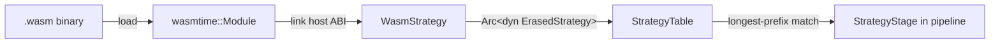

# Hot-Loadable WASM Forwarding Strategies

Forwarding strategies are the brains of an NDN router. They decide, for every
arriving Interest, which nexthop face (or faces) should carry it toward the
data. In a traditional setup, changing that decision logic means editing Rust
code, recompiling the router binary, and restarting -- during which every
in-flight packet is dropped and every PIT entry is lost. For a production
router handling thousands of prefixes, that is a steep price to pay for
tweaking a single algorithm.

ndn-rs solves this with **WASM strategies**: self-contained WebAssembly modules
that implement the forwarding decision function, loaded into a running router
at any time, assigned to specific prefixes, and replaced or rolled back in
seconds -- all without restarting or recompiling anything.

## How It Works

The `ndn-strategy-wasm` crate embeds a [Wasmtime](https://wasmtime.dev/)
runtime inside the router process. A WASM strategy module is a `.wasm` binary
that exports an `on_interest()` function (and optionally `on_nack()`). The
router loads the binary, validates it, links it against a set of host-provided
functions, and wraps it in a `WasmStrategy` struct that implements
`ErasedStrategy` -- the same trait object interface that native Rust strategies
use. From the pipeline's perspective, a WASM strategy is indistinguishable from
a compiled-in one.



Each time an Interest arrives, the pipeline's `StrategyStage` performs a
longest-prefix match against the `StrategyTable`. If the matched entry is a
`WasmStrategy`, the router creates a fresh Wasmtime `Store`, populates it with
the current `StrategyContext` (incoming face, FIB nexthops, RTT measurements,
RSSI, satisfaction rates), calls the guest's `on_interest()` export, and
collects the resulting `ForwardingAction` values.

> **Key detail:** Each invocation gets its own `Store`. There is no mutable
> state that persists between calls inside the WASM module. This makes the
> execution stateless and deterministic, which simplifies reasoning about
> correctness.

## Writing a WASM Strategy

A WASM strategy is a program compiled to `wasm32-unknown-unknown` that imports
functions from the `"ndn"` namespace and exports entry points the router will
call.

### The Guest ABI

The host exposes these imported functions to the WASM guest:

| Function             | Signature                                              | Description                                |
|----------------------|--------------------------------------------------------|--------------------------------------------|
| `get_in_face`        | `() -> u32`                                            | Face ID the Interest arrived on            |
| `get_nexthop_count`  | `() -> u32`                                            | Number of FIB nexthops for this name       |
| `get_nexthop`        | `(index: u32, out_face_id: u32, out_cost: u32) -> u32` | Write face ID and cost to guest memory; returns 0 on success |
| `get_rtt_ns`         | `(face_id: u32) -> f64`                                | RTT in nanoseconds, or -1.0 if unknown     |
| `get_rssi`           | `(face_id: u32) -> i32`                                | RSSI in dBm, or -128 if unknown            |
| `get_satisfaction`   | `(face_id: u32) -> f32`                                | Satisfaction rate [0.0, 1.0], or -1.0      |
| `forward`            | `(face_ids_ptr: u32, count: u32)`                      | Forward Interest to the listed faces       |
| `nack`               | `(reason: u32)`                                        | Send a Nack (0=NoRoute, 1=Duplicate, 2=Congestion, 3=NotYet) |
| `suppress`           | `()`                                                   | Suppress the Interest silently             |

The guest module must export:

- **`on_interest()`** (required) -- called for every Interest matching the assigned prefix.
- **`on_nack()`** (optional) -- called when a Nack arrives on an out-record face.
- **`memory`** (required) -- the guest's linear memory, so the host can write nexthop data into it via `get_nexthop`.

### A Minimal Strategy in Rust

This strategy forwards every Interest to the lowest-cost nexthop, or sends a
NoRoute Nack if the FIB has no entry:

```rust
// Cargo.toml:
//   [lib]
//   crate-type = ["cdylib"]
//
// Build with:
//   cargo build --target wasm32-unknown-unknown --release

// Declare host imports from the "ndn" namespace.
#[link(wasm_import_module = "ndn")]
extern "C" {
    fn get_nexthop_count() -> u32;
    fn get_nexthop(index: u32, out_face_id: *mut u32, out_cost: *mut u32) -> u32;
    fn forward(face_ids_ptr: *const u32, count: u32);
    fn nack(reason: u32);
}

#[no_mangle]
pub extern "C" fn on_interest() {
    unsafe {
        let count = get_nexthop_count();
        if count == 0 {
            nack(0); // NoRoute
            return;
        }
        // Read the first (lowest-cost) nexthop.
        let (mut face_id, mut cost) = (0u32, 0u32);
        get_nexthop(0, &mut face_id, &mut cost);
        // Forward to that single face.
        forward(&face_id, 1);
    }
}
```

### An RTT-Aware Strategy

This strategy picks the nexthop with the lowest observed RTT, falling back to
cost-based ordering when RTT data is unavailable:

```rust
#[link(wasm_import_module = "ndn")]
extern "C" {
    fn get_nexthop_count() -> u32;
    fn get_nexthop(index: u32, out_face_id: *mut u32, out_cost: *mut u32) -> u32;
    fn get_rtt_ns(face_id: u32) -> f64;
    fn forward(face_ids_ptr: *const u32, count: u32);
    fn nack(reason: u32);
}

#[no_mangle]
pub extern "C" fn on_interest() {
    unsafe {
        let count = get_nexthop_count();
        if count == 0 {
            nack(0);
            return;
        }

        let mut best_face: u32 = 0;
        let mut best_rtt: f64 = f64::MAX;

        for i in 0..count {
            let (mut face_id, mut cost) = (0u32, 0u32);
            get_nexthop(i, &mut face_id, &mut cost);
            let rtt = get_rtt_ns(face_id);
            // Use RTT if available, otherwise use cost as a tiebreaker.
            let score = if rtt < 0.0 { cost as f64 * 1e9 } else { rtt };
            if score < best_rtt {
                best_rtt = score;
                best_face = face_id;
            }
        }

        forward(&best_face, 1);
    }
}
```

### Building

```bash
# From your strategy crate directory:
cargo build --target wasm32-unknown-unknown --release

# The output is at:
#   target/wasm32-unknown-unknown/release/my_strategy.wasm
```

The resulting `.wasm` file is typically 1-10 KB for a pure forwarding strategy.
No standard library is needed -- `#![no_std]` works fine and produces smaller
binaries.

## Hot-Loading and Prefix Assignment

Loading a WASM strategy into a running router is a two-step process: create the
`WasmStrategy` instance, then insert it into the `StrategyTable` at the desired
prefix.

```mermaid
sequenceDiagram
    participant Op as Operator
    participant Mgmt as Management API
    participant ST as StrategyTable
    participant Pipeline as StrategyStage

    Op->>Mgmt: Load WASM binary + assign to /prefix
    Mgmt->>Mgmt: WasmStrategy::from_file() or from_bytes()
    Mgmt->>ST: strategy_table.insert(/prefix, Arc&lt;WasmStrategy&gt;)
    Note over ST: Old strategy Arc dropped<br/>when last in-flight packet finishes
    Pipeline->>ST: lpm(/prefix/name) on next Interest
    ST-->>Pipeline: Arc&lt;WasmStrategy&gt;
    Pipeline->>Pipeline: Execute on_interest() in WASM sandbox
```

### Programmatic Loading

```rust
use ndn_strategy_wasm::WasmStrategy;

// Load from a file on disk.
let strategy = WasmStrategy::from_file(
    Name::from_str("/localhost/nfd/strategy/my-rtt-strategy")?,
    "/path/to/my_strategy.wasm",
    10_000, // fuel limit
)?;

// Or load from in-memory bytes.
let strategy = WasmStrategy::from_bytes(
    Name::from_str("/localhost/nfd/strategy/my-rtt-strategy")?,
    &wasm_bytes,
    10_000,
)?;

// Assign to a prefix. Takes effect immediately for new Interests.
engine.strategy_table().insert(
    &Name::from_str("/app/video")?,
    Arc::new(strategy),
);
```

### Rollback

Rolling back is just another `insert` call. Keep the previous strategy around
(or know its name) and re-assign:

```rust
// Roll back to the built-in best-route strategy.
engine.strategy_table().insert(
    &Name::from_str("/app/video")?,
    Arc::new(BestRouteStrategy::new()),
);
```

Or remove the prefix-specific override entirely, letting it inherit from a
parent prefix:

```rust
engine.strategy_table().remove(&Name::from_str("/app/video")?);
```

Because `StrategyTable` stores `Arc<dyn ErasedStrategy>`, the swap is atomic
from the perspective of the pipeline. In-flight packets that already obtained an
`Arc` clone of the old strategy will finish naturally. New packets pick up the
new strategy immediately. There is no window of inconsistency and no dropped
packets.

### Via the Management Protocol

The router's NFD-compatible management API supports strategy assignment through
the standard `strategy-choice/set` and `strategy-choice/unset` commands:

```
strategy-choice/set Name=/app/video Strategy=/localhost/nfd/strategy/wasm-rtt
strategy-choice/unset Name=/app/video
strategy-choice/list
```

## Safety and Sandboxing

A forwarding strategy runs on the hot path of every packet. A bug in a native
strategy can crash the entire router. WASM strategies run inside a sandbox that
provides strong isolation guarantees:

**Fuel-limited execution.** Every WASM invocation is given a fixed fuel budget
(default: 10,000 instructions, roughly 50 microseconds worst case). If the
module exhausts its fuel -- for example, due to an infinite loop -- Wasmtime
traps the execution and the router returns `ForwardingAction::Suppress` for
that packet. The router itself continues running without interruption.

**Memory cap.** Guest modules are limited to a fixed memory allocation (default:
1 MB). A module cannot allocate unbounded memory or access memory outside its
own linear address space.

**No I/O access.** WASM modules have no access to the filesystem, network, or
system clock. The only way they can interact with the outside world is through
the host-provided `"ndn"` namespace functions. A malicious or buggy module
cannot open sockets, read files, or exfiltrate data.

**Graceful degradation.** Every failure mode -- instantiation failure, missing
exports, fuel exhaustion, traps -- results in `Suppress`. The Interest is
silently dropped rather than forwarded to an incorrect face. This is the safest
default: the PIT entry will eventually time out, and the consumer can retry.

> **Note:** The fuel limit is configurable per `WasmStrategy` instance. For
> strategies that need more computation (e.g., iterating over many nexthops with
> cross-layer data), increase the fuel budget. Monitor the `strategy` tracing
> span for fuel exhaustion warnings.

## When to Use WASM Strategies

WASM strategies are not a replacement for native Rust strategies in all cases.
Native strategies have zero overhead and full access to Rust's type system.
WASM strategies trade a small amount of performance for operational flexibility.

**Research and experimentation.** Testing a new forwarding algorithm no longer
requires a full Rust build cycle. Write the logic, compile to WASM (sub-second
for small modules), upload it to the router, assign it to a test prefix, and
observe the results. If it misbehaves, roll back in seconds.

**A/B testing.** Assign different WASM strategies to different prefixes and
compare their performance using the measurements table. For example, run an
RTT-based strategy on `/app/video` and a multicast strategy on
`/app/video-experimental`, then compare satisfaction rates.

**Multi-tenant routers.** In a shared infrastructure setting, different tenants
can supply their own forwarding strategies for their prefix space. The WASM
sandbox ensures that one tenant's strategy cannot interfere with another's
traffic or crash the router.

**Rapid incident response.** If a particular prefix is experiencing poor
forwarding performance, an operator can upload a patched strategy targeting just
that prefix without touching the rest of the router's configuration.

**Teaching and prototyping.** The guest ABI is simple enough that a strategy can
be written in WAT (WebAssembly Text) directly, or in any language that compiles
to `wasm32-unknown-unknown`. This makes it accessible for students and
researchers who may not be familiar with the full ndn-rs Rust codebase.
