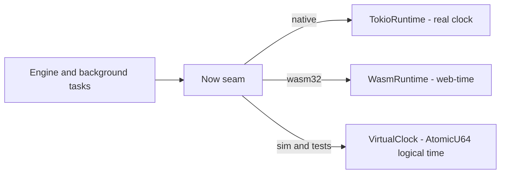

# The determinism seam

A forwarder is full of time. PIT entries expire, nonces age out of the
dead-nonce list, strategies retry after delays, faces time out, sync suppresses
on jittered timers. If every one of those reads the system clock directly, the
engine is non-deterministic: timeout tests are flaky, and a multi-node
simulation can never be replayed. ndn-rs routes **every** engine time read
through one seam so that a test or a simulator can supply logical time instead.
The decision is recorded in [ADR 0004](../adr/0004-virtualize-the-clock.md);
this page is the mechanism.

## The seam: `ndn-runtime`

The seam is three small traits in `crates/core/ndn-runtime/src/lib.rs`, composed
into one `Runtime`:

| Trait | Method | Purpose |
|---|---|---|
| `Spawn` | `spawn(&self, BoxFuture)` | Start a background task. |
| `Sleep` | `sleep(&self, Duration) -> BoxFuture` | Wait for a duration. |
| `Now` | `now() -> Instant` | Monotonic instant — durations, timeouts, interval timing. |
| `Now` | `unix_nanos() -> u64` | **Wall-clock** nanoseconds since the Unix epoch — cross-node timestamps: PIT/Interest-lifetime deadlines, Data freshness, certificate validity. |

The split between `now()` and `unix_nanos()` matters: `now()` is monotonic and
process-local (never goes backwards, not comparable across machines), while
`unix_nanos()` is absolute and comparable across nodes. Code that computes a
deadline or measures an interval uses `now()`; code that stamps or reads a
value that travels on the wire uses `unix_nanos()`.

`unix_nanos()` has a **default** implementation that reads the system clock, so
a production runtime gets it for free and need not implement it. That default is
exactly the hinge the seam turns on.

## Real clock vs. virtual clock

- **Native** uses `TokioRuntime`, which reads the real monotonic and wall
  clocks and spawns Tokio tasks.
- **Browser** uses `WasmRuntime`, which spawns via `wasm-bindgen-futures`,
  sleeps via `gloo-timers`, and reads `web_time::Instant` (a proxy for
  `performance.now()`) — so the same engine builds and runs in a tab, where the
  Tokio timer wheel would panic.
- **Simulation and tests** supply a *virtual* runtime that overrides
  `unix_nanos()` (and `now()`/`sleep()`) to return logical time driven by an
  `AtomicU64`. Because the engine reads only through this one seam, advancing
  the atomic advances the engine's whole notion of time, deterministically.

The unit test `virtual_runtime_can_drive_logical_epoch_time` in
`ndn-runtime`'s `lib.rs` is the seam in miniature: it wraps an
`Arc<AtomicU64>` in a `VirtualClock`, reads `unix_nanos()` back as `1_000`,
`store`s `5_000`, and reads `5_000` — "the logical epoch is whatever the sim
sets." A scheduler advances that atomic the same way; the engine follows.

## One packet, one instant: `ctx.arrival`

Threading time through a seam is only half the job. A single packet touches
several stages (Content Store, PIT, strategy), and if each stage re-read the
clock, one packet's decisions could straddle two different instants. So the
forwarding path stamps a packet's **arrival timestamp** once, at ingress, into
`PacketContext::arrival` (`crates/forwarding/ndn-engine/src/pipeline/context.rs`),
and every downstream stage reads *that* rather than the clock:

- the Content Store freshness/insert stage uses `let now_ns = ctx.arrival;`
  (`stages/cs.rs`),
- the PIT stage anchors expiry and aggregation windows to `ctx.arrival`
  (`stages/pit.rs`),
- the strategy stage reads `ctx.arrival` for its timing (`stages/strategy.rs`).

All of a packet's time-derived decisions are therefore anchored to one
consistent instant, which is both correct and reproducible. Background tasks —
which are not tied to a single packet — take an injected `now` instead: the
expiry sweeps read `runtime.unix_nanos()` / `runtime.now()`
(`crates/forwarding/ndn-engine/src/expiry.rs`), and the signals driver measures
elapsed time from `runtime.now()`.

## Why the suite runs in ~25 seconds

Because timeout-dependent behaviour is driven by logical time, a test *advances
the clock and asserts* instead of sleeping and hoping. No wall-clock waits, no
`sleep` scattered through the tests, and parallel execution under nextest stays
correct because there is no global mutable clock to contend on — the virtual
clock is a per-test `Arc<AtomicU64>`. That is why the full suite completes in
roughly 25 seconds.

The same seam is what lets the simulator be honest. `ndn-sim` (a sibling repo
that depends on `ndn-engine`) runs the **real** `ForwarderEngine` against a
virtual clock, so a simulated multi-node run is deterministic and replayable —
the simulator is not a separate mock of the forwarder, it *is* the forwarder
with time supplied externally.

## What is not yet through the seam

The seam is in place across the forwarding path, background tasks, the Nack-path
out-records, and the discovery clock. A few reads remain direct: `FaceState`
stamps its `last_activity` from `SystemTime::now()` in
`crates/forwarding/ndn-engine/src/engine.rs`. These `FaceState` timestamp reads
are the last direct clock reads being routed through the seam — the polish work
called out in [ADR 0004](../adr/0004-virtualize-the-clock.md)'s status note. If
you are adding engine code, the correct source of time is `runtime.now()` /
`runtime.unix_nanos()` or `ctx.arrival`; a reach for `SystemTime::now()` or
`Instant::now()` in the forwarding path is a review red flag.

## See also

- [ADR 0004 · Virtualize the clock](../adr/0004-virtualize-the-clock.md)
- [The forwarding pipeline](./forwarding-pipeline.md) — the stages that read
  `ctx.arrival`.
- [Testing](../testing.md) — how the suite exercises timeouts without waiting.
