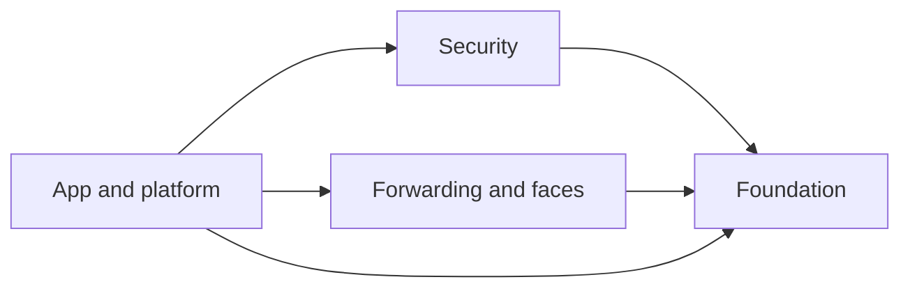

# The layer map

This is the orientation page: where everything lives, which way the arrows
point, and where to start reading. If you have just cloned the workspace and
want the shape of the thing before you dive into any one crate, read this first,
then follow the links out to the deeper pages.

ndn-rs is a Cargo workspace of ~30 library crates. They are grouped on disk
into seven directories under `crates/`, and they form a single directed acyclic
graph in which dependencies only ever point *toward* the foundation. The
[crate graph](./crate-graph.md) page renders that graph visually; this page
gives you the map in words and tables.

## The seven directories

The `crates/` tree groups crates by role, not by dependency layer — the two are
related but not identical (a crate's *directory* is where it lives; its *layer*
is who may depend on it).

| Directory | Representative crates | Responsibility |
|---|---|---|
| `crates/core` | `ndn-tlv`, `ndn-foundation-types`, `ndn-packet`, `ndn-crypto-core`, `ndn-signals-core`, `ndn-runtime`, `ndn-transport`, `ndn-storage`, `ndn-mgmt-wire`, `ndn-frame-io`, `ndn-ble-framing` | The wire codec, packet and name/hash types, the no-alloc crypto core, the cross-layer signal taxonomy, the clock/runtime seam, the face/transport abstraction, and the storage-backend traits. |
| `crates/forwarding` | `ndn-store`, `ndn-fwd-core`, `ndn-strategy`, `ndn-discovery-core`, `ndn-engine`, `ndn-ipc`, `ndn-mgmt`, `ndn-pathcontrol` | The three forwarding tables, the sans-IO forwarding *rules*, the strategy framework, and `ndn-engine` — the crate that assembles the whole forwarding plane. |
| `crates/faces` | `ndn-face`, `ndn-face-local` | Concrete faces: OS-socket transports (`ndn-face`) and the in-process channel face (`ndn-face-local`), split out so wasm consumers get the channel face without OS sockets. |
| `crates/security` | `ndn-security`, `ndn-cert`, `ndn-identity` | Data-centric verification and signing (`ndn-security`), NDNCERT issuance (`ndn-cert`), and identity lifecycle / renewal (`ndn-identity`). |
| `crates/app` | `ndn-app`, `ndn-rs-prelude` | The developer-facing `Node` API and a prelude that re-exports the common surface. |
| `crates/platform` | `ndn-config`, `ndn-observability` | Forwarder configuration and NDN-native span publishing. |
| `crates/protocols` | `ndn-sync` | Dataset synchronisation (SVS and PSync). |

The face/transport *abstraction* (the `Transport`, `LinkService`, and `Face`
types) lives in `crates/core/ndn-transport`; the concrete faces that implement
it live in `crates/faces`. If you are writing a new face, start at
[Implementing a face](../../guides/implementing-a-face.md).

## The dependency layering

Logically the graph is four layers deep, and dependencies flow one way:



Arrows read as *depends on*. Nothing in the foundation reaches back up into
forwarding, security, or app code — the foundation is the widest, most-depended-on
layer and knows nothing of the layers above it. This is what lets the foundation
crates compile for constrained targets that the upper layers never touch (see
below).

## The DAG is enforced, not merely observed

The layering is a checked invariant. Each crate declares a scope in its manifest:

```toml
[package.metadata.scope]
classification = "spec"
```

The **spec** set is the pure library we ship as `ndn-rs`. The rule the CI guard
enforces is that the spec set is *closed under dependency*: a `spec` crate may
only depend, at runtime, on other `spec` crates. Extension, research, and
tooling crates are downstream consumers and may depend on anything. The guard
lives at `testbed/dep-direction-guard.py` and runs on every PR; the moment a
`spec` crate grows an edge into an unclassified or `extension` crate, the build
fails with the offending `crate -> dep` pair named.

Classification is orthogonal to directory. Most crates are `spec`, but a few
that live alongside them are deliberately `extension` — `ndn-storage` (the
pluggable KV backends), `ndn-config`, and `ndn-pathcontrol` — because they are
downstream of, not part of, the closed library core. Do not assume a crate's
directory tells you its classification; the manifest does.

## The four peer targets

The same code compiles for several very different machines. CI proves this on
every PR by building the relevant crate subsets for each target:

| Target | Toolchain triple | What it is | Verified in CI |
|---|---|---|---|
| Native | host (Linux x86-64; macOS in nightly) | the full stack: engine, faces, security, app | `test`, `lint`, `docs` jobs |
| Browser | `wasm32-unknown-unknown` | the forwarding chain up to and including the engine, running in a browser tab | `wasm32` job |
| Bare metal | `riscv32imc-unknown-none-elf` | the `no_std` seed chain on a microcontroller with no OS and no allocator-of-convenience | `no_std` job |

"Native" itself spans more than one machine — the nightly matrix adds macOS for
the `ndrv`/kqueue face paths — but the load-bearing claim is that the *foundation*
and *forwarding rules* are written once and pass on all three architectures. How
that is achieved (sans-IO seed crates, `no_std`+alloc wire types,
`portable-atomic` for MCUs) is the subject of
[sans-IO and no_std](./sans-io-and-no-std.md), and the reasoning is recorded in
[ADR 0003](../adr/0003-sans-io-seed-crates.md). The browser build works because
the time/spawn seam swaps a `web-time` clock in for Tokio; see
[the determinism seam](./determinism-seam.md) and
[ADR 0004](../adr/0004-virtualize-the-clock.md).

## Where a contributor's API starts

Application authors do not touch most of this graph. The developer-facing entry
point is `Node` in `crates/app/ndn-app/src/node.rs`: one handle to a forwarder
over which every NDN pattern is available with one vocabulary.

- `Node::connect(socket)` dials a running `ndn-fwd` over its Unix socket; an
  in-process engine can supply a `Node` too.
- `node.fetch(name)` / `node.verifying(validator)` / `node.object(name)` are the
  consumer side (unverified fetch, verifying fetch, and RDR object fetch).
- `node.serve(prefix, handler)` answers Interests for a prefix.
- `node.publish` / `node.subscribe` drive dataset sync; `node.query` runs a
  responder stream.

The per-pattern building blocks (`Consumer`, `Producer`, `Publisher`,
`Subscriber`, `Queryable`) remain reachable through `Node::connection()` for
code that needs the lower level. For the application-author's view rather than
the contributor's, start at [Building an app](../../guides/building-an-app.md).

## Reading order from here

- [The crate graph](./crate-graph.md) — the interactive picture of the same DAG.
- [The forwarding pipeline](./forwarding-pipeline.md) — the path a packet takes
  through `ndn-engine`.
- [The security model](./security-model.md) — why unverified data is a type
  error, not a code-review finding.
- [The determinism seam](./determinism-seam.md) — why the test suite runs in
  ~25 seconds without sleeping.
- [sans-IO and no_std](./sans-io-and-no-std.md) — how one codebase serves the
  datacenter and the microcontroller.

The sibling repos that consume ndn-rs (the forwarder binary, the simulator, the
embedded forwarder, the mobile app) sit outside this workspace; the surface they
depend on is the [cross-repo contract](../cross-repo-contract.md).
