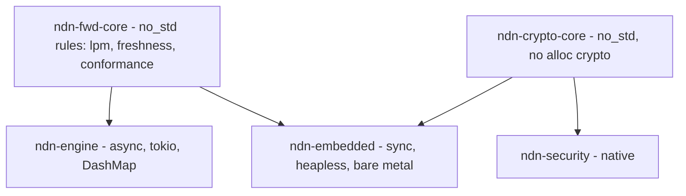

# sans-IO and no_std

ndn-rs targets everything from a datacenter forwarder to a bare-metal
microcontroller. The native engine is async, allocates freely, and uses
`DashMap`/`RwLock`; an embedded forwarder is `#![no_std]`, often no-alloc,
single-threaded, and has no async runtime. The danger is obvious: two
implementations of "longest-prefix match" or "is this Data still fresh?" will
drift apart, and the bugs will differ per target. ndn-rs avoids that by
extracting the pure protocol logic into **sans-IO seed crates** that both builds
share. The reasoning is [ADR 0003](../adr/0003-sans-io-seed-crates.md); this
page is how it is built and how CI keeps it honest.

## The sans-IO philosophy

*Sans-IO* means the protocol *rules* are separated from the machinery that does
I/O. A seed crate contains the parts that are neither async, nor I/O-bound, nor
allocation-dependent, nor opinionated about how the tables are stored — just
pure functions and small state machines over borrowed bytes. The async, sharded
native engine and the synchronous, `heapless` embedded forwarder each keep their
own table containers and their own I/O, but both call into the *same* rules, so
a rule lives exactly once.



## The two seed crates

**`ndn-fwd-core`** (`crates/forwarding/ndn-fwd-core/`) is the sans-IO seed of
the *forwarder*. It is `#![no_std]` and `#![forbid(unsafe_code)]`, and it holds
the container-independent forwarding decisions:

- `lpm` — the FIB longest-prefix-match *selection* rule (longest wins,
  length-guarded). The native trie and the constrained linear table are
  different containers pinned to this one selection rule.
- `freshness` — the Content Store freshness predicate, in both the
  absolute-deadline form the native CS uses and the wrapping relative-period
  form the constrained CS uses, so the comparison and its wrap correctness are
  defined once.
- `conformance` and `strategy`/`store`/`pipeline` seeds.

Deliberately *not* in the seed: anything that does I/O, anything async, and any
`tracing` spans — instrumentation belongs in the adopting I/O layer, not in the
pure functions.

**`ndn-crypto-core`** (`crates/core/ndn-crypto-core/`) is the security analog:
`#![no_std]` and **no alloc** (slice-based), it holds the security-critical
primitives and wire ops — Ed25519 sign/verify over a Data's signed region and
the signed-Data layout — used byte-identically by the native `ndn-security` and
the embedded forwarder, instead of each re-deriving the signed-Data wire. Out of
scope here, and rightly so: key *storage* (PIB/TPM), `TrustSchema` evaluation,
and async cert fetch / NDNCERT — the heavy machinery that stays in
`ndn-security` or is offloaded to capable nodes.

## The `no_std` floor

The `no_std` set is wider than the two seeds, because the wire layer has to run
on the bare-metal floor too. These crates carry `#![no_std]`:

| Crate | Role | Alloc? |
|---|---|---|
| `ndn-tlv` | TLV codec | no_std + alloc |
| `ndn-foundation-types` | shared name/hash primitives | no_std + alloc |
| `ndn-packet` | Interest/Data packet types | no_std + alloc |
| `ndn-crypto-core` | crypto primitives + signed-Data wire | no_std, **no alloc** |
| `ndn-signals-core` | cross-layer signal taxonomy | no_std |
| `ndn-mgmt-wire` | NFD management wire codec | no_std |
| `ndn-storage` | storage-backend traits + flash log | no_std + alloc |
| `ndn-fwd-core` | forwarding rules | no_std |

The wire layer (`ndn-tlv`, `ndn-packet`, `ndn-foundation-types`) is `no_std` but
uses `alloc`, so the same encoder/decoder runs on both native and constrained
targets — the constraint is "no operating system," not "no heap." `ndn-crypto-core`
is stricter still (no alloc) because it must run where even a global allocator is
undesirable.

## `portable-atomic` for MCUs without hardware CAS

`bytes::Bytes` and `Arc` refcounting need atomic compare-and-swap. Some small
single-core microcontrollers (the `riscv32imc` floor among them) have no
hardware CAS instruction. `ndn-packet` therefore exposes a `portable-atomic`
feature that routes `Bytes` and `Arc` refcounting through the
`portable-atomic-util` crate:

```toml
portable-atomic = ["dep:portable-atomic-util", "bytes/extra-platforms"]
```

The dependent binary picks the CAS polyfill via a `portable-atomic` feature or a
rustflag — typically `--cfg portable_atomic_unsafe_assume_single_core`, which is
sound precisely because the target is single-core. This is how the wire types
compile for a chip that a naive `Arc` would reject at link time.

## A concrete `no_std`+alloc backend: the flash store

`ndn-storage` shows the pattern end to end. Its `FlashLogBackend`
(`crates/core/ndn-storage/src/flash.rs`) is a `SyncBackend` generic over the
`embedded-storage` `NorFlash` trait, so the board/HAL plugs in the concrete chip
(ESP32 `esp-storage`, an STM32 HAL) and the engine stays hardware-independent
and CI-testable against a mock flash. It keeps an ordered index in RAM (a
`BTreeMap`, hence `no_std`+alloc) and uses flash as an append-only,
**power-loss-atomic** write-ahead log: each write is one length-framed record
with a validity footer (`len ^ COMMIT_MAGIC`), so a torn tail from an
interrupted write is simply dropped on replay. Compaction is double-buffered
across two halves (A/B ping-pong) with a generation-tagged superblock written
last, so a power cut mid-compaction leaves the last committed state intact. It
is the kind of logic that has to be exactly right on the constrained target,
which is why it lives on the `no_std` floor rather than in a `std`-only crate.

## CI keeps the boundary honest

The seam would rot without enforcement, so two CI jobs guard it on every PR
(`.github/workflows/ci.yml`):

- The **dependency-direction guard** (`testbed/dep-direction-guard.py`) keeps
  the `spec`-classified crate set closed under dependency, so an accidental
  `std`/`tokio` edge into a seed crate fails the build. See
  [the layer map](./layer-map.md) for the classification mechanism.
- The **`riscv32imc` job** actually compiles the seed chain for
  `riscv32imc-unknown-none-elf` with `-Dwarnings` and
  `--cfg=portable_atomic_unsafe_assume_single_core`: it builds
  `ndn-foundation-types`, `ndn-tlv`, and `ndn-packet` with
  `--no-default-features --features portable-atomic`, then `ndn-signals-core`
  and `ndn-fwd-core` with `--no-default-features`. If the wire layer or the
  rules pick up a `std` dependency, this job breaks immediately.

The bare-metal forwarder itself, `ndn-embedded`, is a sibling repo that consumes
`ndn-fwd-core`; the surface it depends on is part of the
[cross-repo contract](../cross-repo-contract.md). The payoff of all this
structure is the property stated on [the forwarding pipeline](./forwarding-pipeline.md)
page: the native engine and the bare-metal forwarder apply *byte-identical*
forwarding logic, because the rules exist exactly once.

## See also

- [ADR 0003 · sans-IO seed crates](../adr/0003-sans-io-seed-crates.md)
- [The layer map](./layer-map.md) — the `spec` classification and the peer
  targets.
- [The forwarding pipeline](./forwarding-pipeline.md) — where the shared rules
  are applied on the native side.
- [Add a storage backend](../cookbook/add-a-storage-backend.md) — implementing a
  `SyncBackend` like the flash store.
