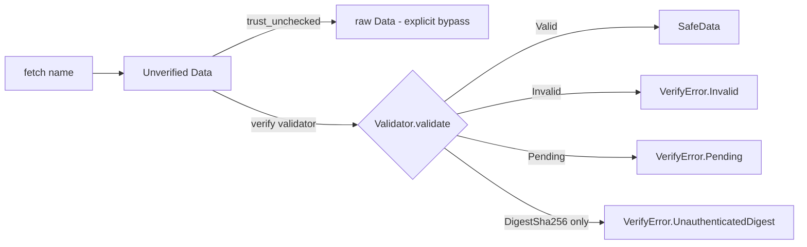

# The security model

NDN's central thesis is *secure the data, not the channel*: every Data packet
is signed, and a consumer must verify that signature against a trust anchor
before trusting the bytes. In most stacks that verification is a discipline —
the API hands you the bytes and trusts you to call the validator. ndn-rs makes
it a **type transition the compiler enforces**, so "did I actually verify this?"
is answered by the type of the value in your hand, not by reading the call site.
This is the design recorded in [ADR 0002](../adr/0002-type-enforced-verification.md);
this page is how it works in the code.

The security core is `ndn-security`; certificates layer on in `ndn-cert` and
identity lifecycle in `ndn-identity`.

## Two types, one invariant

The whole model rests on a pair of dual types in `ndn-security`.

`SafeData` (`crates/security/ndn-security/src/safe_data.rs`) is *"this Data was
verified."* Its fields are `pub(crate)`, so nothing outside `ndn-security` can
construct one with a struct literal. In a normal build the **only** way to
obtain a `SafeData` is to run a `Validator` and have the signature check
succeed — the crate mints it inside `Validator::validate`. A `SafeData` records
not just the payload but *how* it earned trust, in a `TrustPath`:

| `TrustPath` variant | Meaning |
|---|---|
| `CertChain(Vec<Name>)` | Validated via a certificate chain to a trust anchor. |
| `LocalFace { uid }` | Trusted because it arrived on a local face with known process credentials. |
| `DigestSha256` | Only a self-contained `SHA-256(signed_region) == sig_value` integrity check — no key, no anchor. |

`Unverified<T>` (`crates/security/ndn-security/src/unverified.rs`) is the other
half: *"this was **not** verified."* It is freely constructible on purpose —
unverified is the safe, pessimistic state to be in — and it has exactly two ways
out:

- `.verify(validator).await` — validate against a `Validator`, yielding
  `SafeData` on success. This is the safe path.
- `.trust_unchecked()` — accept the value *without* verification, deliberately.
  The name is loud and greppable by design, so a security audit reduces to
  grepping for `trust_unchecked`. There is no silent path to usable bytes.

There is also `.peek()`, which borrows the inner value (e.g. to read a name and
pick a validator) without consuming the wrapper or claiming any trust.

## Integrity is not authentication

A bare SHA-256 digest proves the bytes were not corrupted; it says nothing about
*who* produced them. ndn-rs refuses to conflate the two. `Unverified::verify`
returns `Err(VerifyError::UnauthenticatedDigest)` for a packet that validates
only as `DigestSha256`, even though the digest itself is arithmetically correct.
Accepting integrity-only data is possible but must be asked for explicitly, via
`.verify_allowing_digest()` — for local, in-process, or digest-addressed content
where an unauthenticated-but-intact packet is genuinely acceptable.

The honest subtlety in the code: the `Validator` itself *does* report a valid
`DigestSha256` packet as `ValidationResult::Valid` with the `DigestSha256`
trust path — it labels the trust path truthfully. The refusal to treat that as
"verified" is a *consumer* policy applied by `Unverified::verify`, not a claim
that the digest failed. `VerifyError` has three variants:

| Variant | Cause |
|---|---|
| `Invalid(TrustError)` | Signature was cryptographically invalid, or the trust schema rejected the pair. |
| `Pending` | The signing certificate chain is not yet resolved (async fetch in flight). |
| `UnauthenticatedDigest` | The packet verified only as `DigestSha256` — integrity, not identity. |

## The verification flow

On the application side this is wired through `Node`
(`crates/app/ndn-app/src/node.rs`). A plain `node.fetch(name)` returns raw,
unverified `Data` — the ergonomic-but-unverified path. `node.verifying(validator)`
returns a `VerifiedConsumer` whose `fetch` returns `SafeData`, so the payload is
signature-checked before it reaches your logic. The RDR object path funnels
through one choke point (`accept_content` in `crates/app/ndn-app/src/consumer.rs`):
with a validator present it runs `Unverified::new(data).verify(&v)` and errors
if the Data does not authenticate; without one it takes the content as-is.

## Validators default to deny

A `Validator` (`crates/security/ndn-security/src/validator/mod.rs`) dispatches
each packet to the trust context selected by its name's namespace
(longest-prefix match) and validates against *that* context's schema and anchors
only — never "any anchor I happen to hold." The default policy is deny:
validation fails unless the selected context authorizes the `(data_name,
key_name)` pair *and* the signature and certificate chain all check out.

Trust policy is a `TrustSchema` (`crates/security/ndn-security/src/trust_schema.rs`):

- `TrustSchema::new()` is empty — it rejects everything.
- `TrustSchema::hierarchical()` requires the data name and key name to share a
  top-level component (full hierarchy enforcement is the chain walk's job; the
  schema fixes the namespace). This is the default a `KeyChain` hands out.
- `TrustSchema::accept_all()` accepts any signed packet regardless of name
  relationship — for the `AcceptSigned` profile and tests only.

`KeyChain::validator()` builds a validator over the identity's anchors with
`TrustSchema::hierarchical()`, and `KeyChain::trust_only(prefix)` builds a
consumer-side validator that trusts only certificates under a given anchor
prefix. You reach an accept-all posture only by asking for it by name.

### Interoperable trust schemas (LVS)

Beyond ndn-rs's native `SchemaRule`s, a schema can import a **LightVerSec (LVS)**
model from the TLV binary format used by python-ndn, NDNts (`@ndn/lvs`), and
ndnd, via `TrustSchema::from_lvs_binary(wire)`
(`crates/security/ndn-security/src/lvs.rs`). The two rule sources are OR'd:
`allows` returns true if either the native rules or the imported LVS model
permits the pair. The import is fail-closed — a schema that uses user functions
(`$eq`, `$regex`, …) is rejected with `LvsError::UserFunctionsNotSupported`
rather than loaded and silently mis-enforced, unless a handler registry is
supplied via `from_lvs_binary_with_user_fns`.

## The signing side

Signing is symmetric to validation and also flows through `KeyChain`
(`crates/security/ndn-security/src/keychain.rs`), the single entry point for NDN
security in both applications and the forwarder. Construct one with
`KeyChain::ephemeral(name)` (in-memory, self-signed, ideal for tests and
short-lived producers), `KeyChain::open_or_create(path, name)` (file-backed PIB
that generates on first run and reloads thereafter), or `KeyChain::from_parts`
(for framework code that builds a `SecurityManager` first).

The `Signer` trait (`crates/security/ndn-security/src/signer.rs`) abstracts the
signing key; concrete signers include `Ed25519Signer`, `EcdsaP256Signer` (for
ndn-cxx interop, which lacks Ed25519), `HmacSha256Signer`, and the plain/keyed
`Blake3Signer`/`Blake3KeyedSigner`. A signer exposes `sig_type()` and both an
async `sign()` and a defaulted `sign_sync()` (the default refuses rather than
panics, so signers whose keys live behind an async boundary surface a
recoverable error).

Which key signs a given packet is chosen by a `SignerSelection`
(`crates/security/ndn-security/src/signing_info.rs`), wrapped in a `SigningInfo`
and passed to `KeyChain::sign_packet`:

| `SignerSelection` | Resolves to |
|---|---|
| `Identity(name)` | The identity's default key. |
| `Key(name)` | A specific named key from the key store. |
| `Cert(name)` | The key behind a named certificate (which pins the `KeyLocator`). |
| `HmacKey(name)` | A named HMAC key (kept distinct from `Key` for future HMAC-only policy). |
| `Digest` | `DigestSha256` — integrity only, no key. |
| `Suggested { for_name }` | The schema's recommended signer (falls back to the default key until LVS-driven selection is wired). |

`KeyChain::sign_packet` routes `Digest` through the `sign_digest_sha256` fast
path and resolves every other selection against the local PIB.

## The forwarder's invariant

Type-enforced verification pays off at the forwarder too. The design goal in
[ADR 0002](../adr/0002-type-enforced-verification.md) is that *only `SafeData`
is forwarded on a validating face*. In `ndn-engine` this is realised by the
validation stage (`crates/forwarding/ndn-engine/src/stages/validation.rs`):
on a face that carries a `Validator`, a Data packet that fails validation is
dropped (`Action::Drop(DropReason::ValidationFailed)`) and never propagates,
while a packet that validates sets `ctx.verified = true` on its `PacketContext`.
The Content Store admission gate (`crates/forwarding/ndn-engine/src/stages/cs.rs`)
then admits only `ctx.verified` Data, so unverified bytes cannot poison the
cache for downstream consumers.

One honest nuance for contributors: at the forwarder the trust verdict travels
as a boolean `PacketContext::verified` flag rather than as the `SafeData` type
itself — the `SafeData`/`Unverified` type discipline is the *application-layer*
enforcement, and the pipeline mirrors it with the flag. Both express the same
invariant: data that cannot be authenticated does not flow where authenticated
data is required.

## See also

- [ADR 0002 · Type-enforced verification](../adr/0002-type-enforced-verification.md)
- [The forwarding pipeline](./forwarding-pipeline.md) — where the validation
  stage sits on the Data return path.
- [Security pitfalls](../../guides/security-pitfalls.md) and
  [Trust policies](../../reference/trust-policies.md) — the application author's
  view.
