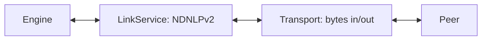

# Add a face transport

A **face** is the NDN-layer link to a peer. In ndn-rs a face is always
`Face = Transport + LinkService`:

- `Transport` moves opaque `Bytes` to and from one peer. It knows nothing of NDN
  packets — only byte frames.
- `LinkService` frames those bytes into NDN-layer packets: NDNLPv2
  fragmentation, PitToken, Nack, congestion marks, `IncomingFaceId` tagging.

You almost never write a `LinkService`; you write a `Transport` and compose it
with one of the two built-in link services. This page is the terse contributor
recipe. The fuller walkthrough — `FaceKind` vs `FacePersistency`, the accept-loop
pattern, the wasm vetting checklist — is the Part I guide
[Implementing a face](../../guides/implementing-a-face.md); read it alongside
this. The definitions live in `ndn-transport/src/{transport.rs, link_service,
face.rs}`; the concrete faces in `ndn-face/` and `ndn-face-local/`.



## Step 1 — implement `Transport`

`Transport` (`ndn-transport/src/transport.rs`) uses return-position `impl
Future` — write the two I/O methods as `async fn`; it is **not**
`#[async_trait]`. Only four methods are required: `id`, `kind`, `send_bytes`,
`recv_bytes`. Everything else is defaulted.

```rust,ignore
use bytes::Bytes;
use ndn_transport::{FaceError, FaceId, FaceKind, Transport};

pub struct MyTransport {
    id: FaceId,
    // your socket / channel / handle
}

impl Transport for MyTransport {
    fn id(&self) -> FaceId { self.id }
    fn kind(&self) -> FaceKind { FaceKind::Udp } // closest classification

    async fn send_bytes(&self, wire: Bytes) -> Result<(), FaceError> {
        // hand `wire` to your link
        Ok(())
    }

    async fn recv_bytes(&self) -> Result<Bytes, FaceError> {
        // pull the next frame; Err(FaceError::Closed) when the link ends
        todo!()
    }
}
```

Contract notes:

- `send_bytes` takes `&self` and may be called concurrently — synchronise
  internally. `recv_bytes` has a **single consumer** (the face's own reader
  task), so it need not be re-entrant.
- `FaceError` has exactly three variants: `Closed`, `Io`, `Full`. Return
  `Closed` when the link ends.
- There is no `shutdown` method — drop the transport and cancel the face's tasks
  via the `CancellationToken` you pass at wiring time.
- Useful defaulted overrides: `send_batch` (a `sendmmsg`-style burst for a
  fragment train), `recv_bytes_with_addr` (multicast sender address),
  `send_bytes_with_source` (in-process source-face tagging), `send_mtu` /
  `set_send_mtu` (link MTU → LP fragmentation threshold), `set_persistency`.
- The object-safe [`ErasedTransport`] is auto-implemented for every `Transport`,
  so `Arc<MyTransport>` becomes `Arc<dyn ErasedTransport>` for free — the face
  table holds the erased form.

The simplest real transport to copy is `InProcFace`
(`ndn-face-local/src/lib.rs`): a pair of `tokio::sync::mpsc` channels, ~40 lines
of `Transport`. For the wire pattern, copy `UdpFace` (`ndn-face/src/net/udp.rs`)
or `TcpFace` (`ndn-face/src/net/tcp.rs`).

## Step 2 — pick a `LinkService`

| LinkService | Use for |
|---|---|
| `LpLinkService` | Lossy or MTU-bounded links. NDNLPv2 framing, fragmentation, `IncomingFaceId`. Default for wire kinds. |
| `PassthroughLinkService` | Reliable, ordered, large-MTU links (shared memory, in-process): bytes in, bytes out. Default for local kinds. |

`default_link_service_for_kind(kind)` returns the right one for a `FaceKind`, so
you rarely choose by hand.

## Step 3 — compose and register

`Face::from_transport` composes the two halves, letting the kind pick the link
service; `Face::new(transport, link_service)` lets you choose explicitly. But you
usually hand the engine a bare `Transport` and let it compose the `Face`:

```rust,ignore
use ndn_engine::EngineBuilder;
use tokio_util::sync::CancellationToken;

// Build time — one initial face:
let (engine, _shutdown) = EngineBuilder::new(Default::default())
    .face(MyTransport { /* ... */ })
    .build()
    .await?;

// Runtime — add per accepted connection. `cancel` stops the face's tasks:
engine.add_face(MyTransport { /* ... */ }, CancellationToken::new());
```

`EngineBuilder::face(transport)` adds a face at build time;
`engine.add_face(transport, cancel)` adds one at runtime, and
`add_face_with_persistency` sets the `FacePersistency` explicitly (`OnDemand`,
`Persistent`, `Permanent`). There is no general `FaceListener` trait: a listening
transport runs its own accept loop and calls `add_face` per connection —
`IpcListener` (`ndn-face/src/local/ipc.rs`) is the in-tree pattern.

For a browser face, assemble with `WasmEngineBuilder::add_face(Arc<Face>)` and
vet every dependency for `wasm32-unknown-unknown` (no `mio`, no raw sockets, no
`tokio::net`) — see the Part I guide's wasm checklist.

## Testing

Wire two `InProcFace` pairs (or two engines over a channel) and assert a Data
comes back for an Interest. The `ndn-face` integration tests
(`ndn-face/tests/callback_face_forwarder.rs`,
`ndn-face/tests/shared_medium_live.rs`) are the model; the reliability path is
covered by `ndn-transport/tests/reliability_loss_recovery.rs`. Run with
`cargo nextest run -p ndn-face` (see [the testing guide](../testing.md)). A new
wire face that speaks to an external peer should also add a script to the
[interop suite](../testing.md#interop-external-peers).

## Built-in references

| Face | Crate / file | Shape |
|---|---|---|
| InProc | `ndn-face-local/src/lib.rs` | `tokio::sync::mpsc` channel pair (simplest) |
| UDP | `ndn-face/src/net/udp.rs` | UDP socket per peer |
| TCP | `ndn-face/src/net/tcp.rs` | TCP connection |
| IPC / Unix | `ndn-face/src/local/{ipc,unix}.rs` | Unix socket / named pipe |
| Callback | `ndn-face/src/callback.rs` | `CallbackFace` — virtual face over an app callback |
| Ethernet | `ndn-face/src/l2/ether.rs` | Raw Ethernet / AF_PACKET |

Shared memory (`ndn-face-shm`), serial (`ndn-face-serial`), Bluetooth
(`ndn-face-bluetooth`), WebTransport, and WebRTC ship as separate face crates.
Note the workspace lint policy: `ndn-face` is one of only two crates permitted to
use `unsafe` (raw sockets, `sendmmsg`/FFI), behind scoped allows — see
[the contribution workflow](../contributing.md#the-lint-policy).

## See also

- [Implementing a face](../../guides/implementing-a-face.md) — the full Part I guide.
- [The forwarding pipeline](../architecture/forwarding-pipeline.md) — how faces feed the dispatcher.

[`ErasedTransport`]: https://github.com/Quarmire/ndn-rs/blob/main/crates/core/ndn-transport/src/transport.rs
