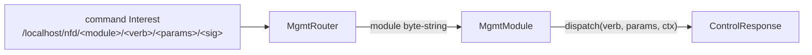

# Add a management module

The forwarder is configured over NDN itself: an operator sends a signed command
Interest to `/localhost/nfd/<module>/<verb>` carrying `ControlParameters`, and
the forwarder answers with a `ControlResponse` in a Data packet. This is the
NFD management protocol, and ndn-rs is wire-compatible with it, so `nfdc` and
other NFD tooling drive an ndn-rs forwarder unchanged.

A **management module** owns one `<module>` name component (`rib`, `faces`,
`cs`, …) and the verbs under it. This page shows how to add one. The trait and
router live in `ndn-mgmt/src/module.rs`; the built-in modules in
`ndn-mgmt/src/modules/`; the wire types in `ndn-mgmt-wire`.

## The dispatch model



The `MgmtRouter` (`ndn-mgmt/src/module.rs`) keys modules by their exact
byte-string name, dispatched on the **second** name component. The router has
already parsed the command name and checked authorisation before it calls your
module — your module only produces the response payload.

## Step 1 — implement `MgmtModule`

`MgmtModule` is an `#[async_trait]` trait with two methods:

```rust,ignore
use async_trait::async_trait;
use ndn_mgmt_wire::{ControlParameters, ControlResponse, control_response::status};
use ndn_mgmt::module::{MgmtContext, MgmtModule};
use ndn_mgmt::MgmtResponse;

pub struct EchoModule;

#[async_trait]
impl MgmtModule for EchoModule {
    fn name(&self) -> &'static [u8] { b"echo" }

    async fn dispatch(
        &self,
        verb: &[u8],
        params: ControlParameters,
        ctx: &MgmtContext<'_>,
    ) -> MgmtResponse {
        match verb {
            b"ping" => {
                // Read engine state through `ctx`; do not block.
                let echo = ControlParameters { name: params.name, ..Default::default() };
                ControlResponse::ok("OK", echo).into()
            }
            _ => ControlResponse::error(status::NOT_FOUND, "unknown echo verb").into(),
        }
    }
}
```

`MgmtContext<'_>` (`ndn-mgmt/src/module.rs`) is the per-Interest dispatch
context. The fields you will reach for most: `ctx.engine: &ForwarderEngine` (the
forwarding plane — FIB, PIT, CS, face table), `ctx.source_face:
Option<FaceId>` (who sent the command, for authorisation-aware verbs),
`ctx.config: &dyn MgmtConfig` (redacted running config), and `ctx.cancel`. A
`dispatch` is `async` but must not stall the mgmt task — read state and return.

## Step 2 — the wire types

`ControlParameters` and `ControlResponse` come from `ndn-mgmt-wire` and are the
real NFD TLVs — do not invent your own envelope.

- `ControlParameters` (`ndn-mgmt-wire/src/control_parameters.rs`) is a struct of
  optional NFD fields (`name`, `face_id`, `uri`, `cost`, `flags`, `mask`,
  `capacity`, `count`, `strategy`, …). Construct with `..Default::default()` and
  fill the fields your verb uses.
- `ControlResponse` (`ndn-mgmt-wire/src/control_response.rs`) has three
  constructors: `ok(text, params)` (echo parameters back), `ok_empty(text)`
  (status text only), and `error(code, text)`. Status codes live in
  `control_response::status` — `OK = 200`, `NOT_FOUND = 404`, `BAD_PARAMS`, and
  the rest of the NFD set.
- `MgmtResponse` (`ndn-mgmt/src/lib.rs`) is the module's return type. A
  `ControlResponse` converts into it with `.into()`; the `Dataset` variant is for
  status-dataset verbs (e.g. `faces/list`) that return raw TLV blocks instead.

For a real, complete module read `ndn-mgmt/src/modules/cs.rs` — `CsModule`
implements `cs/config`, `cs/info`, and `cs/erase` in ~110 lines, matching NFD's
`CsManager` flag semantics (Admit/Serve bits, capacity). Note how it pulls
`engine.cs()` off the context and echoes the effective state back in the
response.

## Step 3 — register the module

Built-in modules are installed by `register_builtins`
(`ndn-mgmt/src/modules/mod.rs`), which does `router.register(Arc::new(...))` for
each. Your out-of-tree module is registered as an **extra module** rather than by
editing that function:

```rust,ignore
use std::sync::Arc;
use ndn_mgmt::{build_mgmt_router, MgmtModule};

let extra: Vec<Arc<dyn MgmtModule>> = vec![Arc::new(EchoModule)];
let router = build_mgmt_router(&extra);
```

The forwarder host passes extra modules through `MgmtHandles::extra_modules` when
it calls `mount_management`, so a downstream crate can add a module without
touching `ndn-mgmt`. The management prefix `/localhost/nfd` (from `mgmt_prefix()`)
is registered in the FIB by `mount_management`; unknown module names return
`NOT_FOUND` automatically.

## NFD compatibility

Because the wire types and status codes are NFD's, keep your verbs
NFD-shaped: use the existing `ControlParameters` fields where they fit, mirror
NFD's `Flags`+`Mask` pattern for boolean toggles (as `cs/config` does), and reuse
the standard status codes. New wire fields must go through `ndn-mgmt-wire` (see
[the conformance matrix](../conformance-matrix.md) and
[ADR 0001](../adr/0001-real-ndn-wire-format.md)). The built-in module set is:
`rib`, `faces`, `fib`, `strategy` (i.e. `strategy-choice`), `cs`, `status`,
`measurements`, `config`, `ext`, `log`, and several extension modules; native
builds add `routing`, `neighbors`, and `security`.

## Testing

Drive the router directly (`build_mgmt_router(&[...])` then `router.dispatch(...)`)
or mount management on an in-process engine and send a real command Interest.
The `ndn-mgmt` integration tests are the model —
`ndn-mgmt/tests/faces_create_idempotent.rs` and
`ndn-mgmt/tests/notifications.rs`. Run with `cargo nextest run -p ndn-mgmt` (see
[the testing guide](../testing.md)).

## See also

- [Management verbs](../../reference/mgmt-verbs.md) — the catalogue of shipped verbs.
- [ADR 0001 · Real NDN wire format](../adr/0001-real-ndn-wire-format.md) — why the wire is NFD's, not a dialect.
