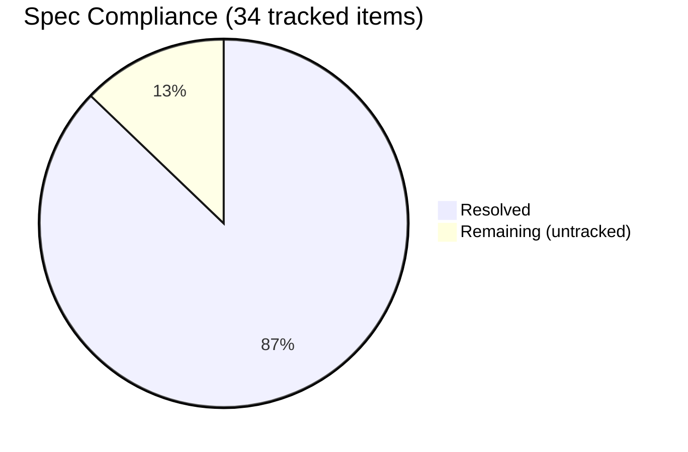

# NDN Specification Compliance

ndn-rs is wire-compatible with NFD and other NDN forwarders. All critical and most important items from the original 25-gap compliance audit have been resolved. Five gaps remain, concentrated in certificate format details and a few validation checks that don't affect day-to-day forwarding or application development.

## Reference Specifications

> **Note:** NDN is not CCNx. NDN Architecture and RFC 8609 define CCNx 1.0 semantics and
> packet encoding respectively and are **not** applicable to NDN. The NDN protocol
> is defined by the documents below.

| Document | Scope |
|----------|-------|
| [NDN Packet Format v0.3](https://docs.named-data.net/NDN-packet-spec/current/) | Canonical TLV encoding, packet types, name components |
| [NDN Architecture (NDN-0001)](https://named-data.net/techreports/) | Forwarding semantics, FIB/PIT/CS model, scope rules |
| [NDNLPv2](https://redmine.named-data.net/projects/nfd/wiki/NDNLPv2) | Link-layer protocol: fragmentation, reliability, per-hop headers |
| [NDN Certificate Format v2](https://docs.named-data.net/NDN-packet-spec/current/certificate.html) | Certificate TLV layout, naming conventions, validity period |
| [NDNCERT 0.3](https://github.com/named-data/ndncert/blob/master/docs/DESIGN.md) | Automated certificate issuance over NDN |
| [NFD Developer Guide](https://docs.named-data.net/NFD/current/) | Forwarder behavior, management protocol, strategy API |

## What's Implemented

### TLV Wire Format (NDN Packet Format v0.3)

The TLV codec handles all four VarNumber encoding widths and enforces shortest-encoding on read — a `NonMinimalVarNumber` error is returned for non-minimal forms. TLV types 0–31 are grandfathered as always critical regardless of LSB, per NDN Packet Format v0.3 §1.3. `TlvWriter::write_nested` uses minimal length encoding. Zero-component Names are rejected at decode time.

### Packet Types

**Interest** — full encode/decode: Name, Nonce, InterestLifetime, CanBePrefix, MustBeFresh, HopLimit, ForwardingHint, ApplicationParameters with `ParametersSha256DigestComponent` verification, and InterestSignatureInfo/InterestSignatureValue for signed Interests with anti-replay fields (`SignatureNonce`, `SignatureTime`, `SignatureSeqNum`).

**Data** — full encode/decode: Name, Content, MetaInfo (ContentType including LINK, KEY, NACK, PREFIX_ANN), FreshnessPeriod, FinalBlockId, SignatureInfo, SignatureValue. `Data::implicit_digest()` computes SHA-256 of the wire encoding for exact-Data retrieval via ImplicitSha256DigestComponent.

**Nack** — encode/decode with NackReason (NoRoute, Duplicate, Congestion).

**Typed name components** — `KeywordNameComponent` (0x20), `SegmentNameComponent` (0x32), `ByteOffsetNameComponent` (0x34), `VersionNameComponent` (0x36), `TimestampNameComponent` (0x38), `SequenceNumNameComponent` (0x3A) — all with typed constructors, accessors, and `Display`/`FromStr`.

### NDNLPv2 Link Protocol

All network faces use NDNLPv2 LpPacket framing (type 0x64). Fully implemented:

- **LpPacket encode/decode** — Nack header, Fragment, Sequence (0x51), FragIndex (0x52), FragCount (0x53)
- **Fragmentation and reassembly** — `fragment_packet` splits oversized packets; `ReassemblyBuffer` collects fragments and reassembles on receive
- **Reliability** — TxSequence (0x0348), Ack (0x0344); per-hop adaptive RTO on unicast UDP faces (NDNLPv2 §6)
- **Per-hop headers** — PitToken (0x62), CongestionMark, IncomingFaceId (0x032C), NextHopFaceId (0x0330), CachePolicy/NoCache (0x0334/0x0335), NonDiscovery (0x034C), PrefixAnnouncement (0x0350)
- **`encode_lp_with_headers()`** — encodes all optional LP headers in correct TLV-TYPE order
- **Nack framing** — correctly wrapped as LpPacket with Nack header and Fragment, not standalone TLV

### Forwarding Semantics (NDN Architecture)

- **HopLimit** — decoded (TLV 0x22); Interests with HopLimit=0 are dropped; decremented before forwarding
- **Nonce** — `ensure_nonce()` adds a random Nonce to any Interest that lacks one before forwarding
- **FIB** — name trie with longest-prefix match, multi-nexthop entries with costs
- **PIT** — DashMap-based, Interest aggregation, nonce-based loop detection, ForwardingHint included in PIT key per NDN Architecture §4.2, expiry via hierarchical timing wheel
- **Content Store** — pluggable backends (LRU, sharded, persistent); MustBeFresh/CanBePrefix semantics; CS admission policy rejects FreshnessPeriod=0 Data; NoCache LP header respected; implicit digest lookup
- **Strategy** — BestRoute and Multicast with per-prefix StrategyTable dispatch; MeasurementsTable tracking EWMA RTT and satisfaction rate per face/prefix
- **Scope enforcement** — `/localhost` prefix restricted to local faces inbound and outbound

### Security

- **Ed25519** — type code 5 per spec; sign and verify end-to-end
- **HMAC-SHA256** — symmetric signing for high-throughput use cases
- **BLAKE3 digest** — experimental type code 6 (NDA extension, pending NDN spec assignment); `Blake3Signer` / `Blake3DigestVerifier` / `Blake3KeyedSigner` / `Blake3KeyedVerifier` — 3–8× faster than SHA-256 on SIMD CPUs
- **Signed Interests** — InterestSignatureInfo/InterestSignatureValue with anti-replay fields
- **Trust chain validation** — `Validator::validate_chain()` walks Data → cert → trust anchor; cycle detection; configurable depth limit; `CertFetcher` deduplicates concurrent cert requests
- **Certificate TLV format** — `Certificate::decode()` parses ValidityPeriod (0xFD) with NotBefore/NotAfter; certificate time validity enforced; `AdditionalDescription` TLV constants defined
- **ValidationStage** — sits in Data pipeline between PitMatch and CsInsert; drops Data failing chain validation
- **NDNCERT 0.3** — all four routes (INFO/PROBE/NEW/CHALLENGE/REVOKE) now use TLV wire format; JSON protocol types removed from CA handler
- **Self-certifying namespaces** — `ZoneKey` in `ndn-security`: zone root = `BLAKE3_DIGEST(blake3(ed25519_pubkey))`; `Name::zone_root_from_hash()`, `Name::is_zone_root()` in `ndn-packet`
- **DID integration** — `ZoneKey::zone_root_did()` bridges zone names ↔ `did:ndn:v1:…` DIDs; top-level `DidDocument`, `UniversalResolver`, `name_to_did`, `did_to_name` exports added to `ndn_security`

### Transports

- **UDP / TCP / WebSocket** — standard IP transports with NDNLPv2 framing
- **Multicast UDP** — NFD-compatible multicast group (`224.0.23.170:6363`)
- **Ethernet** — raw AF_PACKET frames with Ethertype 0x8624 (Linux); PF_NDRV (macOS); Npcap (Windows)
- **Unix socket** — local IPC
- **Shared memory (SHM)** — zero-copy ring for same-host apps
- **Serial/UART** — COBS framing over tokio-serial
- **Bluetooth LE** — NDNts/esp8266ndn-compatible GATT server (`bluetooth` feature, Linux/BlueZ); Service UUID `099577e3-0788-412a-8824-395084d97391`; NDNts fragmentation scheme; interoperable with Web Bluetooth API and ESP32 devices

### Management

NFD-compatible TLV management protocol over Unix domain socket (`/localhost/nfd/`). Modules: `rib`, `faces`, `fib`, `strategy-choice`, `cs`, `status`.

## Remaining Gaps

Five items remain unresolved. None affect wire-level interoperability with NFD.

| Gap | Spec reference | Impact |
|-----|---------------|--------|
| **/localhop scope** — only `/localhost` is enforced; `/localhop` packets (one-hop restriction) are forwarded without checking | NDN Architecture §4.1 | Low — affects multi-hop scenarios involving `/localhop` prefixes |
| **Name canonical ordering** — no `Ord` impl on `Name` or `NameComponent`; cannot use `BTreeMap` or `.sort()` with NDN names | NDN Packet Format v0.3 §2.1 | Low — affects sorted data structures; doesn't affect forwarding |
| **Certificate naming convention** — cert Data packets use arbitrary names instead of `/<Identity>/KEY/<KeyId>/<IssuerId>/<Version>` | NDN Certificate Format v2 §4 | Moderate — certificates not exchangeable with ndn-cxx in the standard way |
| **Certificate content encoding** — public key bytes stored raw rather than DER-wrapped SubjectPublicKeyInfo | NDN Certificate Format v2 §5 | Moderate — same; interoperability with external cert issuers limited |
| **TLV element ordering** — recognized elements accepted in any order; spec requires defined order | NDN Packet Format v0.3 §1.4 | Low — lenient decoding; packets we produce are correctly ordered |

## Summary

34 explicitly tracked compliance items are resolved. The 5 remaining gaps are in certificate format details, name ordering, and lenient TLV parsing — none prevent interoperability with NFD or affect the forwarding pipeline.
