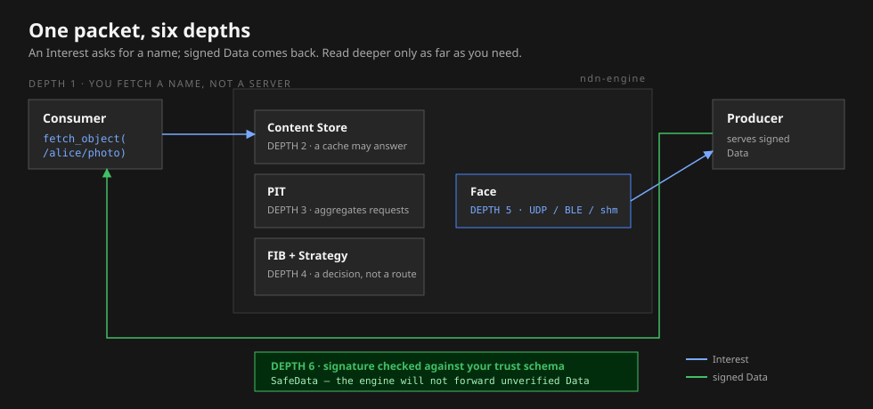

# One packet, six depths

NDN has a small number of moving parts, and the fastest way to meet all
of them is to follow a single request. We will ask for one name,
`/alice/photo`, and watch signed Data come back.

Read top to bottom and stop at the depth that answers your question. The
first depth is the whole idea; the last is the trust check that makes it
safe. You do not need all six to start building — you need depth 1.

<figure>

<figcaption>One request, annotated at six depths. Each layer below is a consequence of depth 1.</figcaption>
</figure>

## Depth 1 — You fetch a name

The consumer expresses an **Interest** for `/alice/photo`. That is the
entire request: a name. No address, no host, no open connection. Whatever
node can satisfy the name will; the consumer never learns or cares which
one did.

If you only ever read one depth, read this one. The rest is how the
network makes it fast and safe.

## Depth 2 — A cache may answer

The first node to see the Interest checks its **Content Store** — a cache
of Data it has already handled. If `/alice/photo` is there and still
fresh, that node returns it immediately and the request goes no further.

This is why popular names are cheap: the tenth request for the same photo
is usually a local cache hit, not a round trip to the producer.

## Depth 3 — Identical requests aggregate

On a cache miss, the node records the pending request in its **Pending
Interest Table** (PIT). If a second consumer asks for `/alice/photo`
while the first is still outstanding, the node does not forward it again —
it adds the new requester to the existing PIT entry. One Data comes back
and fans out to everyone waiting. Aggregation and multicast are the same
mechanism.

## Depth 4 — Forwarding is a decision

To make progress the node consults its **Forwarding Information Base**
(FIB), which lists the next hops known to lead toward the name. When more
than one hop qualifies, a **strategy** decides: which face to use, whether
to try several, when to retransmit, how to react to a failure. Routing
fills in the options; the strategy chooses among them, per packet.

## Depth 5 — It crosses a face

The chosen next hop is reached over a **face** — an NDN-layer link that
could be UDP, TCP, Bluetooth, shared memory, or a browser data channel.
The Interest and Data are the same regardless; only the face underneath
changes. Swapping bearers does not change the packet or its security.

## Depth 6 — The reply is verified

When the Data arrives, the node does not simply pass it along. It checks
the signature against a **trust policy** — is this key allowed to sign
this name? Only Data that passes becomes forwardable and cacheable; in
ndn-rs that verified form has its own type, `SafeData`, and the
forwarding path accepts nothing else. Unverified Data stops here.

How that check is rooted in keys you chose is the subject of
[Trust, first](./trust-first.md).

Stop where your question is answered
Building an app? Depth 1 is enough. Tuning forwarding? Depths 4–5. Worried
about what you accept? Depth 6. You can always come back deeper.

## Reading further

- The same journey with every field and the forwarder state machine:
  [Interest and Data lifecycle](../concepts/interest-data-lifecycle.md).
- The components as a reference, not a narrative:
  [NDN overview](../concepts/ndn-overview.md).
- Why any of this is shaped the way it is:
  [Why NDN is different](./why-ndn-is-different.md).
