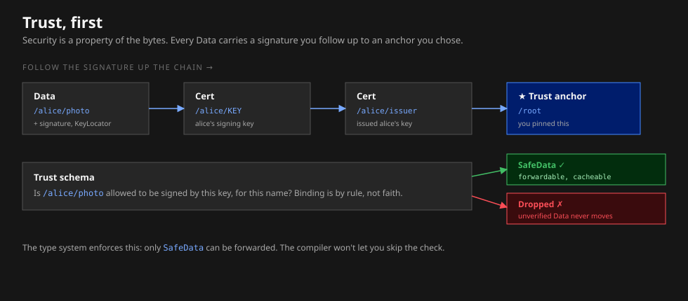

# Trust, first

In NDN you do not trust a connection — you trust the data. That sentence
is easy to nod at and easy to underestimate, so this page is the
mechanics: every Data packet is signed, and a rule *you* chose decides
whether the signature actually counts.

This is the one non-negotiable. You can skip strategies, skip exotic
faces, skip in-network compute — but the moment you accept a packet, you
are making a trust decision, and NDN makes you make it on purpose.

<figure>

<figcaption>A signature is followed up a chain to an anchor you chose, then checked against a naming rule. Pass becomes SafeData; fail is dropped.</figcaption>
</figure>

## A signature is not a verdict

Anyone can generate a key and sign anything with it. A valid signature
only tells you the bytes were not altered since signing — it does not
tell you the signer was *allowed* to produce this name. The real question
is never "is this signed?" but "is **this key** permitted to sign
**this name**?"

Treating "signed" as "trusted" is the mistake NDN is built to prevent.

## Follow the chain to an anchor you pinned

Each Data carries a **KeyLocator** pointing at the certificate for its
signing key. That certificate was itself signed by an issuer, whose
certificate was signed by another, up to a **trust anchor** — a key you
decided to trust ahead of time. Verification walks that chain and
succeeds only if it ends at an anchor you pinned.

Trust is therefore rooted in a choice you made, not in whoever happens to
answer the Interest. Move the data to a different node and nothing about
this changes; the chain travels with the bytes.

## Names bind to keys by rule

The chain proves *who* signed. A **trust schema** decides whether that
signer was *entitled* to. A schema is a set of rules tying name patterns
to the keys allowed to sign them — for example, that Data under
`/alice/...` must be signed by a key named under `/alice/KEY/...`. A
signature from the wrong key is rejected even when it is cryptographically
valid, because the *binding* is wrong.

This is what "names bind to keys" means in practice: authority follows the
namespace, by rule, not by trust-on-faith.

## SafeData — the check the compiler enforces

ndn-rs makes this difficult to skip. Data that has passed verification has
its own type, `SafeData`, and the forwarding and caching paths accept only
`SafeData`. Unverified `Data` is not merely discouraged — it is a
different type, and the compiler will not let it onto the wire. The trust
decision is structural, not a convention you have to remember.

SafeData
Only verified Data is forwardable. If the check did not run, the bytes do
not move — the type system guarantees it.

## Choosing your policy

A trust policy answers "may this key sign this name?" ndn-rs ships several:

- `InsecureTrust` — accepts anything. Tests only; never in deployment.
- `StaticTrust` — an explicit allowlist of keys.
- schema-based trust — name-pattern rules, the usual production choice.
- `HierarchicalPolicy` — a parent-name key may sign child-name Data.

The catalog, with the trade-offs of each, is in
[Trust policies](../reference/trust-policies.md). How keys, certificates,
and key chains are created and stored is in
[Identity and keys](../concepts/identity-and-keys.md).

## Why first, and not last

In connection-based systems, security is something you add: get the bytes
moving, then bolt on TLS, then audit what leaked. NDN inverts the order.
Because trust rides with the data, the verification check is the
precondition for a packet to move at all — there is no "insecure but
working" stage to retrofit later. Deciding what you trust is step one, not
a hardening pass.

## Reading further

- The request this check sits at the end of:
  [One packet, six depths](./one-packet-six-depths.md), depth 6.
- Keys, certificates, key chains, signing:
  [Identity and keys](../concepts/identity-and-keys.md).
- The policy catalog: [Trust policies](../reference/trust-policies.md).
