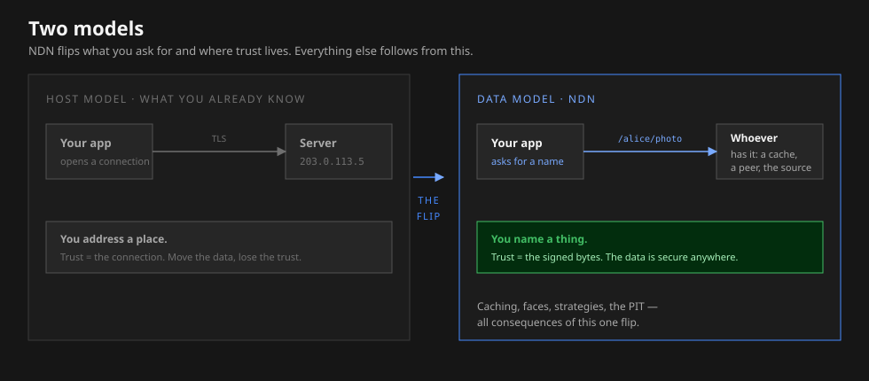

# Why NDN is different

If you have built anything for the web, you already carry a mental model
of how networking works — and it is the one thing you have to set down
before the rest of this wiki makes sense. This page is about that one
idea. Everything else in ndn-rs is a consequence of it.

## The model you already have

You name a *place*. A URL resolves to an address; you open a connection
to the machine at that address; you trust what comes back because you
trust the connection — the TLS certificate proves you are talking to the
right server. The data itself is incidental. Copy that same file onto a
different server and all of the trust evaporates: new connection, new
certificate, prove it again.

This works. It is also why a cache is a special case, why "is this the
real file?" collapses into "did I reach the real server?", and why two
people downloading the same thing open two separate connections.

## The model NDN uses

NDN names the *data*, not the place. You ask for `/alice/photo`. You do
not say where it lives, and you do not care who answers — a nearby cache,
a peer, or the original producer, whichever is closest. What comes back
is a **signed packet**. You trust it because the bytes carry their own
signature and that signature satisfies a rule you chose — not because of
which connection delivered them.

<figure>

<figcaption>The same request, two models. NDN moves trust from the connection to the data.</figcaption>
</figure>

The whole flip, in one line
You fetch a <em>name</em>, not a server — and trust is a property of the
<em>data</em>, not the connection.

## Everything else follows from the flip

Once data is named and self-securing, the rest of NDN stops looking
arbitrary:

- **Caching is automatic.** Any node that already forwarded `/alice/photo`
  can answer the next request for it. Ten consumers asking for the same
  name become one fetch and nine cache hits — multicast you get for free,
  with no special protocol.
- **There are no connections to manage.** A request and its reply are
  matched by name, not by a socket pinned between two hosts.
- **Links are *faces*, not sockets.** A face is an NDN-layer link over
  whatever bearer you have — UDP, Bluetooth, shared memory, a browser
  data channel. The data does not change; only the face does.
- **Forwarding is a decision, not a fixed route.** When a request could
  go several ways, a *strategy* chooses. Routing populates the options;
  the strategy picks among them per packet.

The mechanics behind each of these — the Pending Interest Table, the
Forwarding Information Base, the Content Store — are laid out in the
[NDN overview](../concepts/ndn-overview.md), and traced through a single
request in [Interest and Data lifecycle](../concepts/interest-data-lifecycle.md).

## Security is the floor, not a feature

Because trust rides with the data, signing and verification are not an
add-on you remember to switch on — they are how a packet earns the right
to move at all. Every Data packet is signed. A verifier checks the
signature against a *trust policy* that answers one question: *is this
key allowed to sign this name?*

ndn-rs makes this hard to get wrong on purpose. Verified data has a
distinct type — `SafeData` — and the forwarding path only accepts
`SafeData`. Unverified data is not "discouraged"; the compiler will not
let you forward it. How keys, certificates, and policies fit together is
in [Identity and keys](../concepts/identity-and-keys.md).

SafeData
The engine will not forward Data it has not verified. Trust is enforced
by the type system, not by convention.

## What is standard, and what ndn-rs adds

The core of ndn-rs implements published NDN community specifications.
On top of that it adds pragmatic engineering — browser transports,
in-network compute, network coding, attribute-based encryption — that
have no community spec behind them. Those are always marked
extension in this wiki, so you are
never left guessing whether something is real NDN or specific to ndn-rs.
When it matters, the [spec-compliance summary](../reference/spec-compliance.md)
records what has actually been verified against the wire format.

## Where to go next

You have the one idea. Pick the path that matches why you are here — each
assumes the flip above and nothing more.

<a class="cds-card" href="../path/app-author.md">

App author
Fetch and publish Data by name. The five-minute path.
</a>
<a class="cds-card" href="../path/operator.md">

Operator
Stand up the forwarder and watch traffic move.
</a>
<a class="cds-card" href="../path/extender.md">

Extender
Write a strategy or a face without forking the engine.
</a>
<a class="cds-card" href="../path/researcher.md">

Researcher
Observe every packet; wire two engines together.
</a>

Still want the mechanics first? Start with the
[NDN overview](../concepts/ndn-overview.md).
